# Complete TradeYa System Integration Diagram

```mermaid
graph TB
    %% User Entry Points
    NewUser[👤 New User] --> OnboardingFlow{🎯 Onboarding Assessment}
    
    %% Solo Challenge Tier
    OnboardingFlow --> SoloTier[🎯 SOLO CHALLENGES<br/>Individual Skill Building]
    
    subgraph SoloSystem ["🎯 Solo Challenge System"]
        SoloCreate[Create Solo Challenge] --> SoloAI[🤖 AI Mentor Assignment]
        SoloAI --> SoloProgress[📊 Progress Tracking]
        SoloProgress --> SoloValidation[✅ AI Validation]
        SoloValidation --> SoloComplete[🏆 Challenge Complete]
        
        %% Solo Features
        SoloSkillTrack[📈 Skill Level Tracking]
        SoloPortfolio[📁 Portfolio Building]
        SoloAchieve[🏅 Achievement System]
    end
    
    %% Trade Challenge Tier  
    SoloComplete --> TradeUnlock{🔓 Trade Challenges Unlocked}
    TradeUnlock --> TradeTier[🤝 TRADE CHALLENGES<br/>Skill Exchange]
    
    subgraph TradeSystem ["🤝 Trade Challenge System"]
        TradeMatch[🎯 Smart Matching] --> TradeCreate[Create Trade Partnership]
        TradeCreate --> TradeStructure[📋 Exchange Structure]
        TradeStructure --> TradeSessions[💬 Learning Sessions]
        TradeSessions --> TradeDeliver[📦 Mutual Deliverables]
        TradeDeliver --> TradeComplete[🎉 Trade Complete]
        
        %% Existing Trade System Integration
        ExistingTrade[🔄 Existing Trade System] --> TradeInfra[Infrastructure & Matching]
        TradeInfra --> TradeMatch
    end
    
    %% Collaboration Challenge Tier
    TradeComplete --> CollabUnlock{🔓 Collaboration Challenges Unlocked}
    CollabUnlock --> CollabTier[👥 COLLABORATION CHALLENGES<br/>Team Projects]
    
    subgraph CollabSystem ["👥 Collaboration Challenge System"]
        %% Simplified UI Layer
        SimpleUI[🎨 Simplified UI Layer]
        SimpleUI --> SimpleRoles[Leader/Contributor/Helper]
        SimpleRoles --> SmartAssign[🧠 Smart Role Assignment]
        SimpleUI --> ProgressDisclose[📱 Progressive Disclosure]
        
        %% Complex Backend
        ComplexBackend[⚙️ Complex Backend System]
        ComplexBackend --> CollabRoles[11-State CollaborationRole]
        ComplexBackend --> Permissions[Advanced Permissions]
        ComplexBackend --> Workflow[Complex Workflows]
        
        %% Integration Layer
        SmartAssign --> RoleMapping[🔄 Role Mapping Layer]
        RoleMapping --> ComplexBackend
        
        %% Project Flow
        CollabCreate[Create Team Project] --> CollabForm[👥 Team Formation]
        CollabForm --> CollabWork[🛠️ Collaborative Work]
        CollabWork --> CollabDeliver[🎯 Project Delivery]
        CollabDeliver --> CollabComplete[🎊 Project Complete]
    end
    
    %% AI & Automation Layer
    subgraph AILayer ["🤖 AI & Automation Layer"]
        AIRecommend[Challenge Recommendations]
        AIMatch[Smart Partner Matching]
        AIRole[Optimal Role Assignment]
        AIFeedback[Progress Feedback]
        AIContent[Content Generation]
    end
    
    %% Data & Analytics
    subgraph DataLayer ["📊 Data & Analytics Layer"]
        UserProgress[User Progress Tracking]
        SkillAssess[Skill Assessment]
        NetworkAnalytics[Network Effect Analytics]
        ChallengeMetrics[Challenge Success Metrics]
    end
    
    %% Gamification System
    subgraph GamificationLayer ["🎮 Gamification Layer"]
        XPSystem[XP & Leveling]
        BadgeSystem[Achievement Badges]
        Leaderboards[Community Leaderboards]
        UnlockSystem[Feature Unlocking]
    end
    
    %% Cross-System Integrations
    SoloTier --> AILayer
    TradeTier --> AILayer
    CollabTier --> AILayer
    
    SoloTier --> DataLayer
    TradeTier --> DataLayer
    CollabTier --> DataLayer
    
    SoloTier --> GamificationLayer
    TradeTier --> GamificationLayer  
    CollabTier --> GamificationLayer
    
    %% Advanced User Paths
    CollabComplete --> AdvancedUser[🚀 Advanced User]
    AdvancedUser --> PowerFeatures[⚡ Power User Features]
    AdvancedUser --> Mentorship[👨‍🏫 Become Mentor]
    AdvancedUser --> CommunityLead[🌟 Community Leadership]
    
    %% Real-World Outcomes
    CollabComplete --> Portfolio[📁 Professional Portfolio]
    Portfolio --> JobOpps[💼 Job Opportunities]
    Portfolio --> Freelance[💰 Freelance Projects]
    Portfolio --> Startup[🚀 Startup Opportunities]
    
    %% View Toggle System
    subgraph ViewSystem ["👁️ View Management"]
        UserToggle{User Experience Level}
        UserToggle --> BeginnerView[🌱 Simplified View]
        UserToggle --> AdvancedView[🔧 Advanced View]
        BeginnerView --> SimpleUI
        AdvancedView --> ComplexBackend
    end
    
    %% Challenge Creation Flow
    subgraph ChallengeCreation ["🏗️ Challenge Creation"]
        CommunityCreate[Community Creates]
        AIGenerate[AI Generates]
        ExpertCurate[Expert Curates]
        
        CommunityCreate --> ChallengePool[Challenge Pool]
        AIGenerate --> ChallengePool
        ExpertCurate --> ChallengePool
        
        ChallengePool --> SoloSystem
        ChallengePool --> TradeSystem
        ChallengePool --> CollabSystem
    end
    
    %% Success Metrics
    subgraph SuccessMetrics ["📈 Success Tracking"]
        UserRetention[User Retention]
        SkillGrowth[Skill Development]
        ProjectSuccess[Project Completion]
        NetworkGrowth[Network Building]
        CareerAdvance[Career Advancement]
    end
    
    %% Styling
    classDef tierStyle fill:#e1f5fe,stroke:#01579b,stroke-width:3px
    classDef systemStyle fill:#f3e5f5,stroke:#4a148c,stroke-width:2px
    classDef aiStyle fill:#e8f5e8,stroke:#1b5e20,stroke-width:2px
    classDef userStyle fill:#fff3e0,stroke:#e65100,stroke-width:2px
    
    class SoloTier,TradeTier,CollabTier tierStyle
    class SoloSystem,TradeSystem,CollabSystem systemStyle
    class AILayer,DataLayer,GamificationLayer aiStyle
    class NewUser,AdvancedUser userStyle
```

## 🎯 System Integration Summary

### Three-Tier Progressive Learning
1. **Solo Challenges**: Individual skill building with AI mentorship
2. **Trade Challenges**: Peer-to-peer skill exchange leveraging existing infrastructure  
3. **Collaboration Challenges**: Team projects with simplified UI over complex backend

### Two-Layer Architecture
- **Simplified UI**: User-friendly interface for beginners and casual users
- **Complex Backend**: Sophisticated CollaborationRole system for power users and advanced functionality

### Smart Integration Points
- **Role Mapping**: Simple roles (Leader/Contributor/Helper) map to complex backend roles
- **Progressive Disclosure**: UI complexity grows with user expertise
- **AI Automation**: Smart matching, role assignment, and recommendations across all tiers

### Key Success Factors
1. **Low Barrier Entry**: Anyone can start with Solo challenges
2. **Clear Progression**: Visible path from beginner to expert
3. **Real-World Impact**: Collaboration challenges produce actual portfolio projects
4. **Flexible Complexity**: Users choose their experience level
5. **Community Building**: Natural progression builds stronger network connections

This system successfully balances sophisticated backend functionality with approachable user experience, ensuring both immediate engagement and long-term platform value.
