# Enhanced Challenge System - Complete Visual Architecture

## 1. System Overview

```mermaid
---
title: "TradeYa Enhanced Challenge System Architecture"
config:
  theme: default
  themeVariables:
    primaryColor: "#1976d2"
    primaryTextColor: "#000"
    primaryBorderColor: "#1976d2"
    lineColor: "#666"
---
graph TB
    %% 🎯 User Layer with Enhanced Icons
    U["🎮 User Interface Layer<br/>📱 Multi-platform Dashboard"]
    U --> D["⚡ Daily Sparks<br/>🌅 Quick Morning Boosts"]
    U --> SP["📈 Skill Progression<br/>🎯 Structured Learning Paths"]
    U --> TT["⏱️ Time Trials<br/>🏃‍♂️ Speed Challenges"]
    U --> MB["🎁 Mystery Box<br/>🎲 Surprise Skills"]
    U --> COL["👥 Collaborative Challenges<br/>🤝 Team Projects"]
    U --> GAM["🏆 Gamified Challenges<br/>🏖️ Achievement Focus"]

    %% 🎯 Challenge Types with Detailed Descriptions
    subgraph "🎯 Challenge Categories"
        D --> DS["⚡ 15-min Quick Tasks<br/>💡 Creative micro-challenges"]
        SP --> SPC["🔗 Sequential Learning Chains<br/>📚 Progressive skill building"]
        TT --> TTC["🏃‍♂️ Speedrun Challenges<br/>⏰ Time-pressured excellence"]
        MB --> MBC["🎲 Surprise Skill Challenges<br/>🌟 Unexpected discoveries"]
        COL --> COLC["👥 Team-based Projects<br/>🚀 Collaborative innovation"]
        GAM --> GAMC["🏖️ XP & Achievement Focus<br/>🏅 Competitive progression"]
    end

    %% 🧠 AI Intelligence Layer with Advanced Features
    subgraph "🧠 AI Intelligence Hub"
        AI["🤖 OpenRouter AI Engine<br/>⚡ GPT-4 & Claude Integration"]
        AI --> PG["🎨 Personalized Generation<br/>🎯 Context-aware content"]
        AI --> SA["📊 Skill Assessment<br/>🔍 Competency analysis"]
        AI --> AC["🔄 Adaptive Content<br/>📈 Dynamic difficulty"]
        AI --> QS["⭐ Quality Scoring<br/>🎯 Automated evaluation"]
        AI --> PR["🔮 Predictive Recommendations<br/>📊 Success probability"]
    end

    %% ⚙️ Core Engine with Enhanced Capabilities
    subgraph "⚙️ Challenge Core Engine"
        CE["🎯 Challenge Engine<br/>🔧 Orchestration Hub"]
        CE --> TM["📑 Template Manager<br/>🎨 Dynamic content system"]
        CE --> PM["📊 Progress Manager<br/>📈 Real-time tracking"]
        CE --> VM["✅ Validation Manager<br/>🔍 Multi-layer verification"]
        CE --> RM["🏆 Reward Manager<br/>💎 Achievement system"]
        CE --> SM["👥 Social Manager<br/>🌐 Community features"]
    end

    %% 🛡️ Enhanced Anti-Exploitation
    subgraph "🛡️ Security & Validation System"
        AE["🔒 Anti-Exploitation Engine<br/>🛡️ Fraud prevention"]
        AE --> PV["📋 Process Validation<br/>🔍 Step-by-step verification"]
        AE --> PR_SEC["👥 Peer Review System<br/>🤝 Community validation"]
        AE --> TA["⏱️ Time-based Authenticity<br/>📊 Pattern analysis"]
        AE --> QC["🎯 Quality Control<br/>🔍 AI-powered assessment"]
        AE --> BC["⛓️ Blockchain Verification<br/>🔐 Immutable records"]
    end

    %% 🗄️ Enhanced Backend Services
    subgraph "🗄️ Backend Infrastructure"
        FS["🔥 Firestore Database<br/>☁️ Real-time sync"]
        PS["💼 Portfolio Service<br/>🎨 Automated showcase"]
        US["👤 User Service<br/>🔐 Profile management"]
        NS["🔔 Notification Service<br/>📱 Multi-channel alerts"]
        AS["📊 Analytics Service<br/>📈 Advanced insights"]
        CS["☁️ Cloud Storage<br/>📁 Media management"]
    end

    %% 🔗 Enhanced Connections with Data Flow
    D -.->|"User Selections"| AI
    SP -.->|"Learning Context"| AI
    TT -.->|"Performance Data"| AI
    MB -.->|"Preference Analysis"| AI
    COL -.->|"Team Dynamics"| AI
    GAM -.->|"Achievement History"| AI

    AI -.->|"Generated Content"| CE
    CE -.->|"Validation Requests"| AE
    AE -.->|"Security Results"| FS
    CE -.->|"Portfolio Updates"| PS
    CE -.->|"User Events"| US
    CE -.->|"Notifications"| NS
    CE -.->|"Analytics Data"| AS
    CE -.->|"Media Assets"| CS

    %% Real-time feedback loops
    AS -.->|"Usage Insights"| AI
    PS -.->|"Portfolio Analytics"| AI
    AE -.->|"Security Metrics"| AS

    %% 🎨 Enhanced Styling with Modern Colors
    classDef userLayer fill:#e3f2fd,stroke:#1976d2,stroke-width:3px,color:#000
    classDef challengeTypes fill:#e8f5e8,stroke:#388e3c,stroke-width:2px,color:#000
    classDef aiLayer fill:#f3e5f5,stroke:#7b1fa2,stroke-width:3px,color:#000
    classDef coreLayer fill:#fff3e0,stroke:#f57c00,stroke-width:3px,color:#000
    classDef securityLayer fill:#ffebee,stroke:#d32f2f,stroke-width:3px,color:#000
    classDef backend fill:#e0f2f1,stroke:#00796b,stroke-width:2px,color:#000

    class U,D,SP,TT,MB,COL,GAM userLayer
    class DS,SPC,TTC,MBC,COLC,GAMC challengeTypes
    class AI,PG,SA,AC,QS,PR aiLayer
    class CE,TM,PM,VM,RM,SM coreLayer
    class AE,PV,PR_SEC,TA,QC,BC securityLayer
    class FS,PS,US,NS,AS,CS backend
```

## 2. Challenge Lifecycle Flow

## 3. Technical Architecture Stack

```mermaid
graph TB
    %% Frontend Layer
    subgraph "🎨 Frontend Layer (React + TypeScript)"
        UI[🖥️ User Interface Hub]
        UI --> CL["📋 ChallengeList.tsx<br/>Smart filtering & search"]
        UI --> CD["📊 ChallengeDashboard.tsx<br/>Real-time progress tracking"]
        UI --> CP["⏳ ChallengeProgress.tsx<br/>Live updates & notifications"]
        UI --> CC["🎉 ChallengeCompletion.tsx<br/>Reward celebration"]
        UI --> SC["👤 Solo Components<br/>Personal challenge UI"]
        UI --> CoC["👥 Collaborative Components<br/>Team-based interfaces"]
    end

    %% Service Layer
    subgraph "⚙️ Business Logic Layer"
        CS[🎯 Challenge Service Engine]
        CS --> CRUD["📝 CRUD Operations<br/>Challenge lifecycle management"]
        CS --> Progress["📈 Progress Tracking<br/>Real-time state updates"]
        CS --> Template["📑 Template System<br/>Dynamic content generation"]
        CS --> AI_Int["🤖 AI Integration Hub<br/>OpenRouter API management"]
        CS --> Valid["✅ Validation Logic<br/>Multi-layer verification"]
    end

    %% Enhanced Type System
    subgraph "🏗️ Enhanced Type System"
        TS[📚 gamification.ts]
        TS --> CT["🎮 ChallengeType<br/>Solo | Collaborative | Gamified"]
        TS --> CI["🔗 Challenge Interface<br/>Unified challenge contract"]
        TS --> ST["👤 Solo Types<br/>Daily | Skill | Time | Mystery"]
        TS --> CollT["👥 Collaborative Types<br/>Team | Project | Mentorship"]
        TS --> ValT["✅ Validation Types<br/>Process | Quality | Peer"]
    end

    %% AI Services with Enhanced Features
    subgraph "🧠 AI Intelligence Layer"
        OR[🤖 OpenRouter API Gateway]
        OR --> Gen["🎨 Challenge Generation<br/>Context-aware content creation"]
        OR --> Pers["👤 Personalization Engine<br/>Adaptive difficulty & preferences"]
        OR --> Assess["📊 Assessment AI<br/>Skill evaluation & feedback"]
        OR --> Score["🏆 Quality Scoring<br/>Automated result evaluation"]
        OR --> Predict["🔮 Predictive Analytics<br/>Success probability & recommendations"]
    end

    %% Enhanced Anti-Exploitation
    subgraph "🛡️ Anti-Exploitation System"
        AE[🔒 Validation Engine]
        AE --> Proc["📋 Process Validation<br/>Step-by-step verification"]
        AE --> Time["⏱️ Time Analysis<br/>Pattern detection & authenticity"]
        AE --> Peer["👥 Peer Review Network<br/>Community-driven quality control"]
        AE --> ML["🧠 ML Detection<br/>Fraud pattern recognition"]
        AE --> Blockchain["⛓️ Blockchain Verification<br/>Immutable evidence records"]
    end

    %% Enhanced Database Architecture
    subgraph "🗄️ Database & Storage Layer"
        DB[(💾 Firestore Database)]
        DB --> UC["👥 Users Collection<br/>Profiles & preferences"]
        DB --> CC_DB["🎯 Challenges Collection<br/>Templates & instances"]
        DB --> PC["📊 Progress Collection<br/>Real-time tracking data"]
        DB --> VC["✅ Validation Collection<br/>Review history & scores"]
        DB --> AC["📈 Analytics Collection<br/>Usage patterns & insights"]
        DB --> TC["👥 Teams Collection<br/>Collaboration data"]
    end

    %% External Integrations
    subgraph "🌐 External Services & APIs"
        Cloud["☁️ Cloudinary<br/>Media management & optimization"]
        Port["💼 Portfolio System<br/>Automated showcase generation"]
        Not["🔔 Notification Hub<br/>Multi-channel alerts"]
        Ana["📊 Analytics Service<br/>Advanced reporting & insights"]
        Social["📱 Social Integration<br/>Achievement sharing"]
        Payment["💳 Payment Gateway<br/>Premium features"]
    end

    %% Enhanced Connections with Data Flow
    UI -.->|User Actions| CS
    CS -.->|Type Safety| TS
    CS -.->|AI Requests| OR
    CS -.->|Validation| AE
    CS -.->|Data Persistence| DB
    
    AE -.->|Validation Results| DB
    OR -.->|Generated Content| DB
    
    CS -.->|Media Upload| Cloud
    CS -.->|Portfolio Update| Port
    CS -.->|Notifications| Not
    CS -.->|Analytics| Ana
    CS -.->|Social Sharing| Social
    CS -.->|Payments| Payment

    %% Styling with enhanced visual hierarchy
    classDef frontend fill:#e3f2fd,stroke:#1976d2,stroke-width:3px,color:#000
    classDef service fill:#e8f5e8,stroke:#388e3c,stroke-width:3px,color:#000
    classDef types fill:#f3e5f5,stroke:#7b1fa2,stroke-width:3px,color:#000
    classDef ai fill:#fff3e0,stroke:#f57c00,stroke-width:3px,color:#000
    classDef security fill:#ffebee,stroke:#d32f2f,stroke-width:3px,color:#000
    classDef database fill:#e0f2f1,stroke:#00796b,stroke-width:3px,color:#000
    classDef external fill:#fafafa,stroke:#616161,stroke-width:2px,color:#000

    class UI,CL,CD,CP,CC,SC,CoC frontend
    class CS,CRUD,Progress,Template,AI_Int,Valid service
    class TS,CT,CI,ST,CollT,ValT types
    class OR,Gen,Pers,Assess,Score,Predict ai
    class AE,Proc,Time,Peer,ML,Blockchain security
    class DB,UC,CC_DB,PC,VC,AC,TC database
    class Cloud,Port,Not,Ana,Social,Payment external
```

## 4. Solo Challenge System Deep Dive

## 5. Anti-Exploitation Framework

## 6. Implementation Phases

## 7. User Experience Journey

## 8. Data Flow Architecture

## 9. Real-time Challenge State Machine

## 10. Collaborative Challenge Network

## Summary

## 11. Database Schema & Relationships

## 12. Security & Privacy Architecture

## 13. Performance & Scalability Architecture

This comprehensive visual diagram shows how the enhanced challenge system would work from top to bottom, including:

## 14. API Integration & Service Communication Flow

```mermaid
sequenceDiagram
    participant U as 👤 User
    participant UI as 🖥️ Frontend
    participant API as 🔌 API Gateway
    participant CS as 🎯 Challenge Service
    participant AI as 🤖 AI Service
    participant AE as 🛡️ Anti-Exploit
    participant DB as 🗄️ Database
    participant EXT as 🌐 External APIs
    
    Note over U,EXT: Challenge Creation & Execution Flow
    
    U->>UI: Opens Challenge Dashboard
    UI->>API: GET /challenges/recommended
    API->>CS: Fetch personalized challenges
    CS->>AI: Request AI recommendations
    AI->>DB: Query user preferences & history
    DB-->>AI: Return user data
    AI->>EXT: Call OpenRouter API
    EXT-->>AI: Return generated content
    AI-->>CS: Personalized challenges
    CS-->>API: Challenge options
    API-->>UI: Recommended challenges
    UI-->>U: Display options
    
    U->>UI: Selects challenge
    UI->>API: POST /challenges/start
    API->>CS: Initialize challenge instance
    CS->>DB: Create challenge record
    DB-->>CS: Confirm creation
    CS->>AE: Setup validation rules
    AE-->>CS: Validation configured
    CS-->>API: Challenge started
    API-->>UI: Challenge active
    UI-->>U: Begin challenge UI
    
    Note over U,EXT: Challenge Progress & Validation
    
    loop Challenge Execution
        U->>UI: Work on challenge
        UI->>API: POST /challenges/progress
        API->>CS: Update progress
        CS->>DB: Store progress data
        CS->>AE: Validate activity patterns
        AE-->>CS: Validation status
        CS-->>API: Progress updated
        API-->>UI: Real-time updates
    end
    
    U->>UI: Submit evidence
    UI->>API: POST /challenges/submit
    API->>CS: Process submission
    CS->>AE: Validate evidence
    
    par Multi-layer Validation
        AE->>AE: Time analysis
        AE->>AE: Process validation
        AE->>AI: Quality assessment
        AI->>EXT: AI quality scoring
        EXT-->>AI: Quality score
        AI-->>AE: Assessment complete
        AE->>DB: Store validation data
    end
    
    AE-->>CS: Validation results
    
    alt Validation Passed
        CS->>DB: Update challenge status
        CS->>EXT: Update portfolio
        CS->>EXT: Send notifications
        CS-->>API: Challenge completed
        API-->>UI: Show success
        UI-->>U: Celebration & rewards
    else Validation Failed
        CS->>DB: Log validation failure
        CS-->>API: Validation failed
        API-->>UI: Show feedback
        UI-->>U: Improvement suggestions
    end
    
    Note over U,EXT: Real-time Analytics & Feedback
    
    CS->>EXT: Send analytics data
    EXT->>AI: Process usage patterns
    AI->>DB: Update recommendation models
```

## 15. Error Handling & Resilience Architecture

1. **Complete system architecture** with all components
2. **Challenge lifecycle** from selection to completion
3. **Technical stack** showing how code is organized
4. **Solo challenge system** with all the recommended types
5. **Anti-exploitation framework** with multiple validation layers
6. **Implementation timeline** showing realistic phases
7. **User experience journey** from discovery to mastery
8. **Data flow** showing how information moves through the system

The system is designed to be:

- **Modular**: Each component can be developed and deployed independently
- **Scalable**: Can handle growth in users and challenge complexity
- **Secure**: Multiple layers of validation prevent exploitation
- **Engaging**: AI personalization and diverse challenge types maintain interest
- **Educational**: Focus on skill development and portfolio building

This architecture provides a clear roadmap for implementing the enhanced challenge system while maintaining compatibility with your existing TradeYa codebase.
