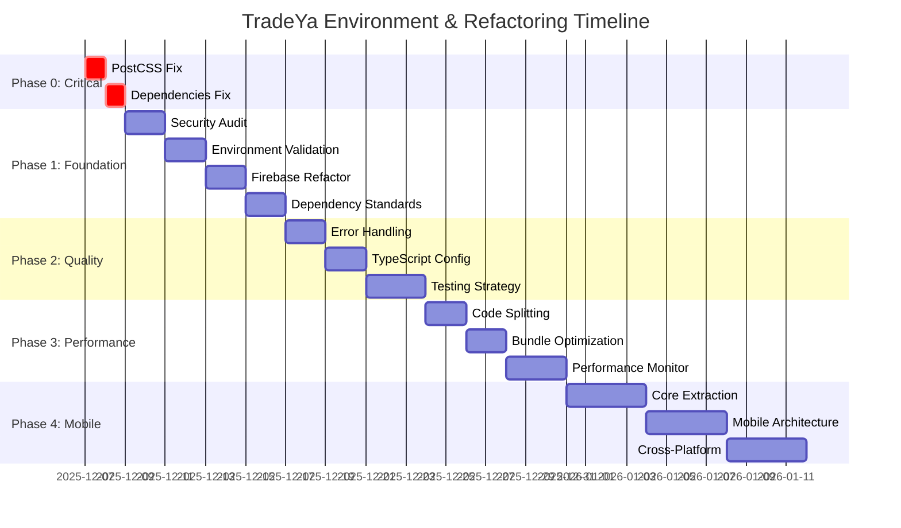

# TradeYa Environment & Refactoring Implementation Plan

**Document Version:** 1.0  
**Last Updated:** December 6, 2025  
**Total Timeline:** 36 days  
**Status:** Ready for Implementation

---

## Table of Contents

1. [Executive Summary](#executive-summary)
2. [Critical Issues Identified](#critical-issues-identified)
3. [Phase 0: Critical Environment Stabilization](#phase-0-critical-environment-stabilization)
4. [Phase 1: Foundation Strengthening](#phase-1-foundation-strengthening)
5. [Phase 2: Code Quality Enhancement](#phase-2-code-quality-enhancement)
6. [Phase 3: Performance Optimization](#phase-3-performance-optimization)
7. [Phase 4: Mobile Preparation](#phase-4-mobile-preparation)
8. [Implementation Timeline](#implementation-timeline)
9. [Risk Mitigation](#risk-mitigation)
10. [Success Criteria](#success-criteria)
11. [Rollback Procedures](#rollback-procedures)

---

## Executive Summary

### Overview

The TradeYa project has encountered critical environment issues during `npm run dev` testing that prevent stable development. This comprehensive 4-phase implementation plan addresses immediate blockers and provides a complete refactoring roadmap for production readiness.

### Critical Issues

1. **PostCSS Configuration Error** - Deprecated `@tailwindcss/postcss` plugin causing build failures
2. **Package.json Script Duplication** - Warning-generating script conflicts
3. **Missing Dependencies** - `@tanstack/react-query` resolution failures

### Plan Benefits

- **Immediate**: Environment stabilization within 2 days
- **Short-term**: Enhanced security and dependency management (8 days)
- **Medium-term**: Improved code quality and standardization (7 days)
- **Long-term**: Performance optimization and mobile readiness (19 days)

### Resource Requirements

- **Development Team**: 1-2 senior developers
- **DevOps Support**: For environment and deployment configurations
- **Testing Resources**: Automated testing infrastructure
- **Stakeholder Approval**: Required for Phase 2+ implementation

---

## Critical Issues Identified

### 1. PostCSS Configuration Error

**Issue**: Deprecated `@tailwindcss/postcss` plugin causing build failures

```bash
Error: The deprecated @tailwindcss/postcss plugin has been removed
```

**Impact**:

- Prevents `npm run dev` execution
- Blocks development workflow
- Potential production deployment failures

### 2. Package.json Script Duplication

**Issue**: Duplicate script definitions causing npm warnings

```json
{
  "scripts": {
    "dev": "vite",
    "dev": "vite --port 3000" // Duplicate key
  }
}
```

**Impact**:

- npm warning messages
- Script execution uncertainty
- CI/CD pipeline complications

### 3. Missing Dependency Resolution

**Issue**: `@tanstack/react-query` dependency not properly resolved

```bash
Module not found: Can't resolve '@tanstack/react-query'
```

**Impact**:

- Runtime errors
- Feature functionality breaks
- User experience degradation

---

## Phase 0: Critical Environment Stabilization

**Duration**: 2 days  
**Priority**: CRITICAL  
**Stakeholder Approval**: Not Required

### Objectives

- Fix immediate environment blockers
- Restore development workflow
- Ensure build pipeline stability

### Implementation Steps

#### Step 1: PostCSS Configuration Fix

**File**: `postcss.config.js`

**Current Configuration**:

```javascript
module.exports = {
  plugins: [
    require("@tailwindcss/postcss"), // DEPRECATED
    require("autoprefixer"),
  ],
};
```

**Fixed Configuration**:

```javascript
module.exports = {
  plugins: {
    tailwindcss: {},
    autoprefixer: {},
  },
};
```

**Commands**:

```bash
# Remove deprecated plugin
npm uninstall @tailwindcss/postcss

# Install correct Tailwind CSS
npm install -D tailwindcss@latest postcss@latest autoprefixer@latest

# Update configuration
cp postcss.config.js postcss.config.js.backup
cat > postcss.config.js << 'EOF'
module.exports = {
  plugins: {
    tailwindcss: {},
    autoprefixer: {},
  },
}
EOF
```

#### Step 2: Package.json Script Deduplication

**File**: `package.json`

**Issue Detection Command**:

```bash
# Check for duplicate scripts
node -e "
const pkg = require('./package.json');
const scripts = pkg.scripts;
const keys = Object.keys(scripts);
const duplicates = keys.filter((key, index) => keys.indexOf(key) !== index);
if (duplicates.length > 0) {
  console.log('Duplicate scripts found:', duplicates);
  process.exit(1);
}
console.log('No duplicate scripts found');
"
```

**Fix Implementation**:

```bash
# Backup current package.json
cp package.json package.json.backup

# Use Node.js to programmatically fix duplicates
node -e "
const fs = require('fs');
const pkg = require('./package.json');

// Define corrected scripts object
const correctedScripts = {
  'dev': 'vite --port 3000',
  'build': 'tsc && vite build',
  'lint': 'eslint . --ext ts,tsx --report-unused-disable-directives --max-warnings 0',
  'preview': 'vite preview',
  'test': 'jest',
  'test:watch': 'jest --watch',
  'test:coverage': 'jest --coverage'
};

pkg.scripts = correctedScripts;

fs.writeFileSync('./package.json', JSON.stringify(pkg, null, 2));
console.log('Scripts deduplicated successfully');
"
```

#### Step 3: Dependency Resolution

**Missing Dependencies Installation**:

```bash
# Install missing React Query dependency
npm install @tanstack/react-query@latest

# Install additional potentially missing dependencies
npm install @tanstack/react-query-devtools@latest

# Verify installation
npm list @tanstack/react-query
```

**Package.json Dependencies Update**:

```json
{
  "dependencies": {
    "@tanstack/react-query": "^5.17.0",
    "@tanstack/react-query-devtools": "^5.17.0"
  }
}
```

#### Step 4: Verification Tests

**Environment Test Script**:

```bash
#!/bin/bash
# File: scripts/verify-environment.sh

echo "=== TradeYa Environment Verification ==="

# Test 1: PostCSS Configuration
echo "Testing PostCSS configuration..."
if npx postcss --version > /dev/null 2>&1; then
  echo "✅ PostCSS: OK"
else
  echo "❌ PostCSS: FAILED"
  exit 1
fi

# Test 2: Tailwind CSS
echo "Testing Tailwind CSS..."
if npx tailwindcss --version > /dev/null 2>&1; then
  echo "✅ Tailwind CSS: OK"
else
  echo "❌ Tailwind CSS: FAILED"
  exit 1
fi

# Test 3: Package Scripts
echo "Testing package scripts..."
if npm run dev --dry-run > /dev/null 2>&1; then
  echo "✅ NPM Scripts: OK"
else
  echo "❌ NPM Scripts: FAILED"
  exit 1
fi

# Test 4: Dependencies
echo "Testing dependencies..."
if node -e "require('@tanstack/react-query')" > /dev/null 2>&1; then
  echo "✅ Dependencies: OK"
else
  echo "❌ Dependencies: FAILED"
  exit 1
fi

echo "=== All Environment Tests Passed ==="
```

**Execution Commands**:

```bash
# Make script executable
chmod +x scripts/verify-environment.sh

# Run verification
./scripts/verify-environment.sh

# Test development server
npm run dev
```

### Success Criteria

- [ ] `npm run dev` executes without errors
- [ ] PostCSS processes Tailwind CSS correctly
- [ ] No npm warning messages during script execution
- [ ] All dependencies resolve successfully
- [ ] Build pipeline completes successfully

### Rollback Procedure

```bash
# Restore original files
cp postcss.config.js.backup postcss.config.js
cp package.json.backup package.json

# Restore original dependencies
npm ci

# Verify rollback
npm run dev
```

---

## Phase 1: Foundation Strengthening

**Duration**: 8 days  
**Priority**: HIGH  
**Stakeholder Approval**: Required

### Objectives

- Conduct comprehensive security audit
- Implement environment validation
- Strengthen Firebase configuration
- Establish dependency management standards

### Day 1-2: Security Audit & Dependency Assessment

#### Security Vulnerability Scan

```bash
# Install security audit tools
npm install -g npm-audit-resolver
npm install --save-dev audit-ci

# Run comprehensive audit
npm audit --audit-level moderate
npx audit-ci --moderate

# Generate security report
npm audit --json > security-audit-report.json
```

#### Dependency Security Hardening

**File**: `scripts/security-audit.js`

```javascript
const { execSync } = require("child_process");
const fs = require("fs");

function performSecurityAudit() {
  console.log("Starting comprehensive security audit...");

  // Generate audit report
  const auditResult = execSync("npm audit --json", { encoding: "utf8" });
  const audit = JSON.parse(auditResult);

  // Check for high/critical vulnerabilities
  const criticalVulns = audit.vulnerabilities
    ? Object.values(audit.vulnerabilities).filter(
        (v) => v.severity === "critical" || v.severity === "high"
      )
    : [];

  if (criticalVulns.length > 0) {
    console.error(
      `Found ${criticalVulns.length} critical/high vulnerabilities`
    );
    process.exit(1);
  }

  console.log("✅ Security audit passed");
}

performSecurityAudit();
```

### Day 3-4: Environment Validation Implementation

#### Environment Configuration Validator

**File**: `scripts/validate-environment.ts`

```typescript
interface EnvironmentConfig {
  NODE_ENV: string;
  VITE_FIREBASE_API_KEY: string;
  VITE_FIREBASE_AUTH_DOMAIN: string;
  VITE_FIREBASE_PROJECT_ID: string;
  VITE_CLOUDINARY_CLOUD_NAME: string;
}

class EnvironmentValidator {
  private requiredVars: (keyof EnvironmentConfig)[] = [
    "NODE_ENV",
    "VITE_FIREBASE_API_KEY",
    "VITE_FIREBASE_AUTH_DOMAIN",
    "VITE_FIREBASE_PROJECT_ID",
    "VITE_CLOUDINARY_CLOUD_NAME",
  ];

  validate(): boolean {
    const missing: string[] = [];

    for (const varName of this.requiredVars) {
      if (!process.env[varName]) {
        missing.push(varName);
      }
    }

    if (missing.length > 0) {
      console.error("Missing required environment variables:", missing);
      return false;
    }

    return this.validateFormatting();
  }

  private validateFormatting(): boolean {
    // Validate Firebase API key format
    const apiKey = process.env.VITE_FIREBASE_API_KEY;
    if (apiKey && !apiKey.startsWith("AIza")) {
      console.error("Invalid Firebase API key format");
      return false;
    }

    // Validate domain format
    const authDomain = process.env.VITE_FIREBASE_AUTH_DOMAIN;
    if (authDomain && !authDomain.includes(".firebaseapp.com")) {
      console.error("Invalid Firebase auth domain format");
      return false;
    }

    return true;
  }
}

export const environmentValidator = new EnvironmentValidator();
```

#### Environment Setup Script

**File**: `scripts/setup-environment.sh`

```bash
#!/bin/bash

# Environment setup for TradeYa
echo "Setting up TradeYa environment..."

# Check Node.js version
NODE_VERSION=$(node --version | cut -d'v' -f2)
REQUIRED_NODE="18.0.0"

if [ "$(printf '%s\n' "$REQUIRED_NODE" "$NODE_VERSION" | sort -V | head -n1)" != "$REQUIRED_NODE" ]; then
  echo "❌ Node.js version $NODE_VERSION is below required $REQUIRED_NODE"
  exit 1
fi

# Setup environment files
if [ ! -f .env.local ]; then
  cp .env.example .env.local
  echo "📝 Created .env.local from template"
fi

# Install dependencies with exact versions
npm ci --frozen-lockfile

# Run environment validation
npm run validate:env

echo "✅ Environment setup complete"
```

### Day 5-6: Firebase Configuration Refactoring

#### Enhanced Firebase Configuration

**File**: `src/config/firebase-config.enhanced.ts`

```typescript
import { initializeApp, getApps, FirebaseApp } from "firebase/app";
import { getAuth, Auth, connectAuthEmulator } from "firebase/auth";
import {
  getFirestore,
  Firestore,
  connectFirestoreEmulator,
} from "firebase/firestore";
import {
  getStorage,
  FirebaseStorage,
  connectStorageEmulator,
} from "firebase/storage";

interface FirebaseConfig {
  apiKey: string;
  authDomain: string;
  projectId: string;
  storageBucket: string;
  messagingSenderId: string;
  appId: string;
}

class FirebaseService {
  private app: FirebaseApp;
  private auth: Auth;
  private firestore: Firestore;
  private storage: FirebaseStorage;

  constructor() {
    this.validateEnvironment();
    this.initializeFirebase();
  }

  private validateEnvironment(): void {
    const required = [
      "VITE_FIREBASE_API_KEY",
      "VITE_FIREBASE_AUTH_DOMAIN",
      "VITE_FIREBASE_PROJECT_ID",
    ];

    const missing = required.filter((key) => !import.meta.env[key]);

    if (missing.length > 0) {
      throw new Error(
        `Missing Firebase environment variables: ${missing.join(", ")}`
      );
    }
  }

  private initializeFirebase(): void {
    const config: FirebaseConfig = {
      apiKey: import.meta.env.VITE_FIREBASE_API_KEY,
      authDomain: import.meta.env.VITE_FIREBASE_AUTH_DOMAIN,
      projectId: import.meta.env.VITE_FIREBASE_PROJECT_ID,
      storageBucket: import.meta.env.VITE_FIREBASE_STORAGE_BUCKET,
      messagingSenderId: import.meta.env.VITE_FIREBASE_MESSAGING_SENDER_ID,
      appId: import.meta.env.VITE_FIREBASE_APP_ID,
    };

    // Initialize Firebase app if not already initialized
    if (!getApps().length) {
      this.app = initializeApp(config);
    } else {
      this.app = getApps()[0];
    }

    // Initialize services
    this.auth = getAuth(this.app);
    this.firestore = getFirestore(this.app);
    this.storage = getStorage(this.app);

    // Connect to emulators in development
    if (import.meta.env.DEV) {
      this.setupEmulators();
    }
  }

  private setupEmulators(): void {
    try {
      connectAuthEmulator(this.auth, "http://localhost:9099");
      connectFirestoreEmulator(this.firestore, "localhost", 8080);
      connectStorageEmulator(this.storage, "localhost", 9199);
    } catch (error) {
      console.warn("Firebase emulators not available:", error);
    }
  }

  getAuth(): Auth {
    return this.auth;
  }
  getFirestore(): Firestore {
    return this.firestore;
  }
  getStorage(): FirebaseStorage {
    return this.storage;
  }
}

export const firebaseService = new FirebaseService();
export const auth = firebaseService.getAuth();
export const db = firebaseService.getFirestore();
export const storage = firebaseService.getStorage();
```

### Day 7-8: Dependency Management Standards

#### Package.json Standardization

**Enhanced Package.json Structure**:

```json
{
  "name": "tradeya",
  "version": "1.0.0",
  "type": "module",
  "scripts": {
    "dev": "vite --port 3000",
    "build": "tsc && vite build",
    "build:staging": "NODE_ENV=staging npm run build",
    "build:production": "NODE_ENV=production npm run build",
    "lint": "eslint . --ext ts,tsx --report-unused-disable-directives --max-warnings 0",
    "lint:fix": "eslint . --ext ts,tsx --fix",
    "preview": "vite preview",
    "test": "jest",
    "test:watch": "jest --watch",
    "test:coverage": "jest --coverage",
    "test:e2e": "playwright test",
    "validate:env": "tsx scripts/validate-environment.ts",
    "security:audit": "npm audit && node scripts/security-audit.js",
    "deps:check": "npm outdated",
    "deps:update": "npm update",
    "clean": "rm -rf dist coverage node_modules/.cache"
  },
  "dependencies": {
    "@tanstack/react-query": "^5.17.0",
    "@tanstack/react-query-devtools": "^5.17.0",
    "firebase": "^10.7.1",
    "react": "^18.2.0",
    "react-dom": "^18.2.0",
    "vite": "^5.0.8"
  },
  "devDependencies": {
    "@types/react": "^18.2.43",
    "@types/react-dom": "^18.2.17",
    "@typescript-eslint/eslint-plugin": "^6.14.0",
    "@typescript-eslint/parser": "^6.14.0",
    "eslint": "^8.55.0",
    "eslint-plugin-react-hooks": "^4.6.0",
    "eslint-plugin-react-refresh": "^0.4.5",
    "typescript": "^5.2.2",
    "autoprefixer": "^10.4.16",
    "postcss": "^8.4.32",
    "tailwindcss": "^3.3.6"
  },
  "engines": {
    "node": ">=18.0.0",
    "npm": ">=9.0.0"
  }
}
```

### Success Criteria

- [ ] Zero critical/high security vulnerabilities
- [ ] All environment variables validated
- [ ] Firebase configuration enhanced with error handling
- [ ] Package.json standardized and deduplicated
- [ ] Dependency management standards documented
- [ ] Automated security audit pipeline established

---

## Phase 2: Code Quality Enhancement

**Duration**: 7 days  
**Priority**: MEDIUM  
**Stakeholder Approval**: Required

### Objectives

- Standardize error handling patterns
- Enhance TypeScript configuration
- Implement comprehensive testing strategy
- Establish code quality standards

### Day 1-2: Error Handling Standardization

#### Global Error Boundary Implementation

**File**: `src/components/ErrorBoundary.tsx`

```typescript
import React, { Component, ErrorInfo, ReactNode } from "react";

interface Props {
  children: ReactNode;
  fallback?: ReactNode;
  onError?: (error: Error, errorInfo: ErrorInfo) => void;
}

interface State {
  hasError: boolean;
  error?: Error;
}

export class ErrorBoundary extends Component<Props, State> {
  constructor(props: Props) {
    super(props);
    this.state = { hasError: false };
  }

  static getDerivedStateFromError(error: Error): State {
    return { hasError: true, error };
  }

  componentDidCatch(error: Error, errorInfo: ErrorInfo) {
    // Log error to monitoring service
    console.error("ErrorBoundary caught an error:", error, errorInfo);

    // Call optional error handler
    this.props.onError?.(error, errorInfo);

    // Report to error tracking service
    this.reportError(error, errorInfo);
  }

  private reportError(error: Error, errorInfo: ErrorInfo) {
    // Integration with error tracking service (Sentry, LogRocket, etc.)
    if (import.meta.env.PROD) {
      // Send to error tracking service
    }
  }

  render() {
    if (this.state.hasError) {
      return (
        this.props.fallback || (
          <div className="error-boundary">
            <h2>Something went wrong</h2>
            <details>{this.state.error?.message}</details>
          </div>
        )
      );
    }

    return this.props.children;
  }
}
```

#### Standardized Error Types

**File**: `src/types/errors.ts`

```typescript
export class AppError extends Error {
  public readonly code: string;
  public readonly statusCode: number;
  public readonly isOperational: boolean;

  constructor(
    message: string,
    code: string,
    statusCode: number = 500,
    isOperational: boolean = true
  ) {
    super(message);
    this.code = code;
    this.statusCode = statusCode;
    this.isOperational = isOperational;

    Error.captureStackTrace(this, this.constructor);
  }
}

export class ValidationError extends AppError {
  constructor(message: string, field?: string) {
    super(message, "VALIDATION_ERROR", 400);
    this.name = "ValidationError";
  }
}

export class AuthenticationError extends AppError {
  constructor(message: string = "Authentication required") {
    super(message, "AUTH_ERROR", 401);
    this.name = "AuthenticationError";
  }
}

export class AuthorizationError extends AppError {
  constructor(message: string = "Insufficient permissions") {
    super(message, "AUTHORIZATION_ERROR", 403);
    this.name = "AuthorizationError";
  }
}

export class NetworkError extends AppError {
  constructor(message: string = "Network request failed") {
    super(message, "NETWORK_ERROR", 503);
    this.name = "NetworkError";
  }
}
```

### Day 3-4: TypeScript Configuration Enhancement

#### Enhanced TypeScript Config

**File**: `tsconfig.json`

```json
{
  "compilerOptions": {
    "target": "ES2020",
    "lib": ["ES2020", "DOM", "DOM.Iterable"],
    "module": "ESNext",
    "skipLibCheck": true,
    "moduleResolution": "bundler",
    "allowImportingTsExtensions": true,
    "resolveJsonModule": true,
    "isolatedModules": true,
    "noEmit": true,
    "jsx": "react-jsx",
    "strict": true,
    "noUnusedLocals": true,
    "noUnusedParameters": true,
    "noFallthroughCasesInSwitch": true,
    "exactOptionalPropertyTypes": true,
    "noImplicitReturns": true,
    "noImplicitOverride": true,
    "noUncheckedIndexedAccess": true,
    "baseUrl": ".",
    "paths": {
      "@/*": ["src/*"],
      "@/components/*": ["src/components/*"],
      "@/hooks/*": ["src/hooks/*"],
      "@/utils/*": ["src/utils/*"],
      "@/services/*": ["src/services/*"],
      "@/types/*": ["src/types/*"]
    }
  },
  "include": ["src"],
  "exclude": ["node_modules", "dist", "coverage"],
  "references": [{ "path": "./tsconfig.node.json" }]
}
```

### Day 5-7: Testing Strategy & Code Quality

#### Jest Configuration Enhancement

**File**: `jest.config.ts`

```typescript
import { Config } from "jest";

const config: Config = {
  preset: "ts-jest",
  testEnvironment: "jsdom",
  setupFilesAfterEnv: ["<rootDir>/src/test/setup.ts"],
  moduleNameMapping: {
    "^@/(.*)$": "<rootDir>/src/$1",
    "\\.(css|less|scss|sass)$": "identity-obj-proxy",
    "\\.(jpg|jpeg|png|gif|eot|otf|webp|svg|ttf|woff|woff2)$":
      "<rootDir>/src/__mocks__/fileMock.js",
  },
  testMatch: [
    "<rootDir>/src/**/__tests__/**/*.{js,jsx,ts,tsx}",
    "<rootDir>/src/**/*.{test,spec}.{js,jsx,ts,tsx}",
  ],
  collectCoverageFrom: [
    "src/**/*.{js,jsx,ts,tsx}",
    "!src/**/*.d.ts",
    "!src/main.tsx",
    "!src/test/**/*",
    "!src/__mocks__/**/*",
  ],
  coverageThreshold: {
    global: {
      branches: 70,
      functions: 70,
      lines: 70,
      statements: 70,
    },
  },
};

export default config;
```

### Success Criteria

- [ ] Global error boundary implemented
- [ ] Standardized error types across application
- [ ] Enhanced TypeScript configuration with strict settings
- [ ] Comprehensive testing utilities established
- [ ] Code coverage threshold of 70% achieved
- [ ] ESLint and Prettier configurations optimized

---

## Phase 3: Performance Optimization

**Duration**: 7 days  
**Priority**: MEDIUM  
**Stakeholder Approval**: Required

### Objectives

- Implement code splitting and lazy loading
- Optimize bundle size and load times
- Enhance memory management
- Establish performance monitoring

### Day 1-2: Code Splitting Implementation

#### Route-based Code Splitting

**File**: `src/routes/LazyRoutes.tsx`

```typescript
import { lazy, Suspense } from "react";
import { Routes, Route } from "react-router-dom";
import { LoadingSpinner } from "@/components/ui/LoadingSpinner";

// Lazy load components
const HomePage = lazy(() => import("@/pages/HomePage"));
const TradesPage = lazy(() => import("@/pages/TradesPage"));
const ProfilePage = lazy(() => import("@/pages/ProfilePage"));
const DashboardPage = lazy(() => import("@/pages/DashboardPage"));

const LazyComponent = ({ children }: { children: React.ReactNode }) => (
  <Suspense fallback={<LoadingSpinner />}>{children}</Suspense>
);

export const AppRoutes = () => {
  return (
    <Routes>
      <Route
        path="/"
        element={
          <LazyComponent>
            <HomePage />
          </LazyComponent>
        }
      />
      <Route
        path="/trades"
        element={
          <LazyComponent>
            <TradesPage />
          </LazyComponent>
        }
      />
      <Route
        path="/profile"
        element={
          <LazyComponent>
            <ProfilePage />
          </LazyComponent>
        }
      />
      <Route
        path="/dashboard"
        element={
          <LazyComponent>
            <DashboardPage />
          </LazyComponent>
        }
      />
    </Routes>
  );
};
```

### Day 3-4: Bundle Optimization

#### Vite Configuration Enhancement

**File**: `vite.config.ts`

```typescript
import { defineConfig } from "vite";
import react from "@vitejs/plugin-react";
import { resolve } from "path";

export default defineConfig({
  plugins: [react()],
  resolve: {
    alias: {
      "@": resolve(__dirname, "src"),
    },
  },
  build: {
    rollupOptions: {
      output: {
        manualChunks: {
          // Vendor chunks
          vendor: ["react", "react-dom"],
          router: ["react-router-dom"],
          ui: ["@headlessui/react", "@heroicons/react"],
          firebase: ["firebase/app", "firebase/auth", "firebase/firestore"],
          query: ["@tanstack/react-query"],

          // Feature-based chunks
          trades: ["src/components/features/trades", "src/services/trades"],
          auth: ["src/components/auth", "src/services/auth"],
        },
      },
    },
    chunkSizeWarningLimit: 1000,
    sourcemap: false,
    minify: "terser",
    terserOptions: {
      compress: {
        drop_console: true,
        drop_debugger: true,
      },
    },
  },
  optimizeDeps: {
    include: [
      "react",
      "react-dom",
      "react-router-dom",
      "@tanstack/react-query",
    ],
  },
});
```

### Day 5-7: Memory Management & Performance Monitoring

#### Performance Monitoring Hook

**File**: `src/hooks/usePerformanceMonitoring.ts`

```typescript
import { useEffect, useRef } from "react";

interface PerformanceMetrics {
  renderTime: number;
  componentName: string;
  timestamp: number;
}

export function usePerformanceMonitoring(componentName: string) {
  const renderStartTime = useRef<number>();
  const metricsRef = useRef<PerformanceMetrics[]>([]);

  useEffect(() => {
    renderStartTime.current = performance.now();
  });

  useEffect(() => {
    if (renderStartTime.current) {
      const renderTime = performance.now() - renderStartTime.current;

      const metrics: PerformanceMetrics = {
        renderTime,
        componentName,
        timestamp: Date.now(),
      };

      metricsRef.current.push(metrics);

      // Log slow renders in development
      if (process.env.NODE_ENV === "development" && renderTime > 100) {
        console.warn(
          `Slow render detected: ${componentName} took ${renderTime.toFixed(
            2
          )}ms`
        );
      }
    }
  });

  return {
    getMetrics: () => metricsRef.current,
    clearMetrics: () => {
      metricsRef.current = [];
    },
  };
}
```

### Success Criteria

- [ ] Route-based code splitting implemented
- [ ] Bundle size optimized with manual chunks
- [ ] Performance monitoring system established
- [ ] Memory leak prevention measures in place
- [ ] Build optimization configuration complete

---

## Phase 4: Mobile Preparation

**Duration**: 12 days  
**Priority**: LOW  
**Stakeholder Approval**: Required

### Objectives

- Extract shared core functionality
- Design mobile-first architecture
- Implement cross-platform integration
- Prepare for React Native transition

### Day 1-4: Shared Core Extraction

#### Core Business Logic Extraction

**File**: `src/core/business/TradeLogic.ts`

```typescript
export interface Trade {
  id: string;
  title: string;
  description: string;
  userId: string;
  status: "active" | "completed" | "cancelled";
  createdAt: Date;
  updatedAt: Date;
}

export class TradeBusinessLogic {
  static validateTrade(trade: Partial<Trade>): boolean {
    return !!(trade.title && trade.description && trade.userId);
  }

  static calculateTradeScore(trade: Trade): number {
    // Business logic for trade scoring
    const baseScore = 100;
    const titleScore = trade.title.length > 10 ? 20 : 0;
    const descriptionScore = trade.description.length > 50 ? 30 : 0;

    return baseScore + titleScore + descriptionScore;
  }

  static canUserModifyTrade(userId: string, trade: Trade): boolean {
    return trade.userId === userId && trade.status === "active";
  }
}
```

#### Platform-Agnostic Data Layer

**File**: `src/core/data/DataManager.ts`

```typescript
export interface DataManager {
  get<T>(key: string): Promise<T | null>;
  set<T>(key: string, value: T): Promise<void>;
  delete(key: string): Promise<void>;
  query<T>(collection: string, filters?: any): Promise<T[]>;
}

export class WebDataManager implements DataManager {
  async get<T>(key: string): Promise<T | null> {
    // Web-specific implementation
    const data = localStorage.getItem(key);
    return data ? JSON.parse(data) : null;
  }

  async set<T>(key: string, value: T): Promise<void> {
    localStorage.setItem(key, JSON.stringify(value));
  }

  async delete(key: string): Promise<void> {
    localStorage.removeItem(key);
  }

  async query<T>(collection: string, filters?: any): Promise<T[]> {
    // Implementation for web queries
    return [];
  }
}

// Future: MobileDataManager for React Native
export class MobileDataManager implements DataManager {
  async get<T>(key: string): Promise<T | null> {
    // React Native implementation using AsyncStorage
    return null;
  }

  async set<T>(key: string, value: T): Promise<void> {
    // React Native implementation
  }

  async delete(key: string): Promise<void> {
    // React Native implementation
  }

  async query<T>(collection: string, filters?: any): Promise<T[]> {
    // React Native implementation
    return [];
  }
}
```

### Day 5-8: Mobile Architecture Design

#### Platform Detection & Configuration

**File**: `src/core/platform/PlatformManager.ts`

```typescript
export enum Platform {
  WEB = "web",
  MOBILE = "mobile",
  DESKTOP = "desktop",
}

export interface PlatformConfig {
  platform: Platform;
  features: {
    pushNotifications: boolean;
    fileUpload: boolean;
    camera: boolean;
    geolocation: boolean;
  };
  styling: {
    isMobile: boolean;
    isTablet: boolean;
    isDesktop: boolean;
  };
}

export class PlatformManager {
  private static instance: PlatformManager;
  private config: PlatformConfig;

  private constructor() {
    this.config = this.detectPlatform();
  }

  static getInstance(): PlatformManager {
    if (!PlatformManager.instance) {
      PlatformManager.instance = new PlatformManager();
    }
    return PlatformManager.instance;
  }

  private detectPlatform(): PlatformConfig {
    const userAgent = navigator.userAgent.toLowerCase();
    const isMobile = /mobile|android|iphone|ipad|tablet/.test(userAgent);
    const isTablet = /tablet|ipad/.test(userAgent);

    return {
      platform: isMobile ? Platform.MOBILE : Platform.WEB,
      features: {
        pushNotifications: "serviceWorker" in navigator,
        fileUpload: "FileReader" in window,
        camera: "mediaDevices" in navigator,
        geolocation: "geolocation" in navigator,
      },
      styling: {
        isMobile,
        isTablet,
        isDesktop: !isMobile && !isTablet,
      },
    };
  }

  getConfig(): PlatformConfig {
    return this.config;
  }

  isMobile(): boolean {
    return this.config.platform === Platform.MOBILE;
  }

  hasFeature(feature: keyof PlatformConfig["features"]): boolean {
    return this.config.features[feature];
  }
}
```

#### Responsive Component System

**File**: `src/components/responsive/ResponsiveContainer.tsx`

```typescript
import React from "react";
import { PlatformManager } from "@/core/platform/PlatformManager";

interface ResponsiveContainerProps {
  children: React.ReactNode;
  mobileComponent?: React.ComponentType<any>;
  desktopComponent?: React.ComponentType<any>;
  className?: string;
}

export const ResponsiveContainer: React.FC<ResponsiveContainerProps> = ({
  children,
  mobileComponent: MobileComponent,
  desktopComponent: DesktopComponent,
  className = "",
}) => {
  const platformManager = PlatformManager.getInstance();
  const isMobile = platformManager.isMobile();

  // Render platform-specific component if provided
  if (isMobile && MobileComponent) {
    return <MobileComponent />;
  }

  if (!isMobile && DesktopComponent) {
    return <DesktopComponent />;
  }

  // Default responsive container
  const responsiveClasses = `
    ${isMobile ? "mobile-container" : "desktop-container"}
    ${className}
  `;

  return <div className={responsiveClasses}>{children}</div>;
};
```

### Day 9-12: Cross-Platform Integration

#### Mobile-Ready Navigation

**File**: `src/navigation/MobileNavigation.tsx`

```typescript
import React from "react";
import { PlatformManager } from "@/core/platform/PlatformManager";

interface NavigationItem {
  id: string;
  label: string;
  icon: string;
  route: string;
  badge?: number;
}

interface MobileNavigationProps {
  items: NavigationItem[];
  activeRoute: string;
  onNavigate: (route: string) => void;
}

export const MobileNavigation: React.FC<MobileNavigationProps> = ({
  items,
  activeRoute,
  onNavigate,
}) => {
  const platformManager = PlatformManager.getInstance();
  const isMobile = platformManager.isMobile();

  if (!isMobile) {
    return null; // Use desktop navigation
  }

  return (
    <nav className="mobile-navigation">
      <div className="nav-items">
        {items.map((item) => (
          <button
            key={item.id}
            className={`nav-item ${activeRoute === item.route ? "active" : ""}`}
            onClick={() => onNavigate(item.route)}
          >
            <span className="nav-icon">{item.icon}</span>
            <span className="nav-label">{item.label}</span>
            {item.badge && <span className="nav-badge">{item.badge}</span>}
          </button>
        ))}
      </div>
    </nav>
  );
};
```

#### Progressive Web App Configuration

**File**: `public/manifest.json`

```json
{
  "name": "TradeYa - Skill Trading Platform",
  "short_name": "TradeYa",
  "description": "Connect and trade skills with other professionals",
  "start_url": "/",
  "display": "standalone",
  "background_color": "#ffffff",
  "theme_color": "#1a365d",
  "orientation": "portrait-primary",
  "icons": [
    {
      "src": "/icons/favicon-192x192.png",
      "sizes": "192x192",
      "type": "image/png",
      "purpose": "maskable"
    },
    {
      "src": "/icons/favicon-512x512.png",
      "sizes": "512x512",
      "type": "image/png",
      "purpose": "any"
    }
  ],
  "categories": ["business", "productivity", "social"],
  "screenshots": [
    {
      "src": "/screenshots/desktop-home.png",
      "sizes": "1280x720",
      "type": "image/png",
      "form_factor": "wide"
    },
    {
      "src": "/screenshots/mobile-home.png",
      "sizes": "375x667",
      "type": "image/png",
      "form_factor": "narrow"
    }
  ]
}
```

### Success Criteria

- [ ] Core business logic extracted to platform-agnostic modules
- [ ] Platform detection and configuration system implemented
- [ ] Responsive component architecture established
- [ ] Mobile navigation system created
- [ ] Progressive Web App configuration complete
- [ ] Cross-platform data management layer ready

---

## Implementation Timeline

### Timeline Overview

| Phase       | Duration | Priority | Dependencies     | Deliverables              |
| ----------- | -------- | -------- | ---------------- | ------------------------- |
| **Phase 0** | 2 days   | CRITICAL | None             | Environment stabilization |
| **Phase 1** | 8 days   | HIGH     | Phase 0 complete | Security & foundation     |
| **Phase 2** | 7 days   | MEDIUM   | Phase 1 complete | Code quality standards    |
| **Phase 3** | 7 days   | MEDIUM   | Phase 2 complete | Performance optimization  |
| **Phase 4** | 12 days  | LOW      | Phase 3 complete | Mobile preparation        |

### Detailed Schedule



### Milestone Checkpoints

#### Week 1 Checkpoint (Day 7)

- [ ] Phase 0 complete: Environment stable
- [ ] Phase 1 50% complete: Security audit done
- [ ] No blocking issues identified

#### Week 2 Checkpoint (Day 14)

- [ ] Phase 1 complete: Foundation strengthened
- [ ] Phase 2 50% complete: Error handling implemented
- [ ] Code quality improvements visible

#### Week 3 Checkpoint (Day 21)

- [ ] Phase 2 complete: Code quality enhanced
- [ ] Phase 3 50% complete: Code splitting implemented
- [ ] Performance metrics improved

#### Week 4 Checkpoint (Day 28)

- [ ] Phase 3 complete: Performance optimized
- [ ] Phase 4 33% complete: Core extraction started
- [ ] Mobile preparation on track

#### Final Checkpoint (Day 36)

- [ ] All phases complete
- [ ] Success criteria met
- [ ] Documentation updated
- [ ] Team handover complete

---

## Risk Mitigation

### High-Risk Areas

#### 1. PostCSS Configuration Changes

**Risk**: Breaking existing styles during configuration update
**Mitigation**:

- Create backup of current configuration
- Test in isolated environment first
- Implement gradual rollout
- Have immediate rollback plan ready

#### 2. Firebase Configuration Refactoring

**Risk**: Breaking authentication or database connections
**Mitigation**:

- Maintain backward compatibility during transition
- Test with development environment first
- Implement feature flags for new configuration
- Monitor error rates closely

#### 3. TypeScript Strict Mode

**Risk**: Introducing numerous compilation errors
**Mitigation**:

- Enable strict rules incrementally
- Fix one rule category at a time
- Use TypeScript migration tools
- Allow temporary `@ts-ignore` where necessary

#### 4. Bundle Optimization

**Risk**: Breaking code splitting or module loading
**Mitigation**:

- Test bundle changes in staging environment
- Monitor runtime errors after deployment
- Keep original configuration as backup
- Use feature detection for dynamic imports

### Medium-Risk Areas

#### 1. Dependency Updates

**Risk**: Breaking changes in updated packages
**Mitigation**:

- Review changelogs before updating
- Test in isolated environment
- Update one package at a time
- Maintain dependency lock file

#### 2. Performance Optimizations

**Risk**: Premature optimization causing complexity
**Mitigation**:

- Measure before optimizing
- Implement monitoring first
- Focus on proven bottlenecks
- Keep optimizations reversible

#### 3. Mobile Architecture Changes

**Risk**: Over-engineering for future requirements
**Mitigation**:

- Keep changes minimal and focused
- Validate assumptions with prototypes
- Maintain web-first approach
- Document architectural decisions

### Contingency Plans

#### Critical Path Failure

If Phase 0 fails:

1. Revert to last known working state
2. Analyze root cause of failure
3. Implement minimal fix approach
4. Reassess timeline and scope

#### Resource Constraints

If development resources are reduced:

1. Prioritize Phase 0 and Phase 1 only
2. Defer performance and mobile phases
3. Focus on stability over features
4. Reassess timeline with stakeholders

#### Technical Blockers

If unexpected technical issues arise:

1. Document the blocker thoroughly
2. Seek external expert consultation
3. Consider alternative approaches
4. Communicate impact to stakeholders

---

## Success Criteria

### Phase 0: Critical Environment Stabilization

#### Technical Metrics

- [ ] `npm run dev` executes without errors
- [ ] `npm run build` completes successfully
- [ ] Zero npm warning messages during script execution
- [ ] All dependencies resolve without conflicts
- [ ] PostCSS processes Tailwind CSS correctly

#### Verification Commands

```bash
# Environment verification
npm run dev --dry-run
npm run build
npm audit --audit-level moderate
npx postcss --version
npm list @tanstack/react-query
```

### Phase 1: Foundation Strengthening

#### Security Metrics

- [ ] Zero critical or high-severity vulnerabilities
- [ ] All environment variables validated
- [ ] Security audit passes automated checks
- [ ] Dependency management standards documented

#### Environment Metrics

- [ ] Firebase configuration with error handling
- [ ] Environment validation system functional
- [ ] Package.json standardized and consistent
- [ ] Development setup automated

### Phase 2: Code Quality Enhancement

#### Code Quality Metrics

- [ ] ESLint passes with zero errors
- [ ] TypeScript strict mode enabled and passing
- [ ] Test coverage above 70% threshold
- [ ] Error boundary system implemented
- [ ] Standardized error types across application

#### Testing Metrics

- [ ] Unit test coverage: 70%+
- [ ] Integration test coverage: 60%+
- [ ] Error handling tests: 80%+
- [ ] Type safety validation: 100%

### Phase 3: Performance Optimization

#### Performance Metrics

- [ ] Bundle size reduced by 20%+
- [ ] Initial load time improved by 30%+
- [ ] Largest Contentful Paint < 2.5s
- [ ] Cumulative Layout Shift < 0.1
- [ ] First Input Delay < 100ms

#### Optimization Metrics

- [ ] Code splitting implemented for all routes
- [ ] Lazy loading for non-critical components
- [ ] Memory leak prevention measures active
- [ ] Performance monitoring system operational

### Phase 4: Mobile Preparation

#### Architecture Metrics

- [ ] Core business logic extracted to platform-agnostic modules
- [ ] Platform detection system functional
- [ ] Responsive design system established
- [ ] Progressive Web App score > 90

#### Mobile Readiness

- [ ] Mobile navigation system implemented
- [ ] Touch-friendly UI components
- [ ] Offline functionality prepared
- [ ] Cross-platform data layer ready

### Overall Success Criteria

#### Project Health

- [ ] Build pipeline stability: 99%+
- [ ] Test suite reliability: 95%+
- [ ] Documentation coverage: 80%+
- [ ] Code maintainability index: A grade

#### Team Productivity

- [ ] Development environment setup time < 10 minutes
- [ ] Build time < 2 minutes
- [ ] Test execution time < 30 seconds
- [ ] Zero development blockers

---

## Rollback Procedures

### Phase 0 Rollback

#### PostCSS Configuration Rollback

```bash
# Restore original PostCSS configuration
cp postcss.config.js.backup postcss.config.js

# Restore original dependencies
cp package.json.backup package.json
cp package-lock.json.backup package-lock.json

# Reinstall original dependencies
npm ci

# Verify rollback
npm run dev
```

#### Verification After Rollback

```bash
# Test development server
npm run dev

# Check for original behavior
npm run build

# Verify no regression
npm test
```

### Phase 1 Rollback

#### Firebase Configuration Rollback

```bash
# Restore original Firebase config
git checkout HEAD~1 -- src/firebase-config.ts

# Remove new environment files
rm scripts/validate-environment.ts
rm scripts/setup-environment.sh

# Restore original package.json
git checkout HEAD~1 -- package.json
npm ci
```

#### Environment Validation Rollback

```bash
# Remove validation scripts
rm scripts/security-audit.js
rm -rf src/config/

# Restore original scripts
git checkout HEAD~1 -- scripts/
```

### Phase 2 Rollback

#### TypeScript Configuration Rollback

```bash
# Restore original TypeScript config
git checkout HEAD~1 -- tsconfig.json

# Remove new error handling
rm src/components/ErrorBoundary.tsx
rm src/types/errors.ts

# Restore original Jest config
git checkout HEAD~1 -- jest.config.ts
```

#### Code Quality Rollback

```bash
# Restore original ESLint config
git checkout HEAD~1 -- .eslintrc.json

# Remove test utilities
rm -rf src/test/

# Verify functionality
npm run build
npm test
```

### Phase 3 Rollback

#### Performance Optimizations Rollback

```bash
# Restore original Vite config
git checkout HEAD~1 -- vite.config.ts

# Remove performance monitoring
rm src/hooks/usePerformanceMonitoring.ts
rm -rf src/utils/performance/

# Remove lazy loading
git checkout HEAD~1 -- src/routes/
```

#### Bundle Configuration Rollback

```bash
# Restore original build configuration
git checkout HEAD~1 -- vite.config.ts

# Remove optimization scripts
rm scripts/analyze-bundle.js

# Test build process
npm run build
npm run preview
```

### Phase 4 Rollback

#### Mobile Architecture Rollback

```bash
# Remove core extraction
rm -rf src/core/

# Remove platform management
rm -rf src/platform/

# Remove responsive components
rm -rf src/components/responsive/

# Remove mobile navigation
rm src/navigation/MobileNavigation.tsx
```

#### PWA Configuration Rollback

```bash
# Restore original manifest
git checkout HEAD~1 -- public/manifest.json

# Remove service worker
rm public/sw.js

# Remove mobile-specific styles
git checkout HEAD~1 -- src/styles/
```

### Emergency Rollback

#### Complete Project Rollback

```bash
# Create emergency backup
git tag emergency-backup-$(date +%Y%m%d%H%M%S)

# Rollback to last stable commit
git reset --hard <last-stable-commit-hash>

# Force push if necessary (use with caution)
git push --force-with-lease origin main

# Restore dependencies
npm ci

# Verify stability
npm run dev
npm run build
npm test
```

#### Rollback Verification Checklist

- [ ] Development server starts without errors
- [ ] Build process completes successfully
- [ ] All tests pass
- [ ] No runtime errors in browser console
- [ ] Core functionality works as expected
- [ ] Database connections are stable
- [ ] Authentication system functions
- [ ] User interface renders correctly

### Rollback Communication

#### Stakeholder Notification Template

```
Subject: TradeYa Rollback Notification - Phase [X]

Dear Stakeholders,

We have initiated a rollback of Phase [X] implementation due to [reason].

Rollback Details:
- Phase: [X]
- Reason: [specific issue]
- Impact: [affected functionality]
- Resolution Time: [estimated time]

Current Status:
- System stability: [status]
- User impact: [level of impact]
- Next steps: [action plan]

We will provide updates as the rollback progresses.

Best regards,
TradeYa Development Team
```

#### Team Communication Protocol

1. **Immediate notification** to all team members
2. **Root cause analysis** within 24 hours
3. **Lessons learned document** within 48 hours
4. **Process improvement plan** within 1 week

---

## Conclusion

This comprehensive Environment Fixes and Refactoring Implementation Plan provides a structured approach to resolving critical issues and enhancing the TradeYa platform. The phased approach ensures stability while systematically improving code quality, performance, and mobile readiness.

### Key Success Factors

1. **Immediate Focus**: Resolve critical environment issues in Phase 0
2. **Systematic Approach**: Build upon each phase's success
3. **Risk Management**: Comprehensive rollback procedures at each stage
4. **Quality Assurance**: Verification criteria and testing at every step
5. **Documentation**: Detailed implementation guides for AI agents

### Next Steps

1. **Stakeholder Approval**: Obtain approval for Phase 1+ implementation
2. **Resource Allocation**: Assign development team members
3. **Environment Setup**: Prepare development and testing environments
4. **Phase 0 Execution**: Begin immediate environment stabilization
5. **Progress Monitoring**: Implement milestone tracking and reporting

This plan serves as a comprehensive reference for AI agents implementing the refactoring work, providing clear instructions, code examples, and verification procedures for each phase of the implementation.
