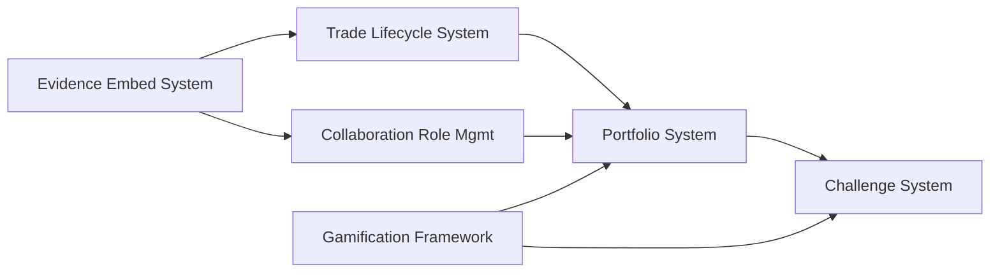

# TradeYa Implementation Master Plan

This document serves as the central roadmap for implementing all planned features in the TradeYa platform. It outlines the optimal order of implementation, breaks down each feature into manageable steps, and provides guidance to ensure seamless integration without breaking existing functionality.

## Table of Contents

1. [Implementation Order and Timeline](#implementation-order-and-timeline)
2. [Feature Dependencies](#feature-dependencies)
3. [Phase 1: Foundation Systems](#phase-1-foundation-systems)
4. [Phase 2: User Experience Enhancements](#phase-2-user-experience-enhancements)
5. [Phase 3: Advanced Features](#phase-3-advanced-features)
6. [Testing Strategy](#testing-strategy)
7. [Risk Mitigation](#risk-mitigation)
8. [Deployment Strategy](#deployment-strategy)

## Implementation Order and Timeline

Based on feature dependencies and complexity, here is the recommended implementation order:

### Phase 1: Foundation Systems (Weeks 1-8)
1. **Evidence Embed System** (Weeks 1-4)
   - Reference: [EVIDENCE_EMBED_SYSTEM.md](./EVIDENCE_EMBED_SYSTEM.md)
   - Foundation for multiple other features

2. **Trade Lifecycle System** (Weeks 5-10)
   - References:
     - [TRADE_LIFECYCLE_SYSTEM.md](./docs/TRADE_LIFECYCLE_SYSTEM.md)
     - [TRADE_CONFIRMATION_SYSTEM.md](./TRADE_CONFIRMATION_SYSTEM.md) (superseded)
     - [TRADE_CONFIRMATION_TECHNICAL.md](./TRADE_CONFIRMATION_TECHNICAL.md) (superseded)
   - Builds on evidence system
   - Includes both Trade Proposal Flow and Trade Confirmation System

### Phase 2: User Experience Enhancements (Weeks 9-16)
3. **Collaboration Role Management** (Weeks 9-12)
   - Reference: [COLLABORATION_ROLE_MANAGEMENT.md](./COLLABORATION_ROLE_MANAGEMENT.md)
   - Enhances existing collaboration system

4. **Basic Gamification Framework** (Weeks 13-16)
   - References:
     - [GAMIFICATION_PLAN.md](./GAMIFICATION_PLAN.md)
     - [CHALLENGE_GAMIFICATION.md](./CHALLENGE_GAMIFICATION.md)
   - Foundation for more advanced gamification features

### Phase 3: Advanced Features (Weeks 17-24)
5. **Portfolio System** (Weeks 17-20)
   - Reference: [PORTFOLIO_SYSTEM.md](./PORTFOLIO_SYSTEM.md)
   - Integrates with trade confirmation and evidence systems

6. **Challenge System** (Weeks 21-24)
   - Reference: [CHALLENGE_SYSTEM_PLAN.md](./CHALLENGE_SYSTEM_PLAN.md)
   - Most complex system, builds on all previous features

## Feature Dependencies

This dependency graph illustrates why the implementation order is critical. Each feature builds upon previously implemented systems, minimizing risk and maximizing value at each stage.

## Phase 1: Foundation Systems

### 1. Evidence Embed System (Weeks 1-4)

The evidence embed system allows users to showcase their work through embedded content from third-party platforms without storing media files directly.

#### Week 1: Core Utilities
- [ ] Implement `embedUtils.ts` with service detection and embed generation
- [ ] Create URL validation and security functions
- [ ] Build embed code generation utilities
- [ ] Set up thumbnail extraction services

#### Week 2: UI Components
- [ ] Develop `EvidenceSubmitter` component
- [ ] Create `EvidenceDisplay` component
- [ ] Build `EvidenceGallery` for multiple items
- [ ] Implement responsive design for all components

#### Week 3: Service Integration
- [ ] Integrate with Firebase for storing embed metadata
- [ ] Implement content security policy for safe embeds
- [ ] Create service functions for adding evidence to different entities
- [ ] Build error handling and fallback mechanisms

#### Week 4: Testing and Documentation
- [ ] Test with various embed services (YouTube, Vimeo, GitHub, etc.)
- [ ] Verify security measures and sanitization
- [ ] Ensure responsive display across devices
- [ ] Document usage patterns for other features

**Reference:** [EVIDENCE_EMBED_SYSTEM.md](./EVIDENCE_EMBED_SYSTEM.md)

### 2. Trade Lifecycle System (Weeks 5-10)

The Trade Lifecycle System manages trades from creation to completion, including proposal submission, acceptance, execution, and confirmation.

#### Week 5-6: Database Schema Updates ✅
- [x] Update Trade interface with new status values and fields
- [x] Create TradeSkill interface for structured skill representation
- [x] Create TradeProposal interface for trade proposals
- [x] Create ChangeRequest interface for tracking change requests
- [x] Set up evidence attachment integration

#### Week 7-8: Service Layer ✅
- [x] Implement trade proposal services (submit, retrieve, accept/reject)
- [x] Implement confirmation request/approval functions
- [x] Build evidence attachment services
- [x] Create notification triggers for trade status changes
- [x] Implement status transition logic

#### Week 9: UI Components ✅
- [x] Create TradeProposalForm component
- [x] Create TradeProposalCard component
- [x] Create TradeCompletionForm component
- [x] Create TradeConfirmationForm component
- [x] Update TradeDetailPage with proposal and confirmation UI
- [x] Create proposal dashboard for trade creators
- [x] Add status visualization and progress indicators

#### Week 10: Testing and Refinement ✅
- [x] Test complete trade lifecycle flow
- [x] Verify notifications and status updates
- [x] Test edge cases (timeouts, disputes, etc.)
- [x] Document integration points for portfolio system

**References:**
- [TRADE_LIFECYCLE_SYSTEM.md](./docs/TRADE_LIFECYCLE_SYSTEM.md)
- [TRADE_LIFECYCLE_IMPLEMENTATION_STATUS.md](./docs/TRADE_LIFECYCLE_IMPLEMENTATION_STATUS.md)

## Phase 2: User Experience Enhancements

### 3. Collaboration Role Management (Weeks 9-12)

The collaboration role management system enhances the existing collaboration feature with advanced role transitions, replacements, and status tracking.

#### Week 9: Database Schema Updates
- [ ] Enhance CollaborationRole interface
- [ ] Add role history and transition fields
- [ ] Create indexes for role queries
- [ ] Implement role status tracking

#### Week 10: Role Transition Logic
- [ ] Implement abandonment/removal workflows
- [ ] Build replacement application system
- [ ] Create role skipping functionality
- [ ] Set up notification system for role changes

#### Week 11: UI Components
- [ ] Update collaboration detail page
- [ ] Create role management interface
- [ ] Implement role application system
- [ ] Build role transition visualization

#### Week 12: Testing and Documentation
- [ ] Test role transition flows
- [ ] Verify notification delivery
- [ ] Test edge cases (multiple transitions, etc.)
- [ ] Document integration points for portfolio system

**Reference:** [COLLABORATION_ROLE_MANAGEMENT.md](./COLLABORATION_ROLE_MANAGEMENT.md)

### 4. Basic Gamification Framework (Weeks 13-16)

The gamification framework adds engagement mechanics including XP, levels, badges, and achievements to encourage platform participation.

#### Week 13: Core XP System
- [ ] Implement user XP tracking
- [ ] Create level progression logic
- [ ] Build XP award triggers
- [ ] Set up user level display

#### Week 14: Achievement System
- [ ] Create basic achievements
- [ ] Implement achievement tracking
- [ ] Build achievement display UI
- [ ] Set up notification triggers for achievements

#### Week 15: Integration Points
- [ ] Connect XP awards to existing actions (trades, collaborations)
- [ ] Add level indicators to user profiles
- [ ] Implement achievement notifications
- [ ] Create gamification settings for users

#### Week 16: Testing and Balancing
- [ ] Test XP accumulation rates
- [ ] Verify achievement triggers
- [ ] Balance progression curve
- [ ] Document integration points for challenge system

**References:**
- [GAMIFICATION_PLAN.md](./GAMIFICATION_PLAN.md)
- [CHALLENGE_GAMIFICATION.md](./CHALLENGE_GAMIFICATION.md)

## Phase 3: Advanced Features

### 5. Portfolio System (Weeks 17-20)

The portfolio system automatically stores and displays completed trades and collaborations on user profiles with visibility controls.

#### Week 17: Database Structure
- [ ] Create portfolio subcollections
- [ ] Implement portfolio item interface
- [ ] Set up security rules
- [ ] Create portfolio settings for users

#### Week 18: Automatic Generation
- [ ] Build portfolio generation from completed trades
- [ ] Create portfolio generation from collaborations
- [ ] Implement visibility controls
- [ ] Set up evidence display integration

#### Week 19: UI Components
- [ ] Add portfolio tab to profile
- [ ] Create portfolio item cards
- [ ] Build portfolio management interface
- [ ] Implement filtering and organization tools

#### Week 20: Testing and Refinement
- [ ] Test automatic generation
- [ ] Verify visibility controls
- [ ] Test with various evidence types
- [ ] Document integration points for challenge system

**Reference:** [PORTFOLIO_SYSTEM.md](./PORTFOLIO_SYSTEM.md)

### 6. Challenge System (Weeks 21-24)

The challenge system provides both AI-generated personalized challenges and scheduled community challenges to engage users and build skills.

#### Week 21: Core Challenge System
- [ ] Implement challenge data structure
- [ ] Create challenge participation tracking
- [ ] Build submission and evaluation system
- [ ] Set up challenge discovery interface

#### Week 22: Scheduled Challenges
- [ ] Implement challenge scheduling
- [ ] Create recurring challenge generation
- [ ] Build challenge calendar interface
- [ ] Set up leaderboards and rankings

#### Week 23: AI Integration
- [ ] Set up OpenRouter connection
- [ ] Implement template-based generation
- [ ] Create user clustering for efficiency
- [ ] Build personalized challenge recommendations

#### Week 24: Testing and Integration
- [ ] Test challenge completion flow
- [ ] Verify XP and badge awards
- [ ] Test AI challenge generation
- [ ] Finalize portfolio integration

**Reference:** [CHALLENGE_SYSTEM_PLAN.md](./CHALLENGE_SYSTEM_PLAN.md)

## Testing Strategy

### Unit Testing
- Test individual components in isolation
- Verify function behavior with various inputs
- Mock dependencies for controlled testing
- Aim for high coverage of core functionality

### Integration Testing
- Test interactions between new and existing systems
- Verify data flow between components
- Test boundary conditions and edge cases
- Ensure proper error handling

### User Flow Testing
- Test complete user journeys
- Verify expected outcomes
- Test error handling and recovery
- Ensure intuitive user experience

### Cross-Feature Testing
- Test interactions between new features
- Verify dependencies work correctly
- Test complex scenarios involving multiple features
- Ensure consistent behavior across the platform

## Risk Mitigation

### Feature Flagging
- Implement features behind toggles to control rollout
- Allow gradual activation of functionality
- Enable quick disabling if issues arise
- Test features with limited user groups

### Database Safety
- Use transactions for critical updates
- Implement schema validation
- Ensure backward compatibility
- Create backups before major migrations

### Performance Monitoring
- Monitor query performance
- Track component render times
- Implement error logging
- Set up usage analytics

### Fallback Mechanisms
- Provide graceful degradation
- Implement retry logic for critical operations
- Create user-friendly error states
- Design system to work with partial feature availability

## Deployment Strategy

### Phased Rollout
- Deploy features incrementally
- Start with small user groups
- Gather feedback before wider release
- Monitor performance and errors closely

### Feature Branches
- Develop each feature in isolated branches
- Merge only when tests pass and code is reviewed
- Use pull requests for code review
- Maintain clean separation of concerns

### Staging Environment
- Test in staging before production
- Perform integration testing in staging
- Validate with real data (anonymized if needed)
- Simulate production load when possible

### Monitoring and Feedback
- Implement error tracking
- Collect user feedback
- Monitor performance metrics
- Be prepared to roll back if necessary

---

This master plan provides a structured approach to implementing all planned features while maintaining system stability and ensuring proper integration between components. By following this phased implementation strategy, we can deliver value incrementally while minimizing risk.

**Note:** This timeline is flexible and can be adjusted based on development velocity and changing priorities. Each feature can be broken down further into smaller tasks as implementation begins.
