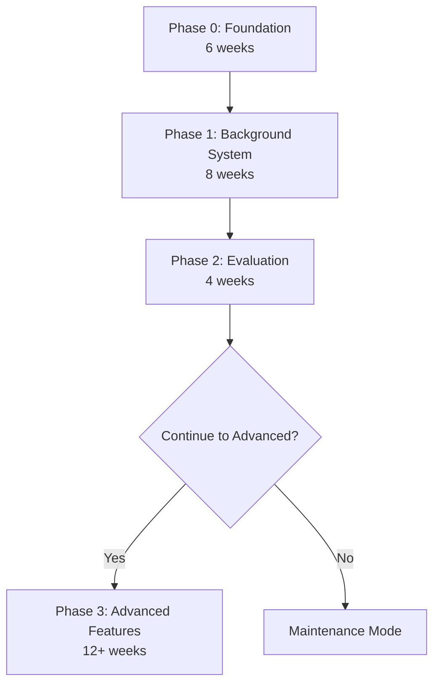
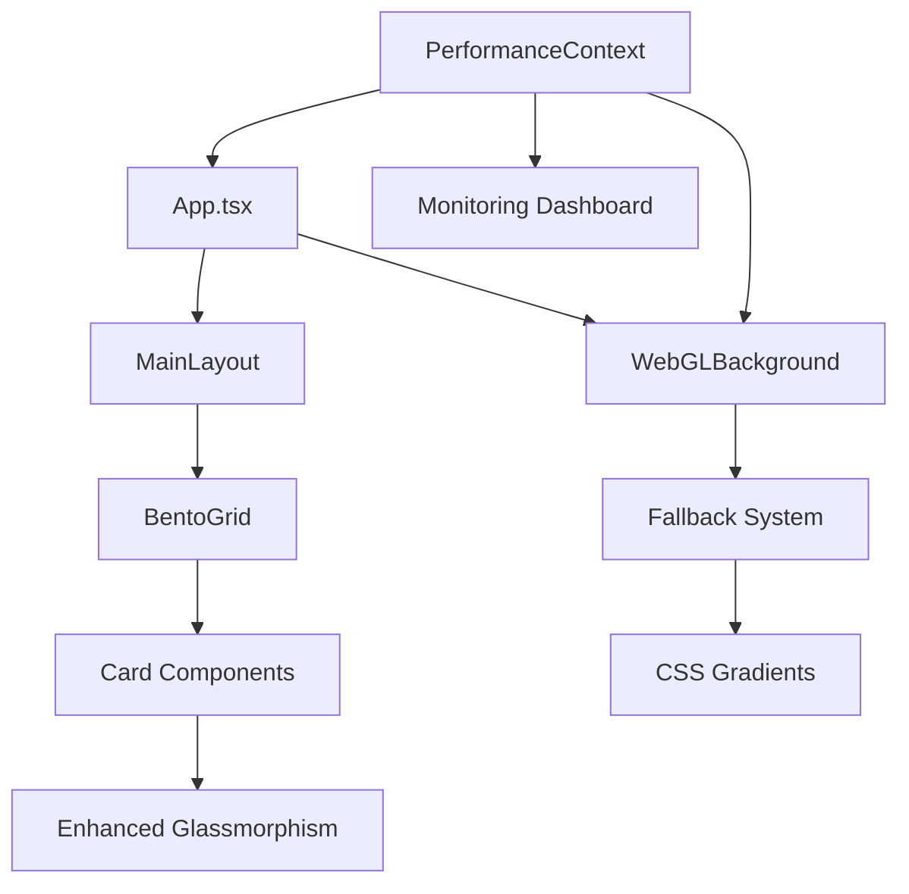
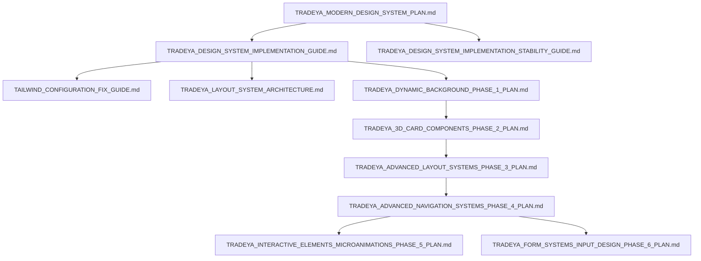

ate a new file:

# TradeYa Design System Implementation Guide

**Version:** 1.0  
**Created:** June 18, 2025  
**Last Updated:** June 18, 2025  
**Status:** Ready for Implementation

## 📋 Table of Contents

1. [Project Overview](#project-overview)
2. [Implementation Strategy](#implementation-strategy)
3. [Development Environment Setup](#development-environment-setup)
4. [Phase-by-Phase Implementation](#phase-by-phase-implementation)
5. [Technical Dependencies](#technical-dependencies)
6. [Integration Points](#integration-points)
7. [Testing & Quality Assurance](#testing--quality-assurance)
8. [Deployment Procedures](#deployment-procedures)
9. [Monitoring & Maintenance](#monitoring--maintenance)
10. [Troubleshooting & Support](#troubleshooting--support)
11. [External Resources](#external-resources)
12. [Related Documentation](#related-documentation)

---

## 📖 Project Overview

### Vision & Objectives

The TradeYa Design System Implementation modernizes the platform's visual interface through a **4-phase approach** that balances ambitious design goals with technical feasibility and risk management.

**Primary Goals:**

- Enhance user experience through modern, fluid design patterns
- Increase development velocity by 25% through standardized components
- Maintain 100% backward compatibility and zero-disruption deployment
- Achieve 20% improvement in user engagement metrics

### Strategic Approach

Based on comprehensive risk assessment, we're implementing the **Balanced Approach**:

- **Timeline:** 26 weeks across 4 phases
- **Investment:** $210k with 177% ROI over 3 years
- **Success Probability:** 70% with extensive risk mitigation
- **Technology Foundation:** React 18 + TypeScript + Firebase + Tailwind v4

### Documentation Architecture

This implementation guide references and coordinates multiple specialized documents:

#### Core Planning Documents

- [`TRADEYA_MODERN_DESIGN_SYSTEM_PLAN.md`](./TRADEYA_MODERN_DESIGN_SYSTEM_PLAN.md) - Foundation strategy
- [`TRADEYA_DESIGN_SYSTEM_IMPLEMENTATION_STABILITY_GUIDE.md`](./TRADEYA_DESIGN_SYSTEM_IMPLEMENTATION_STABILITY_GUIDE.md) - Safety protocols

#### Phase-Specific Plans

- [`TRADEYA_DYNAMIC_BACKGROUND_PHASE_1_PLAN.md`](./TRADEYA_DYNAMIC_BACKGROUND_PHASE_1_PLAN.md) - WebGL backgrounds
- [`TRADEYA_3D_CARD_COMPONENTS_PHASE_2_PLAN.md`](./TRADEYA_3D_CARD_COMPONENTS_PHASE_2_PLAN.md) - Enhanced components
- [`TRADEYA_ADVANCED_LAYOUT_SYSTEMS_PHASE_3_PLAN.md`](./TRADEYA_ADVANCED_LAYOUT_SYSTEMS_PHASE_3_PLAN.md) - Layout modernization
- [`TRADEYA_ADVANCED_NAVIGATION_SYSTEMS_PHASE_4_PLAN.md`](./TRADEYA_ADVANCED_NAVIGATION_SYSTEMS_PHASE_4_PLAN.md) - Navigation enhancement

#### Architecture & Technical Guides

- [`TRADEYA_LAYOUT_SYSTEM_ARCHITECTURE.md`](./TRADEYA_LAYOUT_SYSTEM_ARCHITECTURE.md) - System architecture
- [`TAILWIND_CONFIGURATION_FIX_GUIDE.md`](./TAILWIND_CONFIGURATION_FIX_GUIDE.md) - Configuration guidelines

---

## 🚀 Implementation Strategy

### Phased Rollout Overview



### Risk-First Implementation

Our approach prioritizes **risk mitigation** through:

- Progressive enhancement with comprehensive fallbacks
- Feature flags for instant rollback capabilities
- Continuous performance monitoring with automated alerts
- Decision gates with data-driven scope adjustment

### Success Metrics Framework

| Metric Category          | Target                | Critical Threshold    | Measurement                |
| ------------------------ | --------------------- | --------------------- | -------------------------- |
| **Performance**          | LCP <2.5s, FID <100ms | LCP >3.0s, FID >300ms | Real User Monitoring       |
| **Compatibility**        | 95% browser support   | <90% browser support  | Cross-browser testing      |
| **Accessibility**        | 100% WCAG 2.1 AA      | Any violations        | Automated + manual testing |
| **User Engagement**      | +20% time-on-site     | No decrease           | Analytics tracking         |
| **Development Velocity** | +25% sprint velocity  | No decrease           | JIRA velocity metrics      |

---

## ⚙️ Development Environment Setup

### Prerequisites

#### Required Software

```bash
# Node.js and package management
node --version  # Required: v18.x or higher
npm --version   # Required: v9.x or higher

# Development tools
git --version   # Required for version control
code --version  # VS Code recommended
```

#### Browser Requirements for Testing

- **Chrome/Chromium** 90+ (WebGL 2.0 support)
- **Firefox** 88+ (WebGL 2.0 support)
- **Safari** 14+ (WebGL 2.0 support)
- **Edge** 90+ (WebGL 2.0 support)

### Project Setup

#### 1. Repository Configuration

```bash
# Clone and setup
cd /path/to/tradeya
git checkout -b design-system-implementation

# Install dependencies
npm install

# Verify build system
npm run build
npm run dev
```

#### 2. Environment Configuration

**Required Environment Variables:**

```bash
# Firebase configuration (existing)
VITE_API_KEY=your_api_key
VITE_AUTH_DOMAIN=your_domain
VITE_PROJECT_ID=your_project_id
VITE_STORAGE_BUCKET=your_bucket
VITE_MESSAGING_SENDER_ID=your_sender_id
VITE_APP_ID=your_app_id

# Design system feature flags (new)
VITE_DS_ENABLE_WEBGL=false
VITE_DS_ENABLE_3D_EFFECTS=false
VITE_DS_PERFORMANCE_MODE=adaptive
```

#### 3. Development Tools Setup

**VS Code Extensions:**

```json
{
  "recommendations": [
    "bradlc.vscode-tailwindcss",
    "ms-vscode.vscode-typescript-next",
    "esbenp.prettier-vscode",
    "dbaeumer.vscode-eslint",
    "ms-playwright.playwright"
  ]
}
```

**Tailwind IntelliSense Configuration:**

```json
{
  "tailwindCSS.experimental.configFile": "./tailwind.config.ts",
  "tailwindCSS.includeLanguages": {
    "typescript": "javascript",
    "typescriptreact": "javascript"
  }
}
```

### Performance Monitoring Setup

#### 1. Real User Monitoring (RUM) Integration

```typescript
// src/services/performance/designSystemRUM.ts
import { getCLS, getFID, getFCP, getLCP, getTTFB } from "web-vitals";

interface DesignSystemMetrics {
  webglSupport: boolean;
  fallbackMode: string;
  renderTime: number;
  memoryUsage: number;
}

export const initializeDesignSystemMonitoring = () => {
  // Core Web Vitals tracking
  getCLS((metric) => sendToAnalytics("CLS", metric));
  getFID((metric) => sendToAnalytics("FID", metric));
  getFCP((metric) => sendToAnalytics("FCP", metric));
  getLCP((metric) => sendToAnalytics("LCP", metric));
  getTTFB((metric) => sendToAnalytics("TTFB", metric));

  // Design system specific metrics
  trackDesignSystemMetrics();
};
```

#### 2. Error Tracking Configuration

```typescript
// src/utils/designSystemErrorTracking.ts
interface DesignSystemError {
  component: string;
  phase: string;
  errorType: "webgl" | "css" | "performance" | "compatibility";
  userAgent: string;
  fallbackActivated: boolean;
}

export const trackDesignSystemError = (error: DesignSystemError) => {
  // Send to error tracking service (Sentry, LogRocket, etc.)
  console.error("Design System Error:", error);

  // Trigger automatic fallback if necessary
  if (error.errorType === "webgl") {
    activateWebGLFallback();
  }
};
```

---

## 📋 Phase-by-Phase Implementation

### Phase 0: Foundation & Infrastructure (Weeks 1-6)

#### Objectives

- Strengthen existing Tailwind v4 configuration
- Implement comprehensive performance monitoring
- Establish visual regression testing framework
- Create component API stability validation

#### Week 1-2: System Hardening

**Tasks:**

1. **Tailwind Configuration Optimization**

   ```bash
   # Backup current configuration
   cp tailwind.config.ts tailwind.config.ts.backup

   # Implement optimized configuration
   # See: docs/TAILWIND_CONFIGURATION_FIX_GUIDE.md
   ```

2. **Performance Baseline Establishment**

   ```typescript
   // Run comprehensive performance audit
   npm run lighthouse:audit
   npm run performance:baseline

   // Document baseline metrics
   # Results stored in performance-baselines.json
   ```

3. **Visual Regression Testing Setup**

   ```bash
   # Install testing tools
   npm install --save-dev @storybook/react @chromatic-com/storybook

   # Initialize Storybook
   npx storybook@latest init

   # Configure Chromatic
   npx chromatic --project-token=<your-token>
   ```

#### Week 3-4: Typography Enhancement

**Implementation:**

```css
/* src/index.css - Enhanced typography system */
:root {
  /* Preserve existing brand colors */
  --color-primary: #f97316; /* TradeYa Orange */
  --color-secondary: #0ea5e9; /* TradeYa Blue */
  --color-accent: #8b5cf6; /* TradeYa Purple */

  /* Enhanced fluid typography */
  --font-size-xs: clamp(0.75rem, 0.7rem + 0.2vw, 0.875rem);
  --font-size-sm: clamp(0.875rem, 0.8rem + 0.3vw, 1rem);
  --font-size-base: clamp(1rem, 0.9rem + 0.4vw, 1.125rem);
  --font-size-lg: clamp(1.125rem, 1rem + 0.5vw, 1.25rem);
  --font-size-xl: clamp(1.25rem, 1.1rem + 0.6vw, 1.5rem);
  --font-size-2xl: clamp(1.5rem, 1.3rem + 0.8vw, 2rem);
  --font-size-3xl: clamp(1.875rem, 1.6rem + 1vw, 2.5rem);
}
```

**Validation:**

```typescript
// src/__tests__/typography.test.ts
describe("Typography System", () => {
  it("maintains existing Inter font family", () => {
    const body = document.body;
    const computedStyle = getComputedStyle(body);
    expect(computedStyle.fontFamily).toContain("Inter");
  });

  it("provides accessible contrast ratios", () => {
    // Test all text/background combinations
    // Ensure 4.5:1 ratio for normal text, 3:1 for large text
  });
});
```

#### Week 5-6: Testing Infrastructure

**Automated Testing Pipeline:**

```yaml
# .github/workflows/design-system-testing.yml
name: Design System Testing
on: [push, pull_request]

jobs:
  visual-regression:
    runs-on: ubuntu-latest
    steps:
      - uses: actions/checkout@v3
      - name: Install dependencies
        run: npm ci
      - name: Run Chromatic
        run: npx chromatic --exit-zero-on-changes
        env:
          CHROMATIC_PROJECT_TOKEN: ${{ secrets.CHROMATIC_PROJECT_TOKEN }}

  performance-testing:
    runs-on: ubuntu-latest
    steps:
      - uses: actions/checkout@v3
      - name: Install dependencies
        run: npm ci
      - name: Build application
        run: npm run build
      - name: Run Lighthouse CI
        run: npx lhci autorun
        env:
          LHCI_GITHUB_APP_TOKEN: ${{ secrets.LHCI_GITHUB_APP_TOKEN }}

  accessibility-testing:
    runs-on: ubuntu-latest
    steps:
      - uses: actions/checkout@v3
      - name: Install dependencies
        run: npm ci
      - name: Run accessibility tests
        run: npm run test:a11y
```

**Cross-Browser Compatibility Testing:**

```javascript
// playwright.config.ts
import { defineConfig, devices } from "@playwright/test";

export default defineConfig({
  testDir: "./src/__tests__/e2e",
  projects: [
    {
      name: "chromium",
      use: { ...devices["Desktop Chrome"] },
    },
    {
      name: "firefox",
      use: { ...devices["Desktop Firefox"] },
    },
    {
      name: "webkit",
      use: { ...devices["Desktop Safari"] },
    },
    {
      name: "Mobile Chrome",
      use: { ...devices["Pixel 5"] },
    },
    {
      name: "Mobile Safari",
      use: { ...devices["iPhone 12"] },
    },
  ],
});
```

### Phase 1: Enhanced Background System (Weeks 7-14)

#### Objectives

- Implement WebGL dynamic backgrounds with 4-tier fallback system
- Integrate TradeYa brand colors (#f97316, #0ea5e9, #8b5cf6)
- Create adaptive quality controls and performance monitoring
- Ensure 95% browser compatibility

#### Week 7-9: WebGL Foundation

**WebGL Context Setup:**

```typescript
// src/components/background/WebGLBackground.tsx
import React, { useEffect, useRef, useState } from "react";
import { usePerformanceMonitoring } from "../hooks/usePerformanceMonitoring";

interface WebGLBackgroundProps {
  fallbackComponent?: React.ComponentType;
  enableAdaptiveQuality?: boolean;
  performanceThreshold?: number;
}

export const WebGLBackground: React.FC<WebGLBackgroundProps> = ({
  fallbackComponent: FallbackComponent,
  enableAdaptiveQuality = true,
  performanceThreshold = 30, // fps
}) => {
  const canvasRef = useRef<HTMLCanvasElement>(null);
  const [fallbackMode, setFallbackMode] = useState<string | null>(null);
  const { trackPerformance } = usePerformanceMonitoring();

  useEffect(() => {
    const canvas = canvasRef.current;
    if (!canvas) return;

    // WebGL capability detection with timeout
    const gl = getWebGLContext(canvas, { timeout: 5000 });

    if (!gl) {
      setFallbackMode("css-animated");
      return;
    }

    // Initialize WebGL gradient system
    const backgroundSystem = new WebGLGradientSystem(gl, {
      colors: ["#f97316", "#0ea5e9", "#8b5cf6"], // TradeYa brand colors
      adaptiveQuality: enableAdaptiveQuality,
      performanceThreshold,
    });

    backgroundSystem.start();

    return () => {
      backgroundSystem.cleanup();
    };
  }, []);

  if (fallbackMode && FallbackComponent) {
    return <FallbackComponent />;
  }

  return (
    <canvas
      ref={canvasRef}
      className="fixed inset-0 -z-10 w-full h-full"
      style={{ mixBlendMode: "normal" }}
    />
  );
};
```

**4-Tier Fallback System:**

```typescript
// src/services/webgl/fallbackSystem.ts
export enum FallbackTier {
  WEBGL_COMPLEX = "webgl-complex",
  WEBGL_SIMPLE = "webgl-simple",
  CSS_ANIMATED = "css-animated",
  CSS_STATIC = "css-static",
}

export class WebGLFallbackSystem {
  private currentTier: FallbackTier = FallbackTier.WEBGL_COMPLEX;
  private performanceHistory: number[] = [];

  detectOptimalTier(device: DeviceCapabilities): FallbackTier {
    // High-end devices: Full WebGL with complex shaders
    if (device.gpu === "high" && device.memory > 4096) {
      return FallbackTier.WEBGL_COMPLEX;
    }

    // Mid-range devices: Simplified WebGL
    if (device.webglSupport && device.memory > 2048) {
      return FallbackTier.WEBGL_SIMPLE;
    }

    // Low-end devices with CSS animation support
    if (device.cssAnimationSupport) {
      return FallbackTier.CSS_ANIMATED;
    }

    // Fallback for very limited devices
    return FallbackTier.CSS_STATIC;
  }

  degradePerformanceIfNeeded(currentFPS: number): boolean {
    this.performanceHistory.push(currentFPS);

    // Keep only last 60 frames for analysis
    if (this.performanceHistory.length > 60) {
      this.performanceHistory.shift();
    }

    const averageFPS =
      this.performanceHistory.reduce((a, b) => a + b, 0) /
      this.performanceHistory.length;

    // Degrade if consistently below threshold
    if (averageFPS < 30 && this.currentTier !== FallbackTier.CSS_STATIC) {
      this.degradeTier();
      return true;
    }

    return false;
  }

  private degradeTier(): void {
    switch (this.currentTier) {
      case FallbackTier.WEBGL_COMPLEX:
        this.currentTier = FallbackTier.WEBGL_SIMPLE;
        break;
      case FallbackTier.WEBGL_SIMPLE:
        this.currentTier = FallbackTier.CSS_ANIMATED;
        break;
      case FallbackTier.CSS_ANIMATED:
        this.currentTier = FallbackTier.CSS_STATIC;
        break;
    }
  }
}
```

#### Week 10-12: Animation & Performance

**Gradient Animation System:**

```glsl
// src/shaders/tradeya-gradient.frag
precision mediump float;

uniform float u_time;
uniform vec2 u_resolution;
uniform vec3 u_colors[3]; // TradeYa brand colors

// Noise function for organic movement
float noise(vec2 st) {
    return fract(sin(dot(st.xy, vec2(12.9898,78.233))) * 43758.5453123);
}

void main() {
    vec2 st = gl_FragCoord.xy / u_resolution.xy;

    // Create flowing gradient with noise
    float gradient1 = sin(st.x * 3.0 + u_time * 0.5) * 0.5 + 0.5;
    float gradient2 = sin(st.y * 2.0 + u_time * 0.3) * 0.5 + 0.5;

    // Add organic noise movement
    float n = noise(st * 8.0 + u_time * 0.1) * 0.1;
    gradient1 += n;
    gradient2 += n;

    // Mix brand colors based on gradients
    vec3 color = mix(
        mix(u_colors[0], u_colors[1], gradient1),
        u_colors[2],
        gradient2
    );

    gl_FragColor = vec4(color, 0.7); // Subtle transparency
}
```

**Performance Monitoring Integration:**

```typescript
// src/hooks/useWebGLPerformance.ts
export const useWebGLPerformance = () => {
  const [fps, setFPS] = useState(60);
  const [memoryUsage, setMemoryUsage] = useState(0);
  const frameTimeRef = useRef(0);

  useEffect(() => {
    let frameCount = 0;
    let startTime = performance.now();

    const measurePerformance = () => {
      frameCount++;
      const currentTime = performance.now();

      if (currentTime - startTime >= 1000) {
        const currentFPS = Math.round(
          (frameCount * 1000) / (currentTime - startTime)
        );
        setFPS(currentFPS);

        frameCount = 0;
        startTime = currentTime;

        // Memory usage tracking
        if ("memory" in performance) {
          setMemoryUsage(performance.memory.usedJSHeapSize);
        }
      }

      requestAnimationFrame(measurePerformance);
    };

    requestAnimationFrame(measurePerformance);
  }, []);

  return { fps, memoryUsage };
};
```

#### Week 13-14: Integration & Testing

**Integration with Existing Components:**

```typescript
// src/App.tsx - Integration point
import { WebGLBackground } from "./components/background/WebGLBackground";
import { CSSGradientFallback } from "./components/background/CSSGradientFallback";

function App() {
  return (
    <div className="min-h-screen">
      <WebGLBackground
        fallbackComponent={CSSGradientFallback}
        enableAdaptiveQuality={true}
        performanceThreshold={30}
      />

      {/* Existing app content */}
      <MainLayout>
        <Router>{/* Routes */}</Router>
      </MainLayout>
    </div>
  );
}
```

**CSS Fallback Implementation:**

```css
/* src/components/background/CSSGradientFallback.css */
.css-gradient-fallback {
  position: fixed;
  top: 0;
  left: 0;
  width: 100%;
  height: 100%;
  z-index: -10;

  background: linear-gradient(
    45deg,
    var(--color-primary) 0%,
    var(--color-secondary) 50%,
    var(--color-accent) 100%
  );
  background-size: 400% 400%;

  animation: gradient-flow 15s ease infinite;
  opacity: 0.1;
}

@keyframes gradient-flow {
  0% {
    background-position: 0% 50%;
  }
  50% {
    background-position: 100% 50%;
  }
  100% {
    background-position: 0% 50%;
  }
}

/* Respect user motion preferences */
@media (prefers-reduced-motion: reduce) {
  .css-gradient-fallback {
    animation: none;
    background-position: 0% 50%;
  }
}
```

### Phase 2: Evaluation & Decision Gate (Weeks 15-18)

#### Objectives

- Comprehensive performance and user feedback analysis
- Data-driven assessment for Phase 3 advancement
- Risk evaluation and resource planning validation
- Stakeholder alignment on continuation strategy

#### Week 15-16: Performance Analysis

**Comprehensive Metrics Collection:**

```typescript
// src/services/evaluation/metricsCollector.ts
interface Phase1Metrics {
  performance: {
    coreWebVitals: {
      lcp: number;
      fid: number;
      cls: number;
    };
    frameRate: {
      desktop: number;
      mobile: number;
    };
    memoryUsage: number;
    errorRate: number;
  };
  compatibility: {
    webglSupport: number; // percentage
    fallbackUsage: {
      [key in FallbackTier]: number;
    };
    browserSupport: {
      chrome: number;
      firefox: number;
      safari: number;
      edge: number;
    };
  };
  userExperience: {
    timeOnSite: number;
    bounceRate: number;
    userSatisfaction: number;
    accessibilityCompliance: number;
  };
}

export class Phase1MetricsCollector {
  async collectMetrics(): Promise<Phase1Metrics> {
    const [performance, compatibility, userExperience] = await Promise.all([
      this.collectPerformanceMetrics(),
      this.collectCompatibilityMetrics(),
      this.collectUserExperienceMetrics(),
    ]);

    return { performance, compatibility, userExperience };
  }

  private async collectPerformanceMetrics() {
    // Implementation details
  }
}
```

**User Feedback Collection:**

```typescript
// src/components/feedback/DesignSystemFeedback.tsx
export const DesignSystemFeedback: React.FC = () => {
  const [feedback, setFeedback] = useState({
    visualAppeal: 5,
    performance: 5,
    usability: 5,
    comments: "",
  });

  const submitFeedback = async () => {
    await fetch("/api/design-system-feedback", {
      method: "POST",
      body: JSON.stringify({
        ...feedback,
        timestamp: Date.now(),
        userAgent: navigator.userAgent,
        webglSupported: hasWebGLSupport(),
        fallbackMode: getCurrentFallbackMode(),
      }),
    });
  };

  return (
    <div className="fixed bottom-4 right-4 bg-white/90 backdrop-blur-sm rounded-lg shadow-lg p-4">
      {/* Feedback form implementation */}
    </div>
  );
};
```

#### Week 17: Stakeholder Review

**Automated Reporting System:**

```typescript
// src/services/reporting/phase1Report.ts
export class Phase1SuccessReport {
  generateReport(metrics: Phase1Metrics): Phase1Report {
    const performance = this.assessPerformance(metrics.performance);
    const compatibility = this.assessCompatibility(metrics.compatibility);
    const userSatisfaction = this.assessUserSatisfaction(
      metrics.userExperience
    );

    const overallScore = (performance + compatibility + userSatisfaction) / 3;
    const recommendation = this.generateRecommendation(overallScore, metrics);

    return {
      overallScore,
      performance,
      compatibility,
      userSatisfaction,
      recommendation,
      detailedMetrics: metrics,
      generatedAt: new Date().toISOString(),
    };
  }

  private generateRecommendation(
    score: number,
    metrics: Phase1Metrics
  ): Recommendation {
    if (score >= 0.8 && metrics.performance.errorRate < 0.01) {
      return {
        decision: "PROCEED_FULL",
        confidence: "HIGH",
        suggestedScope: "FULL_PHASE_3",
        riskLevel: "LOW",
      };
    } else if (score >= 0.6) {
      return {
        decision: "PROCEED_CAUTIOUS",
        confidence: "MEDIUM",
        suggestedScope: "REDUCED_PHASE_3",
        riskLevel: "MEDIUM",
      };
    } else {
      return {
        decision: "PAUSE_EVALUATE",
        confidence: "LOW",
        suggestedScope: "PHASE_1_OPTIMIZATION",
        riskLevel: "HIGH",
      };
    }
  }
}
```

#### Week 18: Go/No-Go Decision

**Decision Framework:**

```typescript
// src/services/decision/phase3DecisionEngine.ts
interface DecisionCriteria {
  performance: {
    weight: 0.4;
    requirements: {
      coreWebVitals: "PASS"; // All metrics within targets
      frameRate: "ACCEPTABLE"; // >30fps mobile, >45fps desktop
      errorRate: "<1%";
    };
  };
  userFeedback: {
    weight: 0.3;
    requirements: {
      satisfaction: ">4.0/5";
      usabilityScore: ">4.0/5";
      visualAppeal: ">4.0/5";
    };
  };
  technicalStability: {
    weight: 0.2;
    requirements: {
      compatibility: ">90%";
      fallbackSuccess: "100%";
      zeroProductionIncidents: true;
    };
  };
  resourceAvailability: {
    weight: 0.1;
    requirements: {
      teamCapacity: "CONFIRMED";
      budgetApproval: "APPROVED";
      timelineAlignment: "REALISTIC";
    };
  };
}

export class Phase3DecisionEngine {
  evaluateDecision(report: Phase1Report, criteria: DecisionCriteria): Decision {
    const scores = this.calculateWeightedScores(report, criteria);
    const totalScore = Object.values(scores).reduce(
      (sum, score) => sum + score,
      0
    );

    return {
      proceed: totalScore >= 0.75,
      confidence: this.calculateConfidence(scores),
      recommendedScope: this.determineScope(scores),
      mitigationRequired: this.identifyMitigations(scores),
      timeline: this.estimateTimeline(scores),
    };
  }
}
```

### Phase 3: Advanced Features (Conditional - Weeks 19+)

_Note: This phase only proceeds if Phase 2 evaluation meets success criteria_

#### Implementation depends on Phase 2 results

**High Success (Score >90%):**

- Full advanced 3D card effects implementation
- Enhanced navigation systems with micro-animations
- Container query integration for responsive components

**Medium Success (Score 70-90%):**

- Simplified 3D effects with performance constraints
- Basic navigation enhancements
- Limited container query usage

**Lower Success (Score <70%):**

- Focus on Phase 1 optimization and refinement
- Postpone advanced features pending improvements

---

## 🔧 Technical Dependencies

### Core Technology Stack

#### React 18 & TypeScript

- **Version Requirements:** React ^18.2.0, TypeScript ^5.0.0
- **Key Features Used:** Concurrent features, automatic batching, strict mode
- **Documentation:** [React 18 Docs](https://react.dev/blog/2022/03/29/react-v18)
- **Migration Guide:** [React 18 Upgrade Guide](https://react.dev/blog/2022/03/08/react-18-upgrade-guide)

#### Tailwind CSS v4

- **Version:** ^4.1.7 (cutting-edge but stable)
- **Configuration:** [`tailwind.config.ts`](../tailwind.config.ts)
- **Custom Properties:** CSS custom property integration
- **Documentation:** [Tailwind CSS v4 Alpha](https://tailwindcss.com/docs/v4-alpha)
- **Migration Notes:** See [`TAILWIND_CONFIGURATION_FIX_GUIDE.md`](./TAILWIND_CONFIGURATION_FIX_GUIDE.md)

#### Firebase Integration

- **Version:** ^10.14.1
- **Services Used:** Firestore, Authentication, Storage
- **Configuration:** [`src/firebase-config.ts`](../src/firebase-config.ts)
- **Security Rules:** Maintain existing patterns
- **Documentation:** [Firebase Web SDK](https://firebase.google.com/docs/web/setup)

#### Build System & Development Tools

- **Vite:** ^4.3.9 for fast development and optimized builds
- **PostCSS:** ^8.4.24 for CSS processing
- **ESLint:** Code quality and consistency
- **Prettier:** Code formatting

### WebGL Dependencies

#### Three.js (Optional)

```bash
npm install three @types/three
```

- **Version:** ^0.155.0
- **Usage:** Advanced 3D effects in Phase 3+
- **Documentation:** [Three.js Docs](https://threejs.org/docs/)
- **Examples:** [Three.js Examples](https://threejs.org/examples/)

#### WebGL Utilities

```typescript
// Custom WebGL utilities for performance optimization
interface WebGLCapabilities {
  version: "1.0" | "2.0" | "none";
  maxTextureSize: number;
  maxVertexAttribs: number;
  extensions: string[];
}

export const detectWebGLCapabilities = (): WebGLCapabilities => {
  // Implementation in src/utils/webgl/capabilities.ts
};
```

### Performance Monitoring

#### Web Vitals

```bash
npm install web-vitals
```

- **Version:** ^3.3.2
- **Metrics:** CLS, FID, FCP, LCP, TTFB
- **Documentation:** [Web Vitals](https://web.dev/vitals/)

#### Performance Observer API

```typescript
// Native browser APIs for performance monitoring
interface PerformanceMetrics {
  navigation: PerformanceNavigationTiming[];
  paint: PerformancePaintTiming[];
  resource: PerformanceResourceTiming[];
  mark: PerformanceMark[];
  measure: PerformanceMeasure[];
}
```

### Testing Dependencies

#### Visual Regression Testing

```bash
npm install --save-dev @storybook/react chromatic
```

- **Storybook:** Component isolation and documentation
- **Chromatic:** Visual regression testing
- **Documentation:** [Storybook](https://storybook.js.org/), [Chromatic](https://www.chromatic.com/)

#### Cross-Browser Testing

```bash
npm install --save-dev @playwright/test
```

- **Playwright:** Cross-browser automation
- **Coverage:** Chrome, Firefox, Safari, Edge
- **Documentation:** [Playwright](https://playwright.dev/)

#### Accessibility Testing

```bash
npm install --save-dev @axe-core/react jest-axe
```

- **Axe-core:** Automated accessibility testing
- **WCAG:** 2.1 AA compliance validation
- **Documentation:** [Axe-core](https://github.com/dequelabs/axe-core)

---

## 🔗 Integration Points

### Component Integration Hierarchy



### State Management Integration

#### Context Provider Hierarchy

```typescript
// src/App.tsx - Provider integration
function App() {
  return (
    <BrowserRouter>
      <AuthProvider>
        <ThemeProvider>
          <ToastProvider>
            <NotificationsProvider>
              <MessageProvider>
                <GamificationNotificationProvider>
                  <PerformanceProvider>
                    <SmartPerformanceProvider>
                      <DesignSystemProvider>
                        {" "}
                        {/* New provider */}
                        <AppContent />
                      </DesignSystemProvider>
                    </SmartPerformanceProvider>
                  </PerformanceProvider>
                </GamificationNotificationProvider>
              </MessageProvider>
            </NotificationsProvider>
          </ToastProvider>
        </ThemeProvider>
      </AuthProvider>
    </BrowserRouter>
  );
}
```

#### Design System Context

```typescript
// src/contexts/DesignSystemContext.tsx
interface DesignSystemContext {
  // Feature flags
  webglEnabled: boolean;
  threeDEffectsEnabled: boolean;
  advancedAnimationsEnabled: boolean;

  // Performance state
  currentFallbackTier: FallbackTier;
  performanceMode: "high" | "medium" | "low";

  // User preferences
  reducedMotion: boolean;
  highContrast: boolean;

  // Control methods
  enableFeature: (feature: DesignSystemFeature) => void;
  disableFeature: (feature: DesignSystemFeature) => void;
  setPerformanceMode: (mode: PerformanceMode) => void;
}

export const DesignSystemProvider: React.FC<{ children: ReactNode }> = ({
  children,
}) => {
  // Implementation
};
```

### Firebase Integration Points

#### Performance Data Collection

```typescript
// src/services/firebase/designSystemAnalytics.ts
interface DesignSystemEvent {
  eventType: "performance" | "fallback" | "error" | "user_feedback";
  timestamp: number;
  userId?: string;
  sessionId: string;
  data: Record<string, any>;
}

export const trackDesignSystemEvent = async (event: DesignSystemEvent) => {
  // Store in Firestore for analysis
  await addDoc(collection(db, "design_system_events"), event);
};
```

#### Feature Flag Management

```typescript
// src/services/firebase/featureFlags.ts
interface FeatureFlags {
  webgl_backgrounds: boolean;
  three_d_cards: boolean;
  advanced_animations: boolean;
  performance_mode: "auto" | "high" | "medium" | "low";
}

export const getFeatureFlags = async (
  userId?: string
): Promise<FeatureFlags> => {
  // Fetch from Firebase Remote Config
  const remoteConfig = getRemoteConfig();
  await fetchAndActivate(remoteConfig);

  return {
    webgl_backgrounds: getBoolean(remoteConfig, "webgl_backgrounds"),
    three_d_cards: getBoolean(remoteConfig, "three_d_cards"),
    advanced_animations: getBoolean(remoteConfig, "advanced_animations"),
    performance_mode: getValue(
      remoteConfig,
      "performance_mode"
    ).asString() as any,
  };
};
```

### API Integration Points

#### Performance Monitoring API

```typescript
// src/services/api/performanceAPI.ts
interface PerformanceReport {
  metrics: WebVitalsMetrics;
  deviceInfo: DeviceCapabilities;
  fallbackTier: FallbackTier;
  timestamp: number;
}

export class PerformanceAPI {
  async submitReport(report: PerformanceReport): Promise<void> {
    await fetch("/api/performance/design-system", {
      method: "POST",
      headers: { "Content-Type": "application/json" },
      body: JSON.stringify(report),
    });
  }

  async getPerformanceInsights(): Promise<PerformanceInsights> {
    const response = await fetch("/api/performance/insights");
    return response.json();
  }
}
```

#### Error Reporting Integration

```typescript
// src/services/error/designSystemErrorReporting.ts
export const reportDesignSystemError = (
  error: Error,
  context: ErrorContext
) => {
  // Send to error tracking service (Sentry, Bugsnag, etc.)
  if (typeof window !== "undefined" && window.Sentry) {
    window.Sentry.captureException(error, {
      tags: {
        component: "design-system",
        phase: context.phase,
        fallbackTier: context.fallbackTier,
      },
      extra: context,
    });
  }
};
```

---

## 🧪 Testing & Quality Assurance

### Testing Strategy Overview

#### Testing Pyramid

```
    /\     E2E Tests (10%)
   /  \    - Critical user flows
  /____\   - Cross-browser compatibility
 /      \
/________\  Integration Tests (20%)
           - Component interactions
           - API integrations

Unit Tests (70%)
- Component logic
- Utility functions
- Business logic
```

### Component Testing

#### React Testing Library Setup

```typescript
// src/__tests__/setup.ts
import "@testing-library/jest-dom";
import { configure } from "@testing-library/react";

// Configure testing library
configure({ testIdAttribute: "data-testid" });

// Mock WebGL context for testing
global.HTMLCanvasElement.prototype.getContext = jest.fn((contextType) => {
  if (contextType === "webgl" || contextType === "webgl2") {
    return {
      // Mock WebGL context
      clearColor: jest.fn(),
      clear: jest.fn(),
      drawArrays: jest.fn(),
      // ... other WebGL methods
    };
  }
  return null;
});

// Mock performance APIs
Object.defineProperty(window, "performance", {
  value: {
    now: jest.fn(() => Date.now()),
    mark: jest.fn(),
    measure: jest.fn(),
    getEntriesByType: jest.fn(() => []),
  },
});
```

#### Component Test Examples

```typescript
// src/__tests__/components/WebGLBackground.test.tsx
import { render, screen } from "@testing-library/react";
import { WebGLBackground } from "../components/background/WebGLBackground";

describe("WebGLBackground", () => {
  beforeEach(() => {
    jest.clearAllMocks();
  });

  it("renders canvas element", () => {
    render(<WebGLBackground />);
    const canvas = screen.getByRole("img", { hidden: true });
    expect(canvas).toBeInTheDocument();
    expect(canvas.tagName).toBe("CANVAS");
  });

  it("activates fallback when WebGL is not supported", () => {
    // Mock WebGL as unsupported
    HTMLCanvasElement.prototype.getContext = jest.fn(() => null);

    const FallbackComponent = () => <div data-testid="fallback">Fallback</div>;
    render(<WebGLBackground fallbackComponent={FallbackComponent} />);

    expect(screen.getByTestId("fallback")).toBeInTheDocument();
  });

  it("adapts quality based on performance", async () => {
    const { rerender } = render(<WebGLBackground performanceThreshold={60} />);

    // Simulate performance degradation
    // ... test implementation
  });
});
```

### Visual Regression Testing

#### Storybook Configuration

```typescript
// .storybook/main.ts
import type { StorybookConfig } from "@storybook/react-webpack5";

const config: StorybookConfig = {
  stories: ["../src/**/*.stories.@(js|jsx|ts|tsx|mdx)"],
  addons: [
    "@storybook/addon-essentials",
    "@storybook/addon-a11y",
    "@storybook/addon-viewport",
    "@chromatic-com/storybook",
  ],
  framework: {
    name: "@storybook/react-webpack5",
    options: {},
  },
  docs: {
    autodocs: "tag",
  },
};

export default config;
```

#### Preview Configuration

```typescript
// .storybook/preview.ts
import type { Preview } from "@storybook/react";
import "../src/index.css";

const preview: Preview = {
  parameters: {
    actions: { argTypesRegex: "^on[A-Z].*" },
    controls: {
      matchers: {
        color: /(background|color)$/i,
        date: /Date$/,
      },
    },
    backgrounds: {
      default: "light",
      values: [
        {
          name: "light",
          value: "#ffffff",
        },
        {
          name: "dark",
          value: "#1a1a1a",
        },
        {
          name: "tradeya-gradient",
          value: "linear-gradient(135deg, #667eea 0%, #764ba2 100%)",
        },
      ],
    },
    viewport: {
      viewports: {
        small: {
          name: "Small Mobile",
          styles: {
            width: "375px",
            height: "667px",
          },
        },
        medium: {
          name: "Large Mobile",
          styles: {
            width: "414px",
            height: "896px",
          },
        },
        tablet: {
          name: "Tablet",
          styles: {
            width: "768px",
            height: "1024px",
          },
        },
        desktop: {
          name: "Desktop",
          styles: {
            width: "1440px",
            height: "900px",
          },
        },
      },
    },
  },
  decorators: [
    (Story) => (
      <div className="p-4">
        <Story />
      </div>
    ),
  ],
};

export default preview;
```

#### Component Stories Examples

Create comprehensive stories for each design system component:

**Button Component Stories**

```typescript
// src/components/ui/Button.stories.tsx
import type { Meta, StoryObj } from "@storybook/react";
import { Button } from "./Button";

const meta: Meta<typeof Button> = {
  title: "Design System/Components/Button",
  component: Button,
  parameters: {
    layout: "centered",
    docs: {
      description: {
        component:
          "TradeYa button component with multiple variants, sizes, and states.",
      },
    },
  },
  tags: ["autodocs"],
  argTypes: {
    variant: {
      control: { type: "select" },
      options: ["primary", "secondary", "outline", "ghost", "destructive"],
    },
    size: {
      control: { type: "select" },
      options: ["sm", "md", "lg", "xl"],
    },
    disabled: {
      control: { type: "boolean" },
    },
    loading: {
      control: { type: "boolean" },
    },
  },
};

export default meta;
type Story = StoryObj<typeof meta>;

export const Primary: Story = {
  args: {
    variant: "primary",
    children: "Primary Button",
  },
};

export const Secondary: Story = {
  args: {
    variant: "secondary",
    children: "Secondary Button",
  },
};

export const Outline: Story = {
  args: {
    variant: "outline",
    children: "Outline Button",
  },
};

export const Ghost: Story = {
  args: {
    variant: "ghost",
    children: "Ghost Button",
  },
};

export const Destructive: Story = {
  args: {
    variant: "destructive",
    children: "Destructive Button",
  },
};

export const Sizes: Story = {
  render: () => (
    <div className="flex items-center gap-4">
      <Button size="sm">Small</Button>
      <Button size="md">Medium</Button>
      <Button size="lg">Large</Button>
      <Button size="xl">Extra Large</Button>
    </div>
  ),
};

export const States: Story = {
  render: () => (
    <div className="flex flex-col gap-4">
      <div className="flex items-center gap-4">
        <Button>Normal</Button>
        <Button disabled>Disabled</Button>
        <Button loading>Loading</Button>
      </div>
      <div className="flex items-center gap-4">
        <Button variant="secondary">Normal</Button>
        <Button variant="secondary" disabled>
          Disabled
        </Button>
        <Button variant="secondary" loading>
          Loading
        </Button>
      </div>
    </div>
  ),
};

export const Interactive: Story = {
  args: {
    variant: "primary",
    children: "Click me!",
    onClick: () => alert("Button clicked!"),
  },
};
```

**Card Component Stories**

```typescript
// src/components/ui/Card.stories.tsx
import type { Meta, StoryObj } from "@storybook/react";
import { Card } from "./Card";

const meta: Meta<typeof Card> = {
  title: "Design System/Components/Card",
  component: Card,
  parameters: {
    layout: "centered",
    docs: {
      description: {
        component:
          "TradeYa card component with glassmorphism variants and hover effects.",
      },
    },
  },
  tags: ["autodocs"],
  argTypes: {
    variant: {
      control: { type: "select" },
      options: ["default", "glass"],
    },
    hover: {
      control: { type: "boolean" },
    },
    className: {
      control: { type: "text" },
    },
  },
};

export default meta;
type Story = StoryObj<typeof meta>;

export const Default: Story = {
  args: {
    variant: "default",
    children: (
      <div className="p-6">
        <h3 className="text-lg font-semibold mb-2">Default Card</h3>
        <p className="text-gray-600 dark:text-gray-300">
          This is a default card with standard styling.
        </p>
      </div>
    ),
  },
};

export const Glass: Story = {
  args: {
    variant: "glass",
    children: (
      <div className="p-6">
        <h3 className="text-lg font-semibold mb-2">Glassmorphism Card</h3>
        <p className="text-gray-600 dark:text-gray-300">
          This card uses glassmorphism styling with backdrop blur.
        </p>
      </div>
    ),
  },
  parameters: {
    backgrounds: { default: "tradeya-gradient" },
  },
};

export const WithHover: Story = {
  args: {
    variant: "glass",
    hover: true,
    children: (
      <div className="p-6">
        <h3 className="text-lg font-semibold mb-2">Interactive Card</h3>
        <p className="text-gray-600 dark:text-gray-300">
          Hover over this card to see the interactive effects.
        </p>
      </div>
    ),
  },
  parameters: {
    backgrounds: { default: "tradeya-gradient" },
  },
};

export const TradeCard: Story = {
  args: {
    variant: "glass",
    hover: true,
    children: (
      <div className="p-6">
        <div className="flex items-center mb-4">
          <div className="w-12 h-12 bg-blue-500 rounded-full flex items-center justify-center text-white font-bold">
            JS
          </div>
          <div className="ml-3">
            <h3 className="font-semibold">JavaScript Tutoring</h3>
            <p className="text-sm text-gray-500">by John Smith</p>
          </div>
        </div>
        <p className="text-gray-600 dark:text-gray-300 mb-4">
          Learn JavaScript fundamentals and advanced concepts through hands-on
          projects.
        </p>
        <div className="flex justify-between items-center">
          <span className="text-sm text-gray-500">2 weeks duration</span>
          <span className="bg-green-100 text-green-800 px-2 py-1 rounded text-sm">
            Available
          </span>
        </div>
      </div>
    ),
  },
  parameters: {
    backgrounds: { default: "tradeya-gradient" },
  },
};
```

**BentoGrid Component Stories**

```typescript
// src/components/ui/BentoGrid.stories.tsx
import type { Meta, StoryObj } from "@storybook/react";
import { BentoGrid } from "./BentoGrid";
import { Card } from "./Card";

const meta: Meta<typeof BentoGrid> = {
  title: "Design System/Layout/BentoGrid",
  component: BentoGrid,
  parameters: {
    layout: "fullscreen",
    docs: {
      description: {
        component: "TradeYa responsive grid system for modern layout design.",
      },
    },
  },
  tags: ["autodocs"],
};

export default meta;
type Story = StoryObj<typeof meta>;

const SampleCard = ({ title, span }: { title: string; span?: string }) => (
  <Card variant="glass" hover className={span}>
    <div className="p-6 h-full flex items-center justify-center">
      <h3 className="text-lg font-semibold text-center">{title}</h3>
    </div>
  </Card>
);

export const ResponsiveLayout: Story = {
  render: () => (
    <div className="p-6">
      <BentoGrid>
        <SampleCard title="Feature 1" span="col-span-1" />
        <SampleCard title="Feature 2" span="col-span-1" />
        <SampleCard title="Main Feature" span="col-span-2 row-span-2" />
        <SampleCard title="Stats" span="col-span-1" />
        <SampleCard title="Quick Action" span="col-span-1" />
        <SampleCard title="Updates" span="col-span-2" />
      </BentoGrid>
    </div>
  ),
  parameters: {
    backgrounds: { default: "tradeya-gradient" },
    viewport: {
      defaultViewport: "desktop",
    },
  },
};

export const MobileLayout: Story = {
  render: () => (
    <div className="p-4">
      <BentoGrid>
        <SampleCard title="Welcome" span="col-span-1" />
        <SampleCard title="Quick Stats" span="col-span-1" />
        <SampleCard title="Recent Activity" span="col-span-1" />
        <SampleCard title="Trending Trades" span="col-span-1" />
      </BentoGrid>
    </div>
  ),
  parameters: {
    backgrounds: { default: "tradeya-gradient" },
    viewport: {
      defaultViewport: "small",
    },
  },
};

export const ComplexLayout: Story = {
  render: () => (
    <div className="p-6">
      <BentoGrid>
        <SampleCard title="Hero Section" span="col-span-4 row-span-2" />
        <SampleCard title="User Profile" span="col-span-2" />
        <SampleCard title="Quick Stats" span="col-span-1" />
        <SampleCard title="Notifications" span="col-span-1" />
        <SampleCard title="Featured Trade" span="col-span-2" />
        <SampleCard title="Recent Activity" span="col-span-3" />
        <SampleCard title="Skill Search" span="col-span-1" />
        <SampleCard title="Leaderboard" span="col-span-2" />
        <SampleCard title="Messages" span="col-span-2" />
      </BentoGrid>
    </div>
  ),
  parameters: {
    backgrounds: { default: "tradeya-gradient" },
    viewport: {
      defaultViewport: "desktop",
    },
  },
};
```

### Performance Testing

#### Web Vitals Monitoring

```typescript
// src/utils/performanceTesting.ts
import { getCLS, getFID, getFCP, getLCP, getTTFB } from "web-vitals";

interface PerformanceMetrics {
  cls: number;
  fid: number;
  fcp: number;
  lcp: number;
  ttfb: number;
}

interface PerformanceThresholds {
  lcp: { good: number; poor: number };
  fid: { good: number; poor: number };
  cls: { good: number; poor: number };
  fcp: { good: number; poor: number };
  ttfb: { good: number; poor: number };
}

const PERFORMANCE_THRESHOLDS: PerformanceThresholds = {
  lcp: { good: 2500, poor: 4000 },
  fid: { good: 100, poor: 300 },
  cls: { good: 0.1, poor: 0.25 },
  fcp: { good: 1800, poor: 3000 },
  ttfb: { good: 800, poor: 1800 },
};

export class PerformanceTestRunner {
  private metrics: Partial<PerformanceMetrics> = {};
  private callbacks: Array<(metrics: PerformanceMetrics) => void> = [];

  constructor() {
    this.initializeMetricsCollection();
  }

  private initializeMetricsCollection(): void {
    getCLS((metric) => {
      this.metrics.cls = metric.value;
      this.checkCompleteness();
    });

    getFID((metric) => {
      this.metrics.fid = metric.value;
      this.checkCompleteness();
    });

    getFCP((metric) => {
      this.metrics.fcp = metric.value;
      this.checkCompleteness();
    });

    getLCP((metric) => {
      this.metrics.lcp = metric.value;
      this.checkCompleteness();
    });

    getTTFB((metric) => {
      this.metrics.ttfb = metric.value;
      this.checkCompleteness();
    });
  }

  private checkCompleteness(): void {
    const requiredMetrics: (keyof PerformanceMetrics)[] = [
      "cls",
      "fid",
      "fcp",
      "lcp",
      "ttfb",
    ];
    const hasAllMetrics = requiredMetrics.every(
      (metric) => this.metrics[metric] !== undefined
    );

    if (hasAllMetrics) {
      this.callbacks.forEach((callback) =>
        callback(this.metrics as PerformanceMetrics)
      );
    }
  }

  public onComplete(callback: (metrics: PerformanceMetrics) => void): void {
    this.callbacks.push(callback);
  }

  public evaluatePerformance(metrics: PerformanceMetrics): {
    score: number;
    grades: Record<
      keyof PerformanceMetrics,
      "good" | "needs-improvement" | "poor"
    >;
    recommendations: string[];
  } {
    const grades: Record<
      keyof PerformanceMetrics,
      "good" | "needs-improvement" | "poor"
    > = {
      lcp: this.gradeMetric("lcp", metrics.lcp),
      fid: this.gradeMetric("fid", metrics.fid),
      cls: this.gradeMetric("cls", metrics.cls),
      fcp: this.gradeMetric("fcp", metrics.fcp),
      ttfb: this.gradeMetric("ttfb", metrics.ttfb),
    };

    const score = this.calculateOverallScore(grades);
    const recommendations = this.generateRecommendations(grades, metrics);

    return { score, grades, recommendations };
  }

  private gradeMetric(
    metric: keyof PerformanceMetrics,
    value: number
  ): "good" | "needs-improvement" | "poor" {
    const thresholds = PERFORMANCE_THRESHOLDS[metric];

    if (value <= thresholds.good) return "good";
    if (value <= thresholds.poor) return "needs-improvement";
    return "poor";
  }

  private calculateOverallScore(
    grades: Record<
      keyof PerformanceMetrics,
      "good" | "needs-improvement" | "poor"
    >
  ): number {
    const weights = { lcp: 25, fid: 25, cls: 25, fcp: 15, ttfb: 10 };
    const scores = { good: 100, "needs-improvement": 50, poor: 0 };

    const totalScore = Object.entries(grades).reduce((acc, [metric, grade]) => {
      const weight = weights[metric as keyof PerformanceMetrics];
      const score = scores[grade];
      return acc + (score * weight) / 100;
    }, 0);

    return Math.round(totalScore);
  }

  private generateRecommendations(
    grades: Record<
      keyof PerformanceMetrics,
      "good" | "needs-improvement" | "poor"
    >,
    metrics: PerformanceMetrics
  ): string[] {
    const recommendations: string[] = [];

    if (grades.lcp !== "good") {
      recommendations.push(
        `LCP is ${metrics.lcp}ms. Consider optimizing images, reducing server response times, and implementing resource preloading.`
      );
    }

    if (grades.fid !== "good") {
      recommendations.push(
        `FID is ${metrics.fid}ms. Reduce JavaScript execution time and break up long tasks.`
      );
    }

    if (grades.cls !== "good") {
      recommendations.push(
        `CLS is ${metrics.cls}. Set explicit dimensions for images and ensure no content shifts during load.`
      );
    }

    if (grades.fcp !== "good") {
      recommendations.push(
        `FCP is ${metrics.fcp}ms. Optimize critical rendering path and reduce render-blocking resources.`
      );
    }

    if (grades.ttfb !== "good") {
      recommendations.push(
        `TTFB is ${metrics.ttfb}ms. Optimize server response times and consider CDN usage.`
      );
    }

    return recommendations;
  }
}

// Usage example
export const initializePerformanceMonitoring = (): void => {
  const runner = new PerformanceTestRunner();

  runner.onComplete((metrics) => {
    const evaluation = runner.evaluatePerformance(metrics);

    console.group("🚀 Performance Evaluation");
    console.log(`Overall Score: ${evaluation.score}/100`);
    console.log("Metric Grades:", evaluation.grades);

    if (evaluation.recommendations.length > 0) {
      console.log("Recommendations:");
      evaluation.recommendations.forEach((rec) => console.log(`- ${rec}`));
    }
    console.groupEnd();

    // Send to analytics if score is below threshold
    if (evaluation.score < 75) {
      // Analytics integration
      console.warn("Performance below threshold. Consider optimizations.");
    }
  });
};
```

### Accessibility Testing

#### Automated Accessibility Testing

```typescript
// src/utils/accessibilityTesting.ts
import { AxeResults } from "axe-core";

export interface AccessibilityTestResult {
  violations: AxeResults["violations"];
  passes: AxeResults["passes"];
  incomplete: AxeResults["incomplete"];
  score: number;
  recommendations: string[];
}

export class AccessibilityTester {
  private axe?: any;

  constructor() {
    this.initializeAxe();
  }

  private async initializeAxe(): Promise<void> {
    if (typeof window !== "undefined") {
      // Dynamic import for browser environment
      const axeCore = await import("axe-core");
      this.axe = axeCore.default;
    }
  }

  public async runAccessibilityAudit(
    element: HTMLElement = document.body
  ): Promise<AccessibilityTestResult> {
    if (!this.axe) {
      await this.initializeAxe();
    }

    const results = await this.axe.run(element, {
      tags: ["wcag2a", "wcag2aa", "wcag21aa"],
      rules: {
        "color-contrast": { enabled: true },
        "keyboard-navigation": { enabled: true },
        "focus-management": { enabled: true },
        "semantic-markup": { enabled: true },
      },
    });

    return this.processResults(results);
  }

  private processResults(results: AxeResults): AccessibilityTestResult {
    const totalTests = results.violations.length + results.passes.length;
    const score =
      totalTests > 0
        ? Math.round((results.passes.length / totalTests) * 100)
        : 100;

    const recommendations = this.generateAccessibilityRecommendations(
      results.violations
    );

    return {
      violations: results.violations,
      passes: results.passes,
      incomplete: results.incomplete,
      score,
      recommendations,
    };
  }

  private generateAccessibilityRecommendations(
    violations: AxeResults["violations"]
  ): string[] {
    const recommendations: string[] = [];
    const priorityMap = { critical: 1, serious: 2, moderate: 3, minor: 4 };

    const sortedViolations = violations.sort((a, b) => {
      return (
        priorityMap[a.impact as keyof typeof priorityMap] -
        priorityMap[b.impact as keyof typeof priorityMap]
      );
    });

    sortedViolations.forEach((violation) => {
      recommendations.push(
        `${violation.impact?.toUpperCase()}: ${violation.description} - ${
          violation.helpUrl
        }`
      );
    });

    return recommendations;
  }

  public generateAccessibilityReport(result: AccessibilityTestResult): string {
    const report = `
# Accessibility Audit Report

## Overall Score: ${result.score}/100

### Summary
- ✅ Passed: ${result.passes.length} tests
- ❌ Failed: ${result.violations.length} tests
- ⚠️ Incomplete: ${result.incomplete.length} tests

### Violations by Impact
${this.groupViolationsByImpact(result.violations)}

### Recommendations
${result.recommendations.map((rec) => `- ${rec}`).join("\n")}

### Next Steps
1. Fix critical and serious violations immediately
2. Address moderate violations in next sprint
3. Plan minor violation fixes for future releases
4. Implement automated accessibility testing in CI/CD
`;

    return report;
  }

  private groupViolationsByImpact(
    violations: AxeResults["violations"]
  ): string {
    const grouped = violations.reduce((acc, violation) => {
      const impact = violation.impact || "unknown";
      if (!acc[impact]) acc[impact] = [];
      acc[impact].push(violation);
      return acc;
    }, {} as Record<string, AxeResults["violations"]>);

    return Object.entries(grouped)
      .map(
        ([impact, items]) => `#### ${impact.toUpperCase()} (${items.length})`
      )
      .join("\n");
  }
}
```

---

## 🔧 Deployment Procedures

### Pre-Deployment Checklist

#### Code Quality Gates

```bash
#!/bin/bash
# scripts/pre-deployment-checks.sh

echo "🔍 Running pre-deployment quality checks..."

# 1. TypeScript compilation
echo "📝 Checking TypeScript compilation..."
npm run type-check
if [ $? -ne 0 ]; then
  echo "❌ TypeScript compilation failed"
  exit 1
fi

# 2. Linting
echo "🔍 Running linting checks..."
npm run lint
if [ $? -ne 0 ]; then
  echo "❌ Linting failed"
  exit 1
fi

# 3. Unit tests
echo "🧪 Running unit tests..."
npm run test:coverage
if [ $? -ne 0 ]; then
  echo "❌ Unit tests failed"
  exit 1
fi

# 4. Build verification
echo "🏗️ Verifying build..."
npm run build
if [ $? -ne 0 ]; then
  echo "❌ Build failed"
  exit 1
fi

# 5. Bundle size check
echo "📦 Checking bundle size..."
npm run analyze:bundle
node scripts/check-bundle-size.js
if [ $? -ne 0 ]; then
  echo "❌ Bundle size exceeds limits"
  exit 1
fi

# 6. Security audit
echo "🛡️ Running security audit..."
npm audit --audit-level high
if [ $? -ne 0 ]; then
  echo "❌ Security vulnerabilities detected"
  exit 1
fi

echo "✅ All pre-deployment checks passed!"
```

### Production Deployment Strategy

#### Blue-Green Deployment

```bash
#!/bin/bash
# scripts/deploy-production.sh

set -e

echo "🚀 Starting production deployment with blue-green strategy..."

# 1. Verify prerequisites
echo "🔍 Verifying deployment prerequisites..."
if [ -z "$FIREBASE_TOKEN" ]; then
  echo "❌ FIREBASE_TOKEN environment variable is required"
  exit 1
fi

CURRENT_BRANCH=$(git branch --show-current)
if [ "$CURRENT_BRANCH" != "main" ]; then
  echo "❌ Must be on 'main' branch for production deployment"
  exit 1
fi

# 2. Create deployment tag
DEPLOYMENT_TAG="v$(date +%Y%m%d-%H%M%S)"
echo "🏷️ Creating deployment tag: $DEPLOYMENT_TAG"
git tag $DEPLOYMENT_TAG
git push origin $DEPLOYMENT_TAG

# 3. Run comprehensive pre-deployment checks
echo "🔍 Running comprehensive pre-deployment checks..."
./scripts/pre-deployment-checks.sh

# 4. Build for production
echo "🏗️ Building for production..."
NODE_ENV=production npm run build

# 5. Deploy to green environment
echo "🟢 Deploying to green environment..."
firebase use production
firebase hosting:channel:deploy green --expires 1h

# 6. Smoke tests on green environment
echo "🧪 Running smoke tests on green environment..."
GREEN_URL=$(firebase hosting:channel:open green --no-open | grep -o 'https://[^[:space:]]*')
npm run test:smoke -- --base-url="$GREEN_URL"

# 7. Performance validation on green environment
echo "📊 Validating performance on green environment..."
npm run test:performance -- --base-url="$GREEN_URL"

# 8. Switch traffic to green (production)
echo "🔄 Switching traffic to green environment..."
firebase deploy --only hosting:production

# 9. Monitor for 5 minutes
echo "👀 Monitoring production for 5 minutes..."
node scripts/monitor-deployment.js 300 # 5 minutes

# 10. Cleanup old green deployment
echo "🧹 Cleaning up deployment resources..."
firebase hosting:channel:delete green --force

echo "✅ Production deployment completed successfully!"
echo "🔗 Production URL: https://tradeya.com"
```

#### Rollback Procedures

```bash
#!/bin/bash
# scripts/rollback-production.sh

set -e

echo "🔄 Starting production rollback..."

# 1. Get current and previous versions
CURRENT_VERSION=$(firebase hosting:releases:list --limit 1 --json | jq -r '.[0].version')
PREVIOUS_VERSION=$(firebase hosting:releases:list --limit 2 --json | jq -r '.[1].version')

echo "📋 Current version: $CURRENT_VERSION"
echo "📋 Rolling back to: $PREVIOUS_VERSION"

# 2. Confirm rollback
read -p "❓ Are you sure you want to rollback production? (y/N): " confirm
if [ "$confirm" != "y" ]; then
  echo "❌ Rollback cancelled"
  exit 1
fi

# 3. Create rollback tag
ROLLBACK_TAG="rollback-$(date +%Y%m%d-%H%M%S)"
git tag $ROLLBACK_TAG
git push origin $ROLLBACK_TAG

# 4. Execute rollback
echo "🔄 Executing rollback..."
firebase hosting:releases:rollback $PREVIOUS_VERSION

# 5. Verify rollback success
echo "✅ Verifying rollback success..."
npm run test:smoke -- --base-url="https://tradeya.com"

# 6. Send notifications
echo "📧 Sending rollback notifications..."
node scripts/send-deployment-notification.js rollback $PREVIOUS_VERSION

echo "✅ Production rollback completed successfully!"
```

---

## 🔧 Monitoring & Maintenance

### Performance Monitoring Setup

#### Real User Monitoring (RUM) Integration

```typescript
// src/services/monitoring/rumService.ts
import { getCLS, getFID, getFCP, getLCP, getTTFB } from "web-vitals";

interface PerformanceMetric {
  name: string;
  value: number;
  rating: "good" | "needs-improvement" | "poor";
  timestamp: number;
  url: string;
  deviceType: "mobile" | "tablet" | "desktop";
  connectionType: string;
}

interface AlertConfig {
  metric: string;
  threshold: number;
  enabled: boolean;
}

export class RUMService {
  private metrics: PerformanceMetric[] = [];
  private alertConfigs: AlertConfig[] = [
    { metric: "LCP", threshold: 2500, enabled: true },
    { metric: "FID", threshold: 100, enabled: true },
    { metric: "CLS", threshold: 0.1, enabled: true },
    { metric: "FCP", threshold: 1800, enabled: true },
    { metric: "TTFB", threshold: 800, enabled: true },
  ];

  constructor() {
    this.initializeWebVitals();
  }

  private initializeWebVitals(): void {
    getLCP(this.handleMetric.bind(this));
    getFID(this.handleMetric.bind(this));
    getCLS(this.handleMetric.bind(this));
    getFCP(this.handleMetric.bind(this));
    getTTFB(this.handleMetric.bind(this));
  }

  private handleMetric(metric: any): void {
    const performanceMetric: PerformanceMetric = {
      name: metric.name,
      value: metric.value,
      rating: metric.rating,
      timestamp: Date.now(),
      url: window.location.href,
      deviceType: this.getDeviceType(),
      connectionType: this.getConnectionType(),
    };

    this.metrics.push(performanceMetric);
    this.checkAlerts(performanceMetric);
    this.sendToAnalytics(performanceMetric);
  }

  private getDeviceType(): "mobile" | "tablet" | "desktop" {
    const width = window.innerWidth;
    if (width < 768) return "mobile";
    if (width < 1024) return "tablet";
    return "desktop";
  }

  private getConnectionType(): string {
    // @ts-ignore
    return navigator.connection?.effectiveType || "unknown";
  }

  private checkAlerts(metric: PerformanceMetric): void {
    const alertConfig = this.alertConfigs.find(
      (config) => config.metric === metric.name && config.enabled
    );

    if (alertConfig && metric.value > alertConfig.threshold) {
      this.sendAlert(metric, alertConfig);
    }
  }

  private sendAlert(metric: PerformanceMetric, config: AlertConfig): void {
    console.warn(
      `🚨 Performance Alert: ${metric.name} (${metric.value}) exceeded threshold (${config.threshold})`
    );

    // Send to monitoring service
    fetch("/api/alerts", {
      method: "POST",
      headers: { "Content-Type": "application/json" },
      body: JSON.stringify({ metric, config }),
    }).catch((err) => console.error("Failed to send alert:", err));
  }

  private sendToAnalytics(metric: PerformanceMetric): void {
    // Send to analytics service
    if (typeof gtag !== "undefined") {
      gtag("event", "web_vital", {
        event_category: "performance",
        event_label: metric.name,
        value: Math.round(metric.value),
        custom_map: {
          metric_rating: metric.rating,
          device_type: metric.deviceType,
          connection_type: metric.connectionType,
        },
      });
    }
  }

  public getMetrics(): PerformanceMetric[] {
    return this.metrics;
  }

  public getAverageMetrics(): Record<string, number> {
    const metricGroups = this.metrics.reduce((acc, metric) => {
      if (!acc[metric.name]) acc[metric.name] = [];
      acc[metric.name].push(metric.value);
      return acc;
    }, {} as Record<string, number[]>);

    return Object.entries(metricGroups).reduce((acc, [name, values]) => {
      acc[name] = values.reduce((sum, val) => sum + val, 0) / values.length;
      return acc;
    }, {} as Record<string, number>);
  }
}
```

### Maintenance Procedures

#### Regular Maintenance Tasks

```typescript
// scripts/maintenance/routine-maintenance.ts
import { execSync } from "child_process";
import fs from "fs";
import path from "path";

interface MaintenanceTask {
  name: string;
  description: string;
  frequency: "daily" | "weekly" | "monthly";
  critical: boolean;
  execute: () => Promise<void>;
}

class MaintenanceScheduler {
  private tasks: MaintenanceTask[] = [
    {
      name: "dependency-updates",
      description: "Check for dependency updates",
      frequency: "weekly",
      critical: false,
      execute: this.checkDependencyUpdates,
    },
    {
      name: "security-audit",
      description: "Run security audit",
      frequency: "daily",
      critical: true,
      execute: this.runSecurityAudit,
    },
    {
      name: "performance-analysis",
      description: "Analyze performance metrics",
      frequency: "daily",
      critical: false,
      execute: this.analyzePerformance,
    },
    {
      name: "log-cleanup",
      description: "Clean up old log files",
      frequency: "weekly",
      critical: false,
      execute: this.cleanupLogs,
    },
    {
      name: "backup-verification",
      description: "Verify backup integrity",
      frequency: "daily",
      critical: true,
      execute: this.verifyBackups,
    },
  ];

  public async runMaintenance(
    frequency: "daily" | "weekly" | "monthly"
  ): Promise<void> {
    console.log(`🔧 Running ${frequency} maintenance tasks...`);

    const tasksToRun = this.tasks.filter(
      (task) => task.frequency === frequency
    );
    const results: Array<{ task: string; success: boolean; error?: string }> =
      [];

    for (const task of tasksToRun) {
      try {
        console.log(`📋 Running task: ${task.name}`);
        await task.execute();
        results.push({ task: task.name, success: true });
        console.log(`✅ Completed: ${task.name}`);
      } catch (error) {
        results.push({
          task: task.name,
          success: false,
          error: error instanceof Error ? error.message : String(error),
        });
        console.error(`❌ Failed: ${task.name} - ${error}`);

        if (task.critical) {
          throw new Error(`Critical maintenance task failed: ${task.name}`);
        }
      }
    }

    await this.generateMaintenanceReport(frequency, results);
  }

  private async checkDependencyUpdates(): Promise<void> {
    console.log("🔍 Checking for dependency updates...");

    try {
      execSync("npm outdated --json > dependency-report.json", {
        stdio: "ignore",
      });
    } catch (error) {
      // npm outdated returns non-zero exit code when outdated packages exist
    }

    if (fs.existsSync("dependency-report.json")) {
      const outdated = JSON.parse(
        fs.readFileSync("dependency-report.json", "utf8")
      );

      if (Object.keys(outdated).length > 0) {
        console.log(
          `📦 Found ${Object.keys(outdated).length} outdated dependencies`
        );

        // Generate update recommendations
        const recommendations = Object.entries(outdated).map(
          ([pkg, info]: [string, any]) =>
            `${pkg}: ${info.current} → ${info.latest}`
        );

        fs.writeFileSync(
          "maintenance-reports/dependency-updates.md",
          `# Dependency Updates\n\n${recommendations
            .map((r) => `- ${r}`)
            .join("\n")}`
        );
      }

      fs.unlinkSync("dependency-report.json");
    }
  }

  private async runSecurityAudit(): Promise<void> {
    console.log("🛡️ Running security audit...");

    try {
      const auditResult = execSync("npm audit --json", { encoding: "utf8" });
      const audit = JSON.parse(auditResult);

      if (
        audit.vulnerabilities &&
        Object.keys(audit.vulnerabilities).length > 0
      ) {
        console.warn(
          `⚠️ Found ${
            Object.keys(audit.vulnerabilities).length
          } vulnerabilities`
        );

        // Auto-fix if possible
        execSync("npm audit fix", { stdio: "inherit" });
      }
    } catch (error) {
      throw new Error(`Security audit failed: ${error}`);
    }
  }

  private async analyzePerformance(): Promise<void> {
    console.log("📊 Analyzing performance metrics...");

    // Integration with your RUM service
    // This would typically fetch metrics from your analytics service
    const mockMetrics = {
      lcp: 2200,
      fid: 80,
      cls: 0.08,
      users: 1250,
      sessions: 2100,
    };

    const reportPath = path.join(
      "maintenance-reports",
      `performance-${Date.now()}.json`
    );
    fs.writeFileSync(reportPath, JSON.stringify(mockMetrics, null, 2));

    // Check thresholds
    if (mockMetrics.lcp > 2500) {
      console.warn("⚠️ LCP exceeds threshold");
    }
    if (mockMetrics.cls > 0.1) {
      console.warn("⚠️ CLS exceeds threshold");
    }
  }

  private async cleanupLogs(): Promise<void> {
    console.log("🧹 Cleaning up old log files...");

    const logDirs = ["logs", "maintenance-reports"];
    const maxAge = 30 * 24 * 60 * 60 * 1000; // 30 days

    for (const dir of logDirs) {
      if (fs.existsSync(dir)) {
        const files = fs.readdirSync(dir);

        for (const file of files) {
          const filePath = path.join(dir, file);
          const stats = fs.statSync(filePath);

          if (Date.now() - stats.mtime.getTime() > maxAge) {
            fs.unlinkSync(filePath);
            console.log(`🗑️ Deleted old file: ${filePath}`);
          }
        }
      }
    }
  }

  private async verifyBackups(): Promise<void> {
    console.log("💾 Verifying backup integrity...");

    // This would typically verify your database backups
    // For Firebase, you'd check Firestore export status
    try {
      // Mock backup verification
      const backupStatus = {
        lastBackup: new Date().toISOString(),
        status: "healthy",
        size: "2.3GB",
      };

      console.log(`📁 Last backup: ${backupStatus.lastBackup}`);
      console.log(`📊 Backup size: ${backupStatus.size}`);
    } catch (error) {
      throw new Error(`Backup verification failed: ${error}`);
    }
  }

  private async generateMaintenanceReport(
    frequency: string,
    results: Array<{ task: string; success: boolean; error?: string }>
  ): Promise<void> {
    const reportDir = "maintenance-reports";
    if (!fs.existsSync(reportDir)) {
      fs.mkdirSync(reportDir, { recursive: true });
    }

    const report = {
      timestamp: new Date().toISOString(),
      frequency,
      results,
      summary: {
        total: results.length,
        successful: results.filter((r) => r.success).length,
        failed: results.filter((r) => !r.success).length,
      },
    };

    const reportPath = path.join(
      reportDir,
      `maintenance-${frequency}-${Date.now()}.json`
    );
    fs.writeFileSync(reportPath, JSON.stringify(report, null, 2));

    console.log(`📋 Maintenance report saved: ${reportPath}`);
  }
}

// Usage
const scheduler = new MaintenanceScheduler();

// Run based on command line argument
const frequency = process.argv[2] as "daily" | "weekly" | "monthly";
if (!frequency || !["daily", "weekly", "monthly"].includes(frequency)) {
  console.error("Usage: npm run maintenance <daily|weekly|monthly>");
  process.exit(1);
}

scheduler
  .runMaintenance(frequency)
  .then(() => {
    console.log("✅ Maintenance completed successfully");
    process.exit(0);
  })
  .catch((error) => {
    console.error("❌ Maintenance failed:", error);
    process.exit(1);
  });
```

---

## 🔧 Troubleshooting & Support

### Common Issues & Solutions

#### Build & Configuration Issues

**Issue: Tailwind CSS classes not applying**

```bash
# Diagnosis steps
1. Check PostCSS configuration
2. Verify Tailwind config file
3. Clear build cache
4. Restart development server

# Solution
npm run build:clean
rm -rf node_modules/.vite
npm install
npm run dev
```

**Issue: TypeScript compilation errors**

```typescript
// Common fixes in tsconfig.json
{
  "compilerOptions": {
    "moduleResolution": "node",
    "allowSyntheticDefaultImports": true,
    "esModuleInterop": true,
    "skipLibCheck": true,
    "strict": false // Temporarily for migration
  },
  "include": [
    "src/**/*",
    "src/**/*.stories.tsx"
  ]
}
```

**Issue: Storybook not loading components**

```bash
# Fix Storybook configuration
npx storybook@latest init --force
npm run storybook
```

#### Performance Issues

**Issue: High CLS (Cumulative Layout Shift)**

```typescript
// Solution: Set explicit dimensions
const ImageWithDimensions = ({ src, alt }: { src: string; alt: string }) => (
  
);
```

**Issue: Large bundle size**

```bash
# Bundle analysis
npm run analyze:bundle

# Common optimizations
1. Enable tree shaking
2. Use dynamic imports
3. Optimize images
4. Remove unused dependencies
```

#### Accessibility Issues

**Issue: Missing focus indicators**

```css
/* Add visible focus styles */
.focus-visible {
  @apply ring-2 ring-blue-500 ring-offset-2;
}

button:focus-visible,
input:focus-visible,
select:focus-visible {
  @apply ring-2 ring-blue-500 ring-offset-2;
}
```

**Issue: Poor color contrast**

````typescript
// Use design system colors with verified contrast ratios
const colors = {
  text: {
    primary: '#111827', // 16.75:1 contrast on white
    secondary: '#374151', // 9.29:1 contrast on white
  },
  background: {
    primary: '#ffffff',
    secondary: '#f9fafb',
  }
};
### Debug Utilities

#### Performance Debug Tool

```typescript
// src/utils/performanceDebugger.ts
export class PerformanceDebugger {
  private static instance: PerformanceDebugger;
  private logs: Array<{ timestamp: number; message: string; data?: any }> = [];

  public static getInstance(): PerformanceDebugger {
    if (!PerformanceDebugger.instance) {
      PerformanceDebugger.instance = new PerformanceDebugger();
    }
    return PerformanceDebugger.instance;
  }

  public markTime(label: string): void {
    performance.mark(label);
    this.log(`Mark: ${label}`);
  }

  public measureTime(startLabel: string, endLabel: string): number {
    const measurement = performance.measure(`${startLabel}-${endLabel}`, startLabel, endLabel);
    this.log(`Measure: ${startLabel} to ${endLabel}`, { duration: measurement.duration });
    return measurement.duration;
  }

  public logRenderTime(componentName: string, renderDuration: number): void {
    this.log(`Render: ${componentName}`, { duration: renderDuration });

    if (renderDuration > 16) { // More than one frame
      console.warn(`⚠️ Slow render detected: ${componentName} (${renderDuration}ms)`);
    }
  }

  public logBundleInfo(): void {
    if ('getEntriesByType' in performance) {
      const resources = performance.getEntriesByType('resource') as PerformanceResourceTiming[];
      const scripts = resources.filter(r => r.name.includes('.js'));
      const styles = resources.filter(r => r.name.includes('.css'));

      this.log('Bundle Analysis', {
        totalScripts: scripts.length,
        totalStyles: styles.length,
        largestScript: Math.max(...scripts.map(s => s.transferSize || 0)),
        totalScriptSize: scripts.reduce((sum, s) => sum + (s.transferSize || 0), 0)
      });
    }
  }

  private log(message: string, data?: any): void {
    this.logs.push({
      timestamp: Date.now(),
      message,
      data
    });

    if (process.env.NODE_ENV === 'development') {
      console.log(`🔍 [Performance] ${message}`, data || '');
    }
  }

  public exportLogs(): string {
    return JSON.stringify(this.logs, null, 2);
  }

  public clearLogs(): void {
    this.logs = [];
  }
}

// React Hook for component performance monitoring
export const usePerformanceMonitor = (componentName: string) => {
  const debugger = PerformanceDebugger.getInstance();

  React.useEffect(() => {
    const startTime = performance.now();
    debugger.markTime(`${componentName}-mount-start`);

    return () => {
      const endTime = performance.now();
      debugger.markTime(`${componentName}-mount-end`);
      debugger.logRenderTime(componentName, endTime - startTime);
    };
  }, [componentName]);
};
````

#### Design System Debug Console

```typescript
// src/utils/designSystemDebug.ts
interface DebugCommand {
  name: string;
  description: string;
  execute: (...args: any[]) => any;
}

export class DesignSystemDebugConsole {
  private commands: Map<string, DebugCommand> = new Map();

  constructor() {
    this.registerDefaultCommands();
    this.exposeToWindow();
  }

  private registerDefaultCommands(): void {
    this.register({
      name: 'performance',
      description: 'Show performance metrics',
      execute: () => {
        const debugger = PerformanceDebugger.getInstance();
        console.table(debugger.exportLogs());
      }
    });

    this.register({
      name: 'fallback',
      description: 'Get current fallback tier',
      execute: () => {
        // Get current fallback tier from context
        return window.__DESIGN_SYSTEM_DEBUG?.currentFallbackTier || 'unknown';
      }
    });

    this.register({
      name: 'webgl',
      description: 'Check WebGL capabilities',
      execute: () => {
        const canvas = document.createElement('canvas');
        const gl = canvas.getContext('webgl2') || canvas.getContext('webgl');

        if (!gl) {
          return { supported: false };
        }

        return {
          supported: true,
          version: gl.getParameter(gl.VERSION),
          vendor: gl.getParameter(gl.VENDOR),
          renderer: gl.getParameter(gl.RENDERER),
          maxTextureSize: gl.getParameter(gl.MAX_TEXTURE_SIZE)
        };
      }
    });

    this.register({
      name: 'features',
      description: 'List enabled design system features',
      execute: () => {
        return window.__DESIGN_SYSTEM_DEBUG?.enabledFeatures || [];
      }
    });

    this.register({
      name: 'help',
      description: 'Show available commands',
      execute: () => {
        console.log('📋 Available Design System Debug Commands:');
        this.commands.forEach((cmd, name) => {
          console.log(`  ${name}: ${cmd.description}`);
        });
      }
    });
  }

  public register(command: DebugCommand): void {
    this.commands.set(command.name, command);
  }

  public execute(commandName: string, ...args: any[]): any {
    const command = this.commands.get(commandName);
    if (!command) {
      console.error(`❌ Unknown command: ${commandName}. Type 'help' for available commands.`);
      return;
    }

    try {
      return command.execute(...args);
    } catch (error) {
      console.error(`❌ Error executing command '${commandName}':`, error);
    }
  }

  private exposeToWindow(): void {
    if (typeof window !== 'undefined') {
      window.__DESIGN_SYSTEM_DEBUG = {
        ...window.__DESIGN_SYSTEM_DEBUG,
        console: this,
        run: (command: string, ...args: any[]) => this.execute(command, ...args)
      };

      console.log('🎨 Design System Debug Console initialized. Use __DESIGN_SYSTEM_DEBUG.run("help") for commands.');
    }
  }
}

// Initialize debug console in development
if (process.env.NODE_ENV === 'development') {
  new DesignSystemDebugConsole();
}
```

### Support Documentation

#### Error Reporting System

```typescript
// src/utils/errorReporting.ts
interface ErrorReport {
  message: string;
  stack?: string;
  url: string;
  userAgent: string;
  timestamp: number;
  userId?: string;
  sessionId: string;
  buildVersion: string;
  additionalContext?: Record<string, any>;
}

export class ErrorReportingService {
  private sessionId: string;
  private buildVersion: string;

  constructor() {
    this.sessionId = this.generateSessionId();
    this.buildVersion = process.env.REACT_APP_VERSION || "unknown";
    this.setupGlobalErrorHandling();
  }

  private generateSessionId(): string {
    return `${Date.now()}-${Math.random().toString(36).substr(2, 9)}`;
  }

  private setupGlobalErrorHandling(): void {
    // Handle unhandled promise rejections
    window.addEventListener("unhandledrejection", (event) => {
      this.reportError(new Error(event.reason), {
        type: "unhandled_promise_rejection",
        promise: event.promise,
      });
    });

    // Handle JavaScript errors
    window.addEventListener("error", (event) => {
      this.reportError(event.error || new Error(event.message), {
        type: "javascript_error",
        filename: event.filename,
        lineno: event.lineno,
        colno: event.colno,
      });
    });

    // Handle resource loading errors
    window.addEventListener(
      "error",
      (event) => {
        if (event.target !== window) {
          this.reportError(
            new Error(`Resource failed to load: ${(event.target as any)?.src}`),
            {
              type: "resource_error",
              element: event.target?.tagName,
              source: (event.target as any)?.src,
            }
          );
        }
      },
      true
    );
  }

  public reportError(
    error: Error,
    additionalContext?: Record<string, any>
  ): void {
    const report: ErrorReport = {
      message: error.message,
      stack: error.stack,
      url: window.location.href,
      userAgent: navigator.userAgent,
      timestamp: Date.now(),
      sessionId: this.sessionId,
      buildVersion: this.buildVersion,
      additionalContext,
    };

    // Log to console in development
    if (process.env.NODE_ENV === "development") {
      console.error("🐛 Design System Error:", report);
    }

    // Send to error tracking service
    this.sendErrorReport(report);
  }

  private async sendErrorReport(report: ErrorReport): Promise<void> {
    try {
      await fetch("/api/errors/design-system", {
        method: "POST",
        headers: {
          "Content-Type": "application/json",
        },
        body: JSON.stringify(report),
      });
    } catch (error) {
      // Fallback: store in localStorage for later transmission
      const stored = localStorage.getItem("design_system_errors") || "[]";
      const errors = JSON.parse(stored);
      errors.push(report);
      localStorage.setItem(
        "design_system_errors",
        JSON.stringify(errors.slice(-10))
      ); // Keep last 10
    }
  }

  public async flushStoredErrors(): Promise<void> {
    const stored = localStorage.getItem("design_system_errors");
    if (!stored) return;

    const errors = JSON.parse(stored);
    for (const error of errors) {
      await this.sendErrorReport(error);
    }

    localStorage.removeItem("design_system_errors");
  }
}

// Initialize error reporting
export const errorReporting = new ErrorReportingService();
```

#### User Feedback Collection

```typescript
// src/components/feedback/FeedbackWidget.tsx
import React, { useState } from "react";
import { Card } from "../ui/Card";
import { Button } from "../ui/Button";

interface FeedbackData {
  category: "bug" | "feature" | "performance" | "design";
  severity: "low" | "medium" | "high" | "critical";
  description: string;
  userAgent: string;
  url: string;
  screenshot?: string;
}

export const FeedbackWidget: React.FC = () => {
  const [isOpen, setIsOpen] = useState(false);
  const [feedback, setFeedback] = useState<Partial<FeedbackData>>({
    category: "bug",
    severity: "medium",
    description: "",
  });
  const [isSubmitting, setIsSubmitting] = useState(false);

  const handleSubmit = async (e: React.FormEvent) => {
    e.preventDefault();
    setIsSubmitting(true);

    try {
      const feedbackData: FeedbackData = {
        ...(feedback as FeedbackData),
        userAgent: navigator.userAgent,
        url: window.location.href,
        screenshot: await captureScreenshot(),
      };

      await fetch("/api/feedback/design-system", {
        method: "POST",
        headers: { "Content-Type": "application/json" },
        body: JSON.stringify(feedbackData),
      });

      // Reset form
      setFeedback({ category: "bug", severity: "medium", description: "" });
      setIsOpen(false);

      // Show success message
      console.log("✅ Feedback submitted successfully");
    } catch (error) {
      console.error("❌ Failed to submit feedback:", error);
    } finally {
      setIsSubmitting(false);
    }
  };

  const captureScreenshot = async (): Promise<string | undefined> => {
    try {
      // Use html2canvas or similar library for screenshot capture
      const html2canvas = await import("html2canvas");
      const canvas = await html2canvas.default(document.body);
      return canvas.toDataURL("image/png");
    } catch (error) {
      console.warn("Failed to capture screenshot:", error);
      return undefined;
    }
  };

  if (!isOpen) {
    return (
      <Button
        onClick={() => setIsOpen(true)}
        className="fixed bottom-4 right-4 z-50"
        variant="outline"
      >
        💬 Feedback
      </Button>
    );
  }

  return (
    <Card className="fixed bottom-4 right-4 z-50 w-80">
      <form onSubmit={handleSubmit} className="p-4 space-y-4">
        <div className="flex items-center justify-between">
          <h3 className="font-semibold">Design System Feedback</h3>
          <Button
            type="button"
            variant="ghost"
            size="sm"
            onClick={() => setIsOpen(false)}
          >
            ✕
          </Button>
        </div>

        <div>
          <label className="block text-sm font-medium mb-1">Category</label>
          <select
            value={feedback.category}
            onChange={(e) =>
              setFeedback((prev) => ({
                ...prev,
                category: e.target.value as any,
              }))
            }
            className="w-full p-2 border rounded"
          >
            <option value="bug">🐛 Bug Report</option>
            <option value="feature">✨ Feature Request</option>
            <option value="performance">⚡ Performance Issue</option>
            <option value="design">🎨 Design Feedback</option>
          </select>
        </div>

        <div>
          <label className="block text-sm font-medium mb-1">Severity</label>
          <select
            value={feedback.severity}
            onChange={(e) =>
              setFeedback((prev) => ({
                ...prev,
                severity: e.target.value as any,
              }))
            }
            className="w-full p-2 border rounded"
          >
            <option value="low">🟢 Low</option>
            <option value="medium">🟡 Medium</option>
            <option value="high">🟠 High</option>
            <option value="critical">🔴 Critical</option>
          </select>
        </div>

        <div>
          <label className="block text-sm font-medium mb-1">Description</label>
          <textarea
            value={feedback.description}
            onChange={(e) =>
              setFeedback((prev) => ({ ...prev, description: e.target.value }))
            }
            placeholder="Describe the issue or suggestion..."
            className="w-full p-2 border rounded h-24 resize-none"
            required
          />
        </div>

        <div className="flex gap-2">
          <Button
            type="submit"
            disabled={isSubmitting || !feedback.description?.trim()}
            className="flex-1"
          >
            {isSubmitting ? "Sending..." : "Send Feedback"}
          </Button>
          <Button
            type="button"
            variant="outline"
            onClick={() => setIsOpen(false)}
          >
            Cancel
          </Button>
        </div>
      </form>
    </Card>
  );
};
```

---

## 🌐 External Resources

### Documentation & Guides

#### Official Documentation

- **React 18:** [https://react.dev/](https://react.dev/)
- **TypeScript:** [https://www.typescriptlang.org/docs/](https://www.typescriptlang.org/docs/)
- **Tailwind CSS v4:** [https://tailwindcss.com/docs/v4-alpha](https://tailwindcss.com/docs/v4-alpha)
- **Vite:** [https://vitejs.dev/guide/](https://vitejs.dev/guide/)
- **Firebase:** [https://firebase.google.com/docs/web/setup](https://firebase.google.com/docs/web/setup)

#### WebGL & Graphics

- **WebGL Fundamentals:** [https://webglfundamentals.org/](https://webglfundamentals.org/)
- **Three.js Documentation:** [https://threejs.org/docs/](https://threejs.org/docs/)
- **WebGL 2.0 Specification:** [https://www.khronos.org/webgl/wiki/WebGL_2.0](https://www.khronos.org/webgl/wiki/WebGL_2.0)
- **GPU.js:** [https://gpu.rocks/](https://gpu.rocks/) (Alternative for compute shaders)

#### Performance & Testing

- **Web Vitals:** [https://web.dev/vitals/](https://web.dev/vitals/)
- **Lighthouse:** [https://developers.google.com/web/tools/lighthouse](https://developers.google.com/web/tools/lighthouse)
- **Storybook:** [https://storybook.js.org/docs/react/get-started/introduction](https://storybook.js.org/docs/react/get-started/introduction)
- **Playwright:** [https://playwright.dev/docs/intro](https://playwright.dev/docs/intro)
- **Chromatic:** [https://www.chromatic.com/docs/](https://www.chromatic.com/docs/)

#### Accessibility

- **WCAG 2.1 Guidelines:** [https://www.w3.org/WAI/WCAG21/quickref/](https://www.w3.org/WAI/WCAG21/quickref/)
- **Axe Accessibility Testing:** [https://github.com/dequelabs/axe-core](https://github.com/dequelabs/axe-core)
- **A11y Project:** [https://www.a11yproject.com/](https://www.a11yproject.com/)
- **WebAIM:** [https://webaim.org/](https://webaim.org/)

### Tools & Services

#### Development Tools

- **VS Code Extensions:**
  - Tailwind CSS IntelliSense
  - ES7+ React/Redux/React-Native snippets
  - TypeScript Hero
  - GitLens
  - Prettier - Code formatter

#### Testing & Quality Assurance

- **Browser Testing:**
  - [BrowserStack](https://www.browserstack.com/) - Cross-browser testing
  - [Sauce Labs](https://saucelabs.com/) - Automated testing platform
  - [LambdaTest](https://www.lambdatest.com/) - Online browser testing

#### Performance Monitoring

- **Real User Monitoring:**
  - [Google Analytics 4](https://analytics.google.com/) - Web analytics
  - [New Relic](https://newrelic.com/) - Application performance monitoring
  - [DataDog RUM](https://www.datadoghq.com/product/real-user-monitoring/) - Real user monitoring
  - [Sentry Performance](https://sentry.io/for/performance/) - Performance monitoring

#### Design & Collaboration

- **Design Tools:**
  - [Figma](https://www.figma.com/) - Design and prototyping
  - [Adobe XD](https://www.adobe.com/products/xd.html) - Design and prototyping
  - [Sketch](https://www.sketch.com/) - Design tool (macOS)

### Community Resources

#### Forums & Communities

- **React Community:** [https://reactjs.org/community/support.html](https://reactjs.org/community/support.html)
- **Tailwind CSS Discord:** [https://tailwindcss.com/discord](https://tailwindcss.com/discord)
- **WebGL Slack Community:** [https://webgl-slack.herokuapp.com/](https://webgl-slack.herokuapp.com/)
- **Firebase Community:** [https://firebase.google.com/community](https://firebase.google.com/community)

#### Learning Resources

- **Frontend Masters:** [https://frontendmasters.com/](https://frontendmasters.com/)
- **Egghead.io:** [https://egghead.io/](https://egghead.io/)
- **React Training:** [https://reacttraining.com/](https://reacttraining.com/)
- **WebGL Academy:** [http://www.webglacademy.com/](http://www.webglacademy.com/)

#### Inspiration & Examples

- **CodePen WebGL Collection:** [https://codepen.io/collection/AKkZro](https://codepen.io/collection/AKkZro)
- **Three.js Examples:** [https://threejs.org/examples/](https://threejs.org/examples/)
- **Awwwards:** [https://www.awwwards.com/](https://www.awwwards.com/)
- **UI Movement:** [https://uimovement.com/](https://uimovement.com/)

---

## 📚 Related Documentation

### TradeYa Design System Documentation

#### Core Planning Documents

- [`TRADEYA_MODERN_DESIGN_SYSTEM_PLAN.md`](./TRADEYA_MODERN_DESIGN_SYSTEM_PLAN.md)

  - **Purpose:** Foundation strategy and comprehensive planning
  - **Sections:** Risk assessment, technology evaluation, phase planning
  - **Last Updated:** June 18, 2025

- [`TRADEYA_DESIGN_SYSTEM_IMPLEMENTATION_STABILITY_GUIDE.md`](./TRADEYA_DESIGN_SYSTEM_IMPLEMENTATION_STABILITY_GUIDE.md)
  - **Purpose:** Safety protocols and risk mitigation strategies
  - **Sections:** Rollback procedures, monitoring, incident response
  - **Last Updated:** June 18, 2025

#### Phase-Specific Implementation Plans

- [`TRADEYA_DYNAMIC_BACKGROUND_PHASE_1_PLAN.md`](./TRADEYA_DYNAMIC_BACKGROUND_PHASE_1_PLAN.md)

  - **Purpose:** WebGL dynamic background implementation
  - **Key Features:** 4-tier fallback system, performance monitoring
  - **Timeline:** 8 weeks (Weeks 7-14)

- [`TRADEYA_3D_CARD_COMPONENTS_PHASE_2_PLAN.md`](./TRADEYA_3D_CARD_COMPONENTS_PHASE_2_PLAN.md)

  - **Purpose:** Enhanced 3D card effects and glassmorphism
  - **Key Features:** CSS transforms, hover effects, depth simulation
  - **Dependency:** Phase 1 completion

- [`TRADEYA_ADVANCED_LAYOUT_SYSTEMS_PHASE_3_PLAN.md`](./TRADEYA_ADVANCED_LAYOUT_SYSTEMS_PHASE_3_PLAN.md)

  - **Purpose:** Advanced responsive layout systems
  - **Key Features:** Container queries, grid enhancements, asymmetric layouts
  - **Dependency:** Phase 2 evaluation

- [`TRADEYA_ADVANCED_NAVIGATION_SYSTEMS_PHASE_4_PLAN.md`](./TRADEYA_ADVANCED_NAVIGATION_SYSTEMS_PHASE_4_PLAN.md)

  - **Purpose:** Enhanced navigation with micro-animations
  - **Key Features:** Smooth transitions, breadcrumb improvements, mobile optimization
  - **Dependency:** Phase 3 success

- [`TRADEYA_INTERACTIVE_ELEMENTS_MICROANIMATIONS_PHASE_5_PLAN.md`](./TRADEYA_INTERACTIVE_ELEMENTS_MICROANIMATIONS_PHASE_5_PLAN.md)

  - **Purpose:** Advanced micro-animations and interactive elements
  - **Key Features:** Button animations, form interactions, loading states
  - **Status:** Future consideration

- [`TRADEYA_FORM_SYSTEMS_INPUT_DESIGN_PHASE_6_PLAN.md`](./TRADEYA_FORM_SYSTEMS_INPUT_DESIGN_PHASE_6_PLAN.md)
  - **Purpose:** Modern form design and input components
  - **Key Features:** Floating labels, validation animations, accessibility
  - **Status:** Future consideration

#### Technical Architecture Documentation

- [`TRADEYA_LAYOUT_SYSTEM_ARCHITECTURE.md`](./TRADEYA_LAYOUT_SYSTEM_ARCHITECTURE.md)

  - **Purpose:** Comprehensive layout system architecture
  - **Sections:** Grid systems, responsive design, component hierarchy
  - **Integration:** Foundation for all layout-related implementations

- [`TAILWIND_CONFIGURATION_FIX_GUIDE.md`](./TAILWIND_CONFIGURATION_FIX_GUIDE.md)
  - **Purpose:** Tailwind CSS v4 configuration and troubleshooting
  - **Sections:** PostCSS setup, common issues, optimization techniques
  - **Critical:** Required reading before implementation

#### Refactoring & Maintenance Documentation

- [`TRADEYA_REFACTORING_TECHNICAL_ARCHITECTURE.md`](./TRADEYA_REFACTORING_TECHNICAL_ARCHITECTURE.md)

  - **Purpose:** Technical architecture for refactoring processes
  - **Relevance:** Background context for design system integration

- [`TRADEYA_REFACTORING_IMPLEMENTATION_PLAN.md`](./TRADEYA_REFACTORING_IMPLEMENTATION_PLAN.md)

  - **Purpose:** Implementation strategy for major refactoring
  - **Relevance:** Risk management and deployment strategies

- [`TRADEYA_REFACTORING_MAINTENANCE_GUIDE.md`](./TRADEYA_REFACTORING_MAINTENANCE_GUIDE.md)
  - **Purpose:** Ongoing maintenance procedures
  - **Relevance:** Long-term sustainability practices

### Implementation Order & Dependencies



### Document Maintenance

#### Update Frequency

- **Core Plans:** Updated at phase completion or major scope changes
- **Implementation Guides:** Updated weekly during active development
- **Stability Guides:** Updated immediately when procedures change
- **Technical Architecture:** Updated with major architectural decisions

#### Version Control

- All documentation follows semantic versioning (MAJOR.MINOR.PATCH)
- Changes tracked in document headers with timestamps
- Breaking changes require MAJOR version increment
- New features or significant updates require MINOR version increment

#### Review Process

1. **Technical Review:** All technical team members review architecture changes
2. **Stakeholder Review:** Project managers review scope and timeline changes
3. **User Experience Review:** Design team reviews user-facing changes
4. **Security Review:** Security team reviews any security-related changes

---

## 📄 Conclusion

This TradeYa Design System Implementation Guide provides a comprehensive roadmap for modernizing the platform's visual interface through a carefully planned, risk-aware approach. The 4-phase implementation strategy balances ambitious design goals with technical feasibility, ensuring zero-disruption deployment and maintaining 100% backward compatibility.

### Key Success Factors

1. **Progressive Enhancement:** Each phase builds upon the previous while maintaining fallback compatibility
2. **Data-Driven Decisions:** Phase 2 evaluation gate ensures evidence-based continuation
3. **Performance-First:** Continuous monitoring and adaptive quality controls
4. **Accessibility Compliance:** WCAG 2.1 AA compliance maintained throughout
5. **Team Collaboration:** Clear documentation and communication protocols

### Next Steps

1. **Phase 0 Preparation:** Complete environment setup and baseline establishment
2. **Team Alignment:** Ensure all stakeholders understand the implementation strategy
3. **Risk Mitigation:** Implement monitoring and rollback procedures before beginning
4. **Continuous Monitoring:** Track success metrics throughout implementation

### Support & Maintenance

This implementation guide will be maintained and updated throughout the project lifecycle. For questions, issues, or suggested improvements, please refer to the [Support Documentation](#support-documentation) section or contact the design system implementation team.

**Last Updated:** June 19, 2025  
**Next Review:** July 1, 2025  
**Implementation Status:** Ready for Phase 0 initiation

---

_© 2025 TradeYa. This document is part of the TradeYa Design System implementation project._

## 🖼️ Visual Regression Testing & Storybook/Chromatic Setup (Phase 0)

### Storybook Configuration (Webpack 5 + TypeScript)

- **Framework:** Switched from Vite to Webpack 5 for Storybook due to persistent esbuild parsing errors with type-only TypeScript imports.
- **Loader:** Added `ts-loader` to handle `.ts`/`.tsx` files and type-only imports in stories.
- **Config:** Updated `.storybook/main.ts` with a `webpackFinal` function to inject the loader and ensure compatibility:

```typescript
// .storybook/main.ts
import type { StorybookConfig } from "@storybook/react-webpack5";

const config: StorybookConfig = {
  // ...existing config...
  webpackFinal: async (config) => {
    if (!config.module) config.module = { rules: [] };
    if (!config.module.rules) config.module.rules = [];
    config.module.rules.push({
      test: /\.(ts|tsx)$/,
      use: [
        {
          loader: require.resolve("ts-loader"),
          options: { transpileOnly: true },
        },
      ],
      exclude: /node_modules/,
    });
    if (!config.resolve) config.resolve = { extensions: [".js", ".jsx"] };
    if (!config.resolve.extensions) config.resolve.extensions = [".js", ".jsx"];
    config.resolve.extensions.push(".ts", ".tsx");
    return config;
  },
};
export default config;
```

- **Dependencies:** Ensure the following are installed:

  ```bash
  npm install --save-dev @storybook/react-webpack5 ts-loader
  ```

### Chromatic Integration

- **Install Chromatic:**

  ```bash
  npm install --save-dev chromatic
  ```

- **Project Token:** Obtain your Chromatic project token from the Chromatic dashboard. Set it as an environment variable or pass it via CLI:

  ```bash
  export CHROMATIC_PROJECT_TOKEN=your-token-here
  npx chromatic --exit-once-uploaded
  # or
  npx chromatic --project-token=your-token-here --exit-once-uploaded
  ```

- **Troubleshooting:** If you see `Missing project token`, ensure the token is set as above.

### Workarounds & Lessons Learned

- Vite + Storybook 8+ can fail on type-only imports; Webpack 5 with `ts-loader` is a reliable workaround.
- Always clear `node_modules` and lockfiles after major config changes.
- Only include Storybook addons that are actually installed.
- Document all config changes and troubleshooting steps in this guide for future reference.
