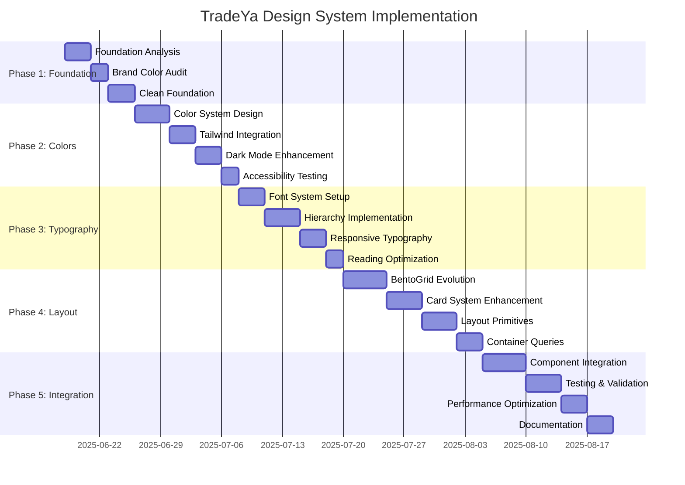

# TradeYa Modern Design System Plan

**Document Version:** 1.1  
**Created:** June 17, 2025  
**Last Updated:** [Current Date]
**Status:** 🚧 **In Progress** | **3D Card Components: ✅ Completed**

---
## 🚀 Implementation Status & Summary

**Date Started:** [Current Date]

**Current Focus:** Migrating components to the new semantic color system and theme initializer.

**Progress:**
- ✅ **Theme Initializer:** The new theme system (`src/utils/themeInitializer.ts`) has been implemented and is active. The old `ThemeContext` has been deprecated and removed from `src/main.tsx`.
- ✅ **Theme Toggle:** The theme toggle component (`src/components/ThemeToggle.tsx`) is functional and correctly switches between light and dark modes using the new system.
- ✅ **3D Card Components (COMPLETED):** All major card components now use premium variants with 3D tilt effects, brand glow colors, and advanced glassmorphism. TradeCard, CollaborationCard, ProfileCard, UserCard, ConnectionCard, RoleCard, and TradeProposalCard are fully standardized.
- 🚧 **Component Migration (In Progress):**
  - ✅ Glassmorphic headers/panels standardized across: `TradesPage`, `UserDirectoryPage`, `ChallengesPage`, `DashboardPage`, `TradeDetailPage`, `NotificationsPage`, `MessagesPage`, `ConnectionsPage`, and verified on `CollaborationsPage`.
  - ✅ Action buttons standardized to shared `Button`; `asChild` usage enforced (single child). See `docs/COMPONENT_GUIDELINES.md`.
  - ✅ Brand tokenization in shared components (chat, evidence, fallbacks, streak/gamification). Replaced `text-orange-*`, `bg-orange-*`, `border-orange-*`, `ring-orange-*` with semantic tokens: `text-primary`, `bg-primary`/`bg-primary/10`, `border-border`, `ring-ring`. Gradients preserved.
  - ✅ Form systems updated: `components/forms/TradeCreationSteps.tsx`, `components/forms/ProfileCompletionSteps.tsx`; verified `components/ui/GlassmorphicForm.tsx` brand accents now use neutral ring tokens.
  - ✅ Design utilities: `src/utils/designSystem.ts` (`textInput`, `badge.brand`) migrated to tokens.
  - ✅ Style guide: `components/ui/EnhancedStyleGuide.tsx` updated to use tokenized classes.
  - 🚧 Remaining: migrate badges/progress/animations still using raw orange; clean up demo/test pages.

**Next Steps:**
- Systematically migrate all UI components to use the semantic color tokens defined in this plan.
- Update typography and layout systems according to Phases 3 and 4.
- Button composition guideline: when using `asChild` (Radix Slot), pass exactly one React element child and include any icons/text inside that element. Our `Button` renders only the single child in `asChild` mode to maintain Slot semantics.

---

## 📋 Executive Summary

This comprehensive planning document outlines a complete modernization strategy for the TradeYa application's design system. The plan preserves the existing orange/blue/purple brand colors while modernizing the overall design approach, building upon previous bento and card layout experiences, and focusing on thorough planning over implementation.

**Key Objectives:**

- 🎨 Preserve brand identity while modernizing visual approach
- 🏗️ Build upon existing bento/card layout success
- 📐 Establish scalable design system foundations
- 🚀 Create implementation roadmap with risk mitigation
- 📊 Enable iterative improvements and user feedback integration

---

## PHASE 1: FOUNDATION ANALYSIS

> **🎯 Objective:** Assess current state, preserve brand colors, and establish clean foundation

### 1.1 Current State Assessment

#### ✅ **Existing Assets Inventory**

**CSS Foundation:**

- ✅ **[`src/index.css`](src/index.css:1)** - CSS custom properties, brand colors, dark mode support
- ✅ **[`tailwind.config.ts`](tailwind.config.ts:1)** - Comprehensive 278-line Tailwind v4 configuration
- ✅ **[`postcss.config.cjs`](postcss.config.cjs:1)** - Proper @tailwindcss/postcss plugin configuration

**Component Architecture:**

- ✅ **[`BentoGrid`](src/components/ui/BentoGrid.tsx:1)** - Responsive grid system (1→2→3→6 columns)
- ✅ **[`Card`](src/components/ui/Card.tsx:1)** - Enhanced with glassmorphism variants
- ✅ **[`MainLayout`](src/components/layout/MainLayout.tsx:1)** - Centralized layout component
- ✅ **[`HomePage`](src/pages/HomePage.tsx:1)** - Effective BentoGrid implementation

**Typography System:**

- ✅ **Inter Font Family** - Established in both CSS and Tailwind config
- ✅ **Font Scale** - Complete xs to 9xl sizing with line heights
- ✅ **Font Families** - Sans (Inter), Heading (Outfit), Mono (JetBrains Mono)

#### 📝 **Strengths Analysis**

```markdown
**What's Working Well:**
✅ Brand colors properly defined and implemented
✅ Tailwind v4 configuration is comprehensive and functional
✅ Dark mode implementation exists and works
✅ BentoGrid provides excellent responsive foundation
✅ Card component glassmorphism effects are modern
✅ Typography foundation with Inter is solid
✅ CSS custom properties enable theme-aware design
```

#### ⚠️ **Areas for Enhancement**

```markdown
**Modernization Opportunities:**
🔄 Color system could be expanded with semantic tokens
🔄 Typography scale could benefit from fluid sizing
🔄 Layout system could incorporate container queries
🔄 Component architecture could use design tokens
🔄 Accessibility could be enhanced with WCAG compliance
🔄 Animation system could be more sophisticated
```

### 1.2 Brand Color Preservation Strategy

#### 🎨 **Core Brand Colors (PRESERVED)**

```css
/* Primary Brand Colors - NEVER CHANGE */
--color-primary-orange: #f97316; /* TradeYa Orange */
--color-secondary-blue: #0ea5e9; /* TradeYa Blue */
--color-accent-purple: #8b5cf6; /* TradeYa Purple */
```

#### 📊 **Brand Color Usage Audit**

| Component       | Orange Usage | Blue Usage | Purple Usage | Status                  |
| --------------- | ------------ | ---------- | ------------ | ----------------------- |
| HomePage Links  | ✅ Primary   | ❌ None    | ❌ None      | **Compliant**           |
| Card Components | 🔄 Minimal   | 🔄 Minimal | 🔄 Minimal   | **Needs Enhancement**   |
| BentoGrid Items | 🔄 Limited   | 🔄 Limited | 🔄 Limited   | **Needs Enhancement**   |
| Typography      | ✅ Good      | ❌ None    | ❌ None      | **Partially Compliant** |

#### 🎯 **Preservation Success Criteria**

- [ ] Brand colors remain visually prominent in final design
- [ ] Orange maintains primary brand color status
- [ ] Blue serves complementary/secondary role effectively
- [ ] Purple provides accent/highlight functionality
- [ ] All three colors work harmoniously in both light and dark themes

### 1.3 Clean Foundation Establishment Plan

#### 🧹 **Foundation Cleanup Checklist**

- [ ] **CSS Architecture Review**

  - [ ] Audit [`src/index.css`](src/index.css:1) for unused styles
  - [ ] Consolidate redundant custom properties
  - [ ] Optimize CSS custom property naming convention
  - [ ] Remove test/debug styles (`.test-dark-mode`, `.test-colors`)

- [ ] **Tailwind Configuration Optimization**

  - [ ] Review [`tailwind.config.ts`](tailwind.config.ts:1) for unused configurations
  - [ ] Optimize color palette organization
  - [ ] Enhance responsive breakpoint strategy
  - [ ] Add missing Tailwind v4 features

- [ ] **Component Standardization**
  - [ ] Standardize component prop interfaces
  - [ ] Implement consistent naming conventions
  - [ ] Add comprehensive TypeScript definitions
  - [ ] Create component documentation standards

#### 📋 **Foundation Success Metrics**

| Metric                | Current State | Target State | Validation Method |
| --------------------- | ------------- | ------------ | ----------------- |
| CSS Bundle Size       | ~Unknown      | <50KB        | Bundle analysis   |
| Component Consistency | ~70%          | 95%          | Manual audit      |
| TypeScript Coverage   | ~80%          | 98%          | TSC strict mode   |
| Performance Score     | ~Unknown      | >90          | Lighthouse audit  |

---

## PHASE 2: COLOR SYSTEM DESIGN

> **🎯 Objective:** Modern palette expansion with preserved brand colors and Tailwind v4 integration

### 2.1 Brand Color Integration Strategy

#### 🎨 **Extended Brand Palette Design**

```typescript
// Enhanced brand color system
const brandColors = {
  // Primary Orange Palette (PRESERVED)
  orange: {
    50: "#fff7ed", // Lightest tint
    100: "#ffedd5", // Very light
    200: "#fed7aa", // Light
    300: "#fdba74", // Medium light
    400: "#fb923c", // Medium
    500: "#f97316", // BRAND PRIMARY (preserved)
    600: "#ea580c", // Medium dark
    700: "#c2410c", // Dark
    800: "#9a3412", // Very dark
    900: "#7c2d12", // Darkest
    950: "#431407", // Ultra dark
  },

  // Secondary Blue Palette (PRESERVED)
  blue: {
    50: "#f0f9ff", // Sky light
    100: "#e0f2fe", // Very light
    200: "#bae6fd", // Light
    300: "#7dd3fc", // Medium light
    400: "#38bdf8", // Medium
    500: "#0ea5e9", // BRAND SECONDARY (preserved)
    600: "#0284c7", // Medium dark
    700: "#0369a1", // Dark
    800: "#075985", // Very dark
    900: "#0c4a6e", // Darkest
    950: "#082f49", // Ultra dark
  },

  // Accent Purple Palette (PRESERVED)
  purple: {
    50: "#f5f3ff", // Lavender light
    100: "#ede9fe", // Very light
    200: "#ddd6fe", // Light
    300: "#c4b5fd", // Medium light
    400: "#a78bfa", // Medium
    500: "#8b5cf6", // BRAND ACCENT (preserved)
    600: "#7c3aed", // Medium dark
    700: "#6d28d9", // Dark
    800: "#5b21b6", // Very dark
    900: "#4c1d95", // Darkest
    950: "#2e1065", // Ultra dark
  },
};
```

#### 🌈 **Modern Semantic Color System**

```typescript
// Semantic color tokens built on brand palette
const semanticColors = {
  // Feedback Colors
  success: {
    light: "#22c55e", // Green for positive actions
    DEFAULT: "#16a34a",
    dark: "#15803d",
  },
  warning: {
    light: "#f59e0b", // Amber for cautionary states
    DEFAULT: "#d97706",
    dark: "#b45309",
  },
  error: {
    light: "#ef4444", // Red for negative states
    DEFAULT: "#dc2626",
    dark: "#b91c1c",
  },
  info: {
    light: brandColors.blue[400], // Use brand blue for info
    DEFAULT: brandColors.blue[500],
    dark: brandColors.blue[600],
  },
};
```

### 2.2 Tailwind v4 Color Configuration

#### ⚙️ **Enhanced Tailwind Configuration**

```typescript
// tailwind.config.ts enhancements
export default {
  theme: {
    extend: {
      colors: {
        // Brand colors with semantic naming
        brand: {
          primary: brandColors.orange,
          secondary: brandColors.blue,
          accent: brandColors.purple,
        },

        // Semantic colors
        semantic: semanticColors,

        // Context-aware neutral system
        neutral: {
          // Light mode neutrals
          50: "#f9fafb",
          100: "#f3f4f6",
          200: "#e5e7eb",
          300: "#d1d5db",
          400: "#9ca3af",
          500: "#6b7280",
          600: "#4b5563",
          700: "#374151",
          800: "#1f2937",
          900: "#111827",
          950: "#030712",
        },
      },
    },
  },
};
```

#### 📝 **Color Usage Guidelines**

```markdown
**Color Application Strategy:**

🟠 **Orange (Primary):**

- Primary buttons and CTAs
- Active states and selections
- Brand emphasis areas
- Links and interactive elements

🔵 **Blue (Secondary):**

- Secondary buttons and actions
- Information states
- Navigation elements
- Progress indicators

🟣 **Purple (Accent):**

- Special features and highlights
- Premium/advanced functionality
- Badges and status indicators
- Decorative accents

📊 **Implementation Priority:**

1. Orange: 40% of color usage
2. Blue: 35% of color usage
3. Purple: 25% of color usage
```

### 2.3 Dark Mode & Accessibility

#### 🌙 **Dark Mode Color Strategy**

```css
/* Enhanced dark mode color variables */
.dark {
  /* Brand colors adjusted for dark backgrounds */
  --color-primary: #fb923c; /* Lighter orange for contrast */
  --color-secondary: #38bdf8; /* Lighter blue for contrast */
  --color-accent: #a78bfa; /* Lighter purple for contrast */

  /* Semantic adjustments for dark mode */
  --color-success: #4ade80;
  --color-warning: #fbbf24;
  --color-error: #f87171;
  --color-info: var(--color-secondary);
}
```

#### ♿ **Accessibility Compliance Checklist**

- [ ] **WCAG 2.1 AA Compliance**

  - [ ] Color contrast ratios ≥ 4.5:1 for normal text
  - [ ] Color contrast ratios ≥ 3:1 for large text
  - [ ] Color is not the only means of conveying information
  - [ ] Focus indicators have sufficient contrast

- [ ] **Color Blindness Considerations**
  - [ ] Test with Protanopia simulation
  - [ ] Test with Deuteranopia simulation
  - [ ] Test with Tritanopia simulation
  - [ ] Provide alternative visual indicators

#### 🧪 **Color Testing Strategy**

```markdown
**Testing Tools & Methods:**

- WebAIM Contrast Checker for ratio validation
- Stark plugin for Figma/browser testing
- Chrome DevTools accessibility audit
- Color Oracle for color blindness simulation
- Manual testing with screen readers
```

---

## PHASE 3: TYPOGRAPHY & VISUAL HIERARCHY

> **🎯 Objective:** Modern font system with responsive scales and clear hierarchy

### 3.1 Modern Font System Design

#### 🔤 **Enhanced Typography Foundation**

```typescript
// Enhanced font system configuration
const fontSystem = {
  families: {
    // Primary text - keeping Inter for body
    sans: [
      "Inter var",
      "Inter",
      "system-ui",
      "-apple-system",
      "BlinkMacSystemFont",
      "Segoe UI",
      "Roboto",
      "sans-serif",
    ],

    // Headings - enhanced with Outfit
    heading: [
      "Outfit", // Modern geometric sans
      "Inter var", // Fallback to Inter
      "system-ui",
      "-apple-system",
      "BlinkMacSystemFont",
      "Segoe UI",
      "Roboto",
      "sans-serif",
    ],

    // Code and technical content
    mono: [
      "JetBrains Mono", // Excellent for code
      "Fira Code", // Alternative with ligatures
      "Menlo",
      "Monaco",
      "Consolas",
      "Liberation Mono",
      "Courier New",
      "monospace",
    ],
  },
};
```

#### 📏 **Fluid Typography Scale**

```css
/* Fluid typography using clamp() for responsive scaling */
:root {
  /* Fluid font sizes that scale with viewport */
  --font-size-xs: clamp(0.75rem, 0.71rem + 0.2vw, 0.875rem);
  --font-size-sm: clamp(0.875rem, 0.83rem + 0.23vw, 1rem);
  --font-size-base: clamp(1rem, 0.95rem + 0.25vw, 1.125rem);
  --font-size-lg: clamp(1.125rem, 1.06rem + 0.33vw, 1.25rem);
  --font-size-xl: clamp(1.25rem, 1.18rem + 0.36vw, 1.5rem);
  --font-size-2xl: clamp(1.5rem, 1.39rem + 0.56vw, 1.875rem);
  --font-size-3xl: clamp(1.875rem, 1.71rem + 0.83vw, 2.25rem);
  --font-size-4xl: clamp(2.25rem, 2.01rem + 1.2vw, 3rem);
  --font-size-5xl: clamp(3rem, 2.54rem + 2.31vw, 4rem);
  --font-size-6xl: clamp(3.75rem, 3.08rem + 3.33vw, 5.625rem);

  /* Fluid line heights */
  --line-height-tight: 1.25;
  --line-height-snug: 1.375;
  --line-height-normal: 1.5;
  --line-height-relaxed: 1.625;
  --line-height-loose: 2;
}
```

### 3.2 Visual Hierarchy Planning

#### 📑 **Heading System Design**

```typescript
// Semantic heading system with visual hierarchy
const headingSystem = {
  h1: {
    fontSize: "var(--font-size-5xl)", // 3rem - 4rem fluid
    fontFamily: "var(--font-family-heading)",
    fontWeight: "800",
    lineHeight: "var(--line-height-tight)",
    letterSpacing: "-0.025em",
    usage: "Page titles, hero headings",
    color: "var(--color-text-primary)",
  },

  h2: {
    fontSize: "var(--font-size-4xl)", // 2.25rem - 3rem fluid
    fontFamily: "var(--font-family-heading)",
    fontWeight: "700",
    lineHeight: "var(--line-height-tight)",
    letterSpacing: "-0.025em",
    usage: "Section headings, card titles",
    color: "var(--color-text-primary)",
  },

  h3: {
    fontSize: "var(--font-size-3xl)", // 1.875rem - 2.25rem fluid
    fontFamily: "var(--font-family-heading)",
    fontWeight: "600",
    lineHeight: "var(--line-height-snug)",
    letterSpacing: "-0.01em",
    usage: "Subsection headings",
    color: "var(--color-text-primary)",
  },

  h4: {
    fontSize: "var(--font-size-2xl)", // 1.5rem - 1.875rem fluid
    fontFamily: "var(--font-family-heading)",
    fontWeight: "600",
    lineHeight: "var(--line-height-snug)",
    usage: "Component headings",
    color: "var(--color-text-primary)",
  },

  h5: {
    fontSize: "var(--font-size-xl)", // 1.25rem - 1.5rem fluid
    fontFamily: "var(--font-family-heading)",
    fontWeight: "500",
    lineHeight: "var(--line-height-normal)",
    usage: "List headings, labels",
    color: "var(--color-text-secondary)",
  },

  h6: {
    fontSize: "var(--font-size-lg)", // 1.125rem - 1.25rem fluid
    fontFamily: "var(--font-family-heading)",
    fontWeight: "500",
    lineHeight: "var(--line-height-normal)",
    usage: "Minor headings, overlines",
    color: "var(--color-text-secondary)",
  },
};
```

#### 📝 **Text Content Hierarchy**

```typescript
// Body text and content hierarchy
const textHierarchy = {
  // Primary body text
  bodyLarge: {
    fontSize: "var(--font-size-lg)", // 1.125rem - 1.25rem
    lineHeight: "var(--line-height-relaxed)",
    usage: "Primary content, article text",
  },

  body: {
    fontSize: "var(--font-size-base)", // 1rem - 1.125rem
    lineHeight: "var(--line-height-normal)",
    usage: "Standard body text, descriptions",
  },

  bodySmall: {
    fontSize: "var(--font-size-sm)", // 0.875rem - 1rem
    lineHeight: "var(--line-height-normal)",
    usage: "Secondary content, captions",
  },

  // Specialty text
  lead: {
    fontSize: "var(--font-size-xl)", // 1.25rem - 1.5rem
    lineHeight: "var(--line-height-relaxed)",
    fontWeight: "400",
    usage: "Introduction paragraphs, callouts",
  },

  caption: {
    fontSize: "var(--font-size-xs)", // 0.75rem - 0.875rem
    lineHeight: "var(--line-height-normal)",
    usage: "Image captions, footnotes, metadata",
  },

  overline: {
    fontSize: "var(--font-size-xs)", // 0.75rem - 0.875rem
    fontWeight: "600",
    textTransform: "uppercase",
    letterSpacing: "0.1em",
    usage: "Category labels, section markers",
  },
};
```

### 3.3 Reading Optimization

#### 📖 **Reading Experience Enhancements**

```css
/* Optimal reading experience variables */
:root {
  /* Optimal line lengths for readability */
  --line-length-optimal: 65ch; /* 45-75 characters optimal */
  --line-length-minimum: 45ch; /* Minimum readable length */
  --line-length-maximum: 75ch; /* Maximum readable length */

  /* Text density options */
  --text-density-compact: 1.4; /* Compact line spacing */
  --text-density-comfortable: 1.6; /* Default comfortable spacing */
  --text-density-spacious: 1.8; /* Spacious line spacing */
}

/* Reading optimization classes */
.text-optimized {
  max-width: var(--line-length-optimal);
  line-height: var(--text-density-comfortable);
  font-feature-settings: "kern" 1, "liga" 1, "calt" 1;
  text-rendering: optimizeLegibility;
}

.text-compact {
  line-height: var(--text-density-compact);
}

.text-spacious {
  line-height: var(--text-density-spacious);
}
```

#### ✅ **Typography Success Criteria**

- [ ] **Readability Metrics**

  - [ ] Line lengths stay within 45-75 character range
  - [ ] Line heights provide comfortable reading rhythm
  - [ ] Font sizes scale appropriately across devices
  - [ ] Contrast ratios meet WCAG standards

- [ ] **Performance Metrics**
  - [ ] Font loading doesn't block rendering
  - [ ] Variable fonts load efficiently
  - [ ] Fallback fonts provide consistent experience
  - [ ] Typography doesn't impact Core Web Vitals

---

## PHASE 4: LAYOUT SYSTEM MODERNIZATION

> **🎯 Objective:** Evolve bento/card layouts with modern CSS techniques and component architecture

### 4.1 BentoGrid Evolution Strategy

#### 🏗️ **Enhanced BentoGrid Architecture**

```typescript
// Evolved BentoGrid with container queries support
interface BentoGridProps {
  children: React.ReactNode;
  className?: string;

  // Enhanced responsive options
  columns?: {
    mobile: 1 | 2;
    tablet: 2 | 3 | 4;
    desktop: 3 | 4 | 6 | 8;
    wide: 4 | 6 | 8 | 12;
  };

  // Gap system with semantic names
  gap?: "xs" | "sm" | "md" | "lg" | "xl" | "2xl";

  // Layout behavior options
  autoFit?: boolean; // CSS Grid auto-fit minmax
  minItemWidth?: string; // Minimum item width for auto-fit
  aspectRatio?: "auto" | "square" | "golden" | "video";

  // Container query support
  containerQueries?: boolean; // Enable @container queries

  // Advanced grid features
  subgrid?: boolean; // CSS Subgrid support
  masonry?: boolean; // Masonry-style layout
}
```

#### 📐 **Modern Grid Implementation**

```css
/* Enhanced BentoGrid with container queries */
.bento-grid {
  display: grid;
  container-type: inline-size;

  /* Default responsive grid */
  grid-template-columns: repeat(1, 1fr);
  gap: var(--grid-gap, 1rem);

  /* Auto-fit responsive behavior */
  &.auto-fit {
    grid-template-columns: repeat(
      auto-fit,
      minmax(var(--min-item-width, 280px), 1fr)
    );
  }

  /* Container query responsive breakpoints */
  @container (min-width: 768px) {
    &.columns-tablet-2 {
      grid-template-columns: repeat(2, 1fr);
    }
    &.columns-tablet-3 {
      grid-template-columns: repeat(3, 1fr);
    }
    &.columns-tablet-4 {
      grid-template-columns: repeat(4, 1fr);
    }
  }

  @container (min-width: 1024px) {
    &.columns-desktop-3 {
      grid-template-columns: repeat(3, 1fr);
    }
    &.columns-desktop-4 {
      grid-template-columns: repeat(4, 1fr);
    }
    &.columns-desktop-6 {
      grid-template-columns: repeat(6, 1fr);
    }
    &.columns-desktop-8 {
      grid-template-columns: repeat(8, 1fr);
    }
  }

  @container (min-width: 1440px) {
    &.columns-wide-6 {
      grid-template-columns: repeat(6, 1fr);
    }
    &.columns-wide-8 {
      grid-template-columns: repeat(8, 1fr);
    }
    &.columns-wide-12 {
      grid-template-columns: repeat(12, 1fr);
    }
  }

  /* Subgrid support for nested grids */
  &.subgrid {
    grid-template-columns: subgrid;
    grid-template-rows: subgrid;
  }

  /* Masonry layout support */
  &.masonry {
    grid-template-rows: masonry;
  }
}
```

### 4.2 Advanced Card System

#### 🎴 **Enhanced Card Architecture**

```typescript
// Modern Card component with advanced features
interface CardProps {
  children: React.ReactNode;
  className?: string;

  // Visual variants
  variant?: "default" | "glass" | "elevated" | "outlined" | "filled";

  // Size variants
  size?: "sm" | "md" | "lg" | "xl";

  // Interactive states
  hover?: boolean;
  interactive?: boolean;
  pressed?: boolean;
  selected?: boolean;
  disabled?: boolean;

  // Layout options
  orientation?: "vertical" | "horizontal";
  aspectRatio?: "auto" | "square" | "video" | "golden" | string;

  // Content density
  padding?: "none" | "sm" | "md" | "lg" | "xl";

  // Advanced features
  loadingState?: boolean;
  skeleton?: boolean;
  draggable?: boolean;

  // Event handlers
  onClick?: () => void;
  onFocus?: () => void;
  onBlur?: () => void;
}
```

#### 🎨 **Card Variant System**

```css
/* Enhanced card variant system */
.card {
  /* Base card styles */
  position: relative;
  border-radius: var(--border-radius-lg, 0.75rem);
  transition: all var(--transition-duration, 200ms) var(
      --transition-timing,
      ease-out
    );

  /* Size variants */
  &.size-sm {
    padding: var(--spacing-3, 0.75rem);
  }
  &.size-md {
    padding: var(--spacing-4, 1rem);
  }
  &.size-lg {
    padding: var(--spacing-6, 1.5rem);
  }
  &.size-xl {
    padding: var(--spacing-8, 2rem);
  }

  /* Visual variants */
  &.variant-default {
    background: var(--color-bg-card);
    border: 1px solid var(--color-border);
    box-shadow: var(--shadow-sm);
  }

  &.variant-glass {
    background: var(--color-glass-bg);
    backdrop-filter: blur(16px);
    border: 1px solid var(--color-glass-border);
    box-shadow: var(--shadow-glass);
  }

  &.variant-elevated {
    background: var(--color-bg-card);
    border: none;
    box-shadow: var(--shadow-lg);
  }

  &.variant-outlined {
    background: transparent;
    border: 2px solid var(--color-border-strong);
    box-shadow: none;
  }

  &.variant-filled {
    background: var(--color-primary-50);
    border: 1px solid var(--color-primary-200);
    box-shadow: var(--shadow-sm);
  }

  /* Interactive states */
  &.interactive {
    cursor: pointer;

    &:hover {
      transform: translateY(-2px);
      box-shadow: var(--shadow-xl);
    }

    &:active {
      transform: translateY(0);
      box-shadow: var(--shadow-md);
    }

    &:focus-visible {
      outline: 2px solid var(--color-primary);
      outline-offset: 2px;
    }
  }

  /* Loading state */
  &.loading {
    pointer-events: none;
    opacity: 0.7;

    &::after {
      content: "";
      position: absolute;
      inset: 0;
      background: linear-gradient(
        90deg,
        transparent,
        var(--color-loading-shimmer),
        transparent
      );
      animation: shimmer 2s infinite;
    }
  }
}
```

### 4.3 Layout Primitive Components

#### 🧱 **Layout Building Blocks**

```typescript
// Stack - Vertical layout primitive
interface StackProps {
  children: React.ReactNode;
  gap?: "xs" | "sm" | "md" | "lg" | "xl" | "2xl";
  align?: "start" | "center" | "end" | "stretch";
  distribute?: "start" | "center" | "end" | "between" | "around" | "evenly";
  wrap?: boolean;
}

// Cluster - Horizontal layout primitive
interface ClusterProps {
  children: React.ReactNode;
  gap?: "xs" | "sm" | "md" | "lg" | "xl" | "2xl";
  justify?: "start" | "center" | "end" | "between" | "around" | "evenly";
  align?: "start" | "center" | "end" | "stretch" | "baseline";
  wrap?: boolean;
}

// Sidebar - Side-by-side layout primitive
interface SidebarProps {
  children: React.ReactNode;
  side?: "left" | "right";
  sidebarWidth?: string;
  gap?: "xs" | "sm" | "md" | "lg" | "xl" | "2xl";
  contentMinWidth?: string;
  noStretch?: boolean;
}

// Center - Centering layout primitive
interface CenterProps {
  children: React.ReactNode;
  max?: string;
  gutters?: "xs" | "sm" | "md" | "lg" | "xl" | "2xl";
  andText?: boolean;
  intrinsic?: boolean;
}
```

#### 📐 **Intrinsic Web Design Principles**

```css
/* Layout primitives using intrinsic web design */

/* Stack - Flexible vertical layout */
.stack {
  display: flex;
  flex-direction: column;
  gap: var(--stack-gap, 1rem);

  &.wrap {
    flex-wrap: wrap;
  }
  &.align-start {
    align-items: flex-start;
  }
  &.align-center {
    align-items: center;
  }
  &.align-end {
    align-items: flex-end;
  }
  &.align-stretch {
    align-items: stretch;
  }
}

/* Cluster - Flexible horizontal layout */
.cluster {
  display: flex;
  flex-wrap: wrap;
  gap: var(--cluster-gap, 1rem);

  &.justify-start {
    justify-content: flex-start;
  }
  &.justify-center {
    justify-content: center;
  }
  &.justify-end {
    justify-content: flex-end;
  }
  &.justify-between {
    justify-content: space-between;
  }
  &.justify-around {
    justify-content: space-around;
  }
  &.justify-evenly {
    justify-content: space-evenly;
  }
}

/* Sidebar - Content-aware side layout */
.sidebar {
  display: flex;
  flex-wrap: wrap;
  gap: var(--sidebar-gap, 1rem);

  > :first-child {
    flex-basis: var(--sidebar-width, 250px);
    flex-grow: 1;
  }

  > :last-child {
    flex-basis: 0;
    flex-grow: 999;
    min-width: var(--content-min-width, 50%);
  }

  &.reverse {
    flex-direction: row-reverse;
  }
}

/* Center - Intelligent centering */
.center {
  box-sizing: content-box;
  margin-left: auto;
  margin-right: auto;
  max-width: var(--center-max, 60ch);
  padding-left: var(--center-gutters, 1rem);
  padding-right: var(--center-gutters, 1rem);

  &.intrinsic {
    display: flex;
    flex-direction: column;
    align-items: center;
  }

  &.and-text {
    text-align: center;
  }
}
```

### 4.4 Container Query Integration

#### 📱 **Container-Responsive Components**

```css
/* Container query system for component-level responsiveness */
.container-responsive {
  container-type: inline-size;
  container-name: component;
}

/* Component responds to its own container size, not viewport */
@container component (min-width: 300px) {
  .card-content {
    padding: 1.5rem;

    .title {
      font-size: 1.25rem;
    }
  }
}

@container component (min-width: 500px) {
  .card-content {
    padding: 2rem;
    display: grid;
    grid-template-columns: auto 1fr;
    gap: 1rem;

    .title {
      font-size: 1.5rem;
    }
  }
}

@container component (min-width: 700px) {
  .card-content {
    grid-template-columns: auto 1fr auto;

    .title {
      font-size: 1.75rem;
    }
  }
}
```

#### ✅ **Layout System Success Criteria**

- [ ] **Responsive Excellence**

  - [ ] Components respond to container size, not just viewport
  - [ ] Layouts work seamlessly across all device sizes
  - [ ] Content reflows naturally without horizontal scroll
  - [ ] Touch targets meet minimum size requirements (44px)

- [ ] **Performance Standards**

  - [ ] Layout shifts (CLS) score < 0.1
  - [ ] Layout calculations don't block main thread
  - [ ] Responsive images load appropriately
  - [ ] Animations run at 60fps

- [ ] **Accessibility Compliance**
  - [ ] Focus management works across all layouts
  - [ ] Screen readers can navigate logically
  - [ ] Reduced motion preferences respected
  - [ ] Color alone doesn't convey layout meaning

---

## PHASE 5: IMPLEMENTATION STRATEGY
### Component Migration

- Page headers/panels standardized: Glassmorphic headers and panels applied consistently using `glassmorphic`, `border-border`, `bg-card`, and semantic text tokens across all key pages, including `CollaborationsPage`.
- Action buttons standardized: All new/changed buttons use the shared `Button` (or `AnimatedButton` where intended). When using `asChild`, exactly one child element is passed; icons/text live inside the child.
- Brand tokenization in shared components: Chat lists, evidence gallery links, fallbacks, and gamification counters migrated to `text-primary`, `bg-primary` (or `bg-primary/10` for pills), `ring-ring`, and `border-border`. Gradients (`from/to/via`) retained.
- Tooling: lint:brand: Added brand audit script wired into `npm run validate`. Run `npm run lint:brand` to detect single‑color orange utilities; fix by replacing with semantic tokens.

#### Remaining work
- Finish tokenization in forms and badges where legacy orange remains (e.g., reputation tiers that still reference orange in some thresholds, demo/test pages).
- Migrate animation/status components using raw orange (e.g., trade status indicators, progress animations) to semantic tokens or status palettes.
- Clean up legacy demo/test pages: `HomePage`, `SimpleAsymmetricTest`, `AsymmetricLayoutTestPage`, `MicroAnimationsDemoPage`, and utility spinners.

### Enforcement & Audits

- Use `npm run lint:brand` to flag disallowed raw orange utilities in non‑gradient UI.
- CI `npm run validate` runs: lint, tests, `lint:glass`, and `lint:brand` to enforce design‑system standards.


> **🎯 Objective:** Detailed roadmap with testing, validation, and rollback strategies

### 5.1 Phased Implementation Roadmap

#### 🗓️ **Implementation Timeline**



#### 📋 **Weekly Implementation Sprints**

**Week 1: Foundation & Colors**

- [ ] **Days 1-3:** Foundation analysis and cleanup

  - [ ] Audit existing CSS and components
  - [ ] Document current brand color usage
  - [ ] Clean up test styles and unused code
  - [ ] Establish baseline metrics

- [ ] **Days 4-7:** Color system implementation
  - [ ] Implement enhanced brand color palettes
  - [ ] Update Tailwind configuration
  - [ ] Test dark mode compatibility
  - [ ] Run accessibility audits

**Week 2: Typography & Hierarchy**

- [ ] **Days 1-4:** Typography system

  - [ ] Implement fluid typography scales
  - [ ] Create heading hierarchy system
  - [ ] Set up font loading optimization
  - [ ] Test reading experience across devices

- [ ] **Days 5-7:** Visual hierarchy refinement
  - [ ] Implement semantic text styles
  - [ ] Create text density options
  - [ ] Test typography performance
  - [ ] Document usage guidelines

**Week 3: Layout System Evolution**

- [ ] **Days 1-3:** BentoGrid enhancement

  - [ ] Add container query support
  - [ ] Implement auto-fit functionality
  - [ ] Create masonry layout option
  - [ ] Test responsive behavior

- [ ] **Days 4-7:** Card system and primitives
  - [ ] Enhance Card component variants
  - [ ] Create layout primitive components
  - [ ] Implement loading and interactive states
  - [ ] Test component composition

**Week 4: Integration & Optimization**

- [ ] **Days 1-3:** Component integration

  - [ ] Update HomePage with new system
  - [ ] Migrate existing components
  - [ ] Test component interactions
  - [ ] Validate design consistency

- [ ] **Days 4-7:** Testing and optimization
  - [ ] Performance testing and optimization
  - [ ] Cross-browser compatibility testing
  - [ ] Accessibility compliance validation
  - [ ] Documentation completion

### 5.2 Testing & Validation Strategy

#### 🧪 **Testing Framework**

```typescript
// Testing strategy configuration
const testingStrategy = {
  // Visual regression testing
  visualRegression: {
    tool: "Chromatic", // or Percy, BackstopJS
    viewports: ["mobile", "tablet", "desktop", "wide"],
    browsers: ["chrome", "firefox", "safari", "edge"],
    threshold: 0.05, // 5% change threshold
  },

  // Performance testing
  performance: {
    tools: ["Lighthouse", "WebPageTest", "SpeedCurve"],
    metrics: {
      CLS: { target: 0.1, threshold: 0.15 },
      LCP: { target: 2500, threshold: 3000 },
      FID: { target: 100, threshold: 300 },
      FCP: { target: 1800, threshold: 2000 },
    },
  },

  // Accessibility testing
  accessibility: {
    tools: ["axe-core", "Lighthouse", "WAVE"],
    standards: "WCAG 2.1 AA",
    automatedCoverage: 80, // % of issues caught automatically
    manualTesting: true, // Screen reader testing required
  },

  // Cross-browser testing
  crossBrowser: {
    browsers: [
      "Chrome (latest)",
      "Firefox (latest)",
      "Safari (latest)",
      "Edge (latest)",
      "Chrome Mobile",
      "Safari Mobile",
    ],
    testingService: "BrowserStack", // or Sauce Labs
  },
};
```

#### 📊 **Quality Gates**

```markdown
**Pre-Implementation Checklist:**

- [ ] Design tokens documented and approved
- [ ] Component API designed and reviewed
- [ ] Accessibility considerations identified
- [ ] Performance impact estimated
- [ ] Browser support confirmed

**Post-Implementation Validation:**

- [ ] Visual regression tests pass
- [ ] Performance metrics within targets
- [ ] Accessibility audit shows no regressions
- [ ] Cross-browser compatibility confirmed
- [ ] Code review completed

**Release Criteria:**

- [ ] All automated tests pass
- [ ] Manual testing completed
- [ ] Documentation updated
- [ ] Stakeholder approval received
- [ ] Rollback plan confirmed
```

#### 🎯 **Success Metrics Dashboard**

| Metric Category    | Current Baseline | Target           | Measurement Method   |
| ------------------ | ---------------- | ---------------- | -------------------- |
| **Performance**    |
| Lighthouse Score   | ~Unknown         | >90              | Automated CI testing |
| Bundle Size        | ~Unknown         | <50KB additional | Bundle analyzer      |
| CLS Score          | ~Unknown         | <0.1             | RUM monitoring       |
| LCP Score          | ~Unknown         | <2.5s            | RUM monitoring       |
| **Accessibility**  |
| axe-core Score     | ~Unknown         | 0 violations     | Automated testing    |
| Color Contrast     | ~Unknown         | 100% WCAG AA     | Manual audit         |
| Screen Reader      | ~Unknown         | 100% navigable   | Manual testing       |
| **Design Quality** |
| Brand Consistency  | ~70%             | 95%              | Design review        |
| Component Reuse    | ~Unknown         | 80%              | Code analysis        |
| Design Token Usage | ~Unknown         | 90%              | Static analysis      |

### 5.3 Risk Mitigation & Rollback Strategies

#### ⚠️ **Risk Assessment Matrix**

| Risk                       | Probability | Impact | Mitigation Strategy                       | Rollback Plan                         |
| -------------------------- | ----------- | ------ | ----------------------------------------- | ------------------------------------- |
| **Breaking Changes**       | Medium      | High   | Incremental implementation, feature flags | Git revert, component versioning      |
| **Performance Regression** | Low         | High   | Performance budgets, monitoring           | Asset rollback, lazy loading          |
| **Accessibility Issues**   | Medium      | High   | Automated testing, manual audits          | Immediate fixes, temporary rollback   |
| **Browser Compatibility**  | Medium      | Medium | Progressive enhancement, polyfills        | Fallback styles, graceful degradation |
| **User Confusion**         | Low         | Medium | User testing, gradual rollout             | A/B testing, quick fixes              |
| **Development Velocity**   | High        | Medium | Training, documentation                   | Parallel development, team support    |

#### 🔄 **Rollback Strategy**

```typescript
// Rollback strategy configuration
const rollbackStrategy = {
  // Git-based rollback
  versionControl: {
    strategy: "feature-branch",
    protection: "main-branch-protection",
    revertProcess: "automated-revert-pr",
    hotfixProcess: "emergency-hotfix-branch",
  },

  // Component versioning
  componentVersioning: {
    strategy: "semantic-versioning",
    deprecationPeriod: "30-days",
    migrationGuides: "automatic-generation",
    legacySupport: "parallel-components",
  },

  // Feature flags
  featureFlags: {
    tool: "LaunchDarkly", // or similar
    granularity: "component-level",
    rolloutStrategy: "percentage-based",
    rollbackSpeed: "immediate",
  },

  // Asset management
  assetManagement: {
    cdn: "versioned-assets",
    caching: "cache-busting",
    fallbacks: "previous-version-assets",
    monitoring: "real-time-alerts",
  },
};
```

#### 🚨 **Emergency Procedures**

```markdown
**Critical Issue Response Plan:**

**Phase 1: Immediate Response (< 15 minutes)**

1. 🚨 Identify impact scope and severity
2. 🔄 Execute feature flag rollback if available
3. 📢 Notify stakeholders via emergency channel
4. 📊 Begin monitoring key metrics

**Phase 2: Assessment & Mitigation (< 1 hour)**

1. 🔍 Root cause analysis
2. 🛠️ Implement immediate fix or rollback
3. 📋 Document incident details
4. 🔄 Verify fix resolves the issue

**Phase 3: Resolution & Recovery (< 4 hours)**

1. 🚀 Deploy verified fix to production
2. 📊 Confirm metrics return to baseline
3. 📝 Update stakeholders on resolution
4. 🔍 Plan post-incident review

**Phase 4: Post-Incident (< 1 week)**

1. 📊 Conduct thorough post-incident review
2. 📝 Document lessons learned
3. 🛠️ Implement preventive measures
4. 📚 Update runbooks and procedures
```

### 5.4 User Feedback Integration

#### 👥 **Feedback Collection Strategy**

```typescript
// User feedback collection system
const feedbackStrategy = {
  // Collection methods
  methods: {
    usabilityTesting: {
      frequency: "weekly",
      participants: "target-users",
      scenarios: "real-world-tasks",
      format: "moderated-remote",
    },

    surveys: {
      tool: "Typeform", // or similar
      triggers: "post-interaction",
      questions: "nps-and-specific",
      frequency: "monthly",
    },

    analytics: {
      tool: "Hotjar", // or similar
      tracking: "interaction-patterns",
      heatmaps: "component-level",
      recordings: "error-sessions",
    },

    abTesting: {
      tool: "Optimizely", // or similar
      scope: "component-variants",
      duration: "2-week-cycles",
      metrics: "engagement-conversion",
    },
  },

  // Feedback processing
  processing: {
    categorization: "automated-tagging",
    prioritization: "impact-effort-matrix",
    tracking: "linear-integration",
    response: "weekly-updates",
  },
};
```

#### 🔄 **Iterative Improvement Process**

```markdown
**Continuous Improvement Cycle:**

**Week 1-2: Collection Phase**

- [ ] Deploy new design system changes
- [ ] Monitor usage analytics and error rates
- [ ] Collect user feedback through multiple channels
- [ ] Track performance and accessibility metrics

**Week 3: Analysis Phase**

- [ ] Analyze feedback patterns and themes
- [ ] Review performance impact data
- [ ] Assess accessibility compliance
- [ ] Identify high-priority improvement areas

**Week 4: Planning Phase**

- [ ] Prioritize improvements based on impact/effort
- [ ] Plan next iteration of design system updates
- [ ] Update documentation with lessons learned
- [ ] Prepare for next implementation cycle

**Monthly Reviews:**

- [ ] Stakeholder review of progress and metrics
- [ ] Design system roadmap updates
- [ ] Team retrospective and process improvements
- [ ] Success story documentation and sharing
```

#### ✅ **Feedback Integration Success Criteria**

- [ ] **Response Time:** User feedback acknowledged within 48 hours
- [ ] **Implementation Rate:** 70% of high-priority feedback implemented within 30 days
- [ ] **User Satisfaction:** NPS score improvement by 10+ points
- [ ] **Usage Analytics:** 80% adoption rate of new design system components
- [ ] **Performance Impact:** No regression in core performance metrics
- [ ] **Accessibility:** 100% compliance maintained across iterations

---

## 📊 PROJECT TRACKING & METRICS

### Overall Progress Tracking

#### 🎯 **Phase Completion Checklist**

**PHASE 1: FOUNDATION ANALYSIS** ⏳

- [ ] Current state assessment completed
- [ ] Brand color preservation strategy defined
- [ ] Clean foundation establishment plan created
- [ ] Baseline metrics established
- [ ] Risk assessment completed

**PHASE 2: COLOR SYSTEM DESIGN** ⏳

- [ ] Brand color integration strategy implemented
- [ ] Tailwind v4 color configuration updated
- [ ] Dark mode compatibility verified
- [ ] Accessibility compliance achieved
- [ ] Color testing completed

**PHASE 3: TYPOGRAPHY & VISUAL HIERARCHY** ⏳

- [ ] Modern font system implemented
- [ ] Responsive typography scales created
- [ ] Text hierarchy planning completed
- [ ] Reading optimization implemented
- [ ] Typography performance validated

**PHASE 4: LAYOUT SYSTEM MODERNIZATION** ⏳

- [ ] BentoGrid evolution completed
- [ ] Enhanced Card system implemented
- [ ] Layout primitives created
- [ ] Container queries integrated
- [ ] Component architecture validated

**PHASE 5: IMPLEMENTATION STRATEGY** ⏳

- [ ] Implementation roadmap executed
- [ ] Testing and validation completed
- [ ] Rollback strategies tested
- [ ] User feedback integration established
- [ ] Documentation completed

### Key Performance Indicators (KPIs)

#### 📈 **Success Metrics Dashboard**

| Metric                     | Baseline | Target  | Current | Status     |
| -------------------------- | -------- | ------- | ------- | ---------- |
| **Design System Adoption** | 0%       | 90%     | TBD     | 🟡 Pending |
| **Performance Score**      | TBD      | >90     | TBD     | 🟡 Pending |
| **Accessibility Score**    | TBD      | 100%    | TBD     | 🟡 Pending |
| **User Satisfaction**      | TBD      | +10 NPS | TBD     | 🟡 Pending |
| **Development Velocity**   | TBD      | +25%    | TBD     | 🟡 Pending |
| **Brand Consistency**      | 70%      | 95%     | TBD     | 🟡 Pending |

### Documentation & Resources

#### 📚 **Related Documentation**

- [`src/index.css`](src/index.css:1) - Current CSS foundation
- [`tailwind.config.ts`](tailwind.config.ts:1) - Tailwind configuration
- [`src/components/ui/BentoGrid.tsx`](src/components/ui/BentoGrid.tsx:1) - Current BentoGrid implementation
- [`src/components/ui/Card.tsx`](src/components/ui/Card.tsx:1) - Current Card component
- [`src/pages/HomePage.tsx`](src/pages/HomePage.tsx:1) - BentoGrid usage example

#### 🔗 **External Resources**

- [Tailwind CSS v4 Documentation](https://tailwindcss.com/docs)
- [CSS Container Queries Guide](https://developer.mozilla.org/en-US/docs/Web/CSS/CSS_Container_Queries)
- [WCAG 2.1 Guidelines](https://www.w3.org/WAI/WCAG21/quickref/)
- [Inter Font Family](https://rsms.me/inter/)
- [Modern CSS Layout Techniques](https://web.dev/learn/css/layout/)

---

## 🎉 CONCLUSION

This comprehensive planning document provides a strategic roadmap for modernizing the TradeYa design system while preserving brand identity and building upon existing successes. The phased approach ensures manageable implementation with proper risk mitigation and quality assurance.

**Next Steps:**

1. 📋 Review and approve this planning document
2. 🚀 Begin Phase 1 implementation
3. 📊 Set up tracking and monitoring systems
4. 👥 Establish feedback collection processes
5. 🔄 Begin iterative improvement cycle

**Expected Outcomes:**

- 🎨 Modern, cohesive design system
- 🚀 Improved development velocity
- ♿ Enhanced accessibility compliance
- 📱 Better responsive behavior
- 👥 Increased user satisfaction
- 🏗️ Scalable component architecture

The plan is designed to be flexible and iterative, allowing for adjustments based on user feedback and changing requirements while maintaining focus on the core objectives of modernization and brand preservation.

---

_This document should be reviewed and updated regularly as the implementation progresses and new requirements emerge._
