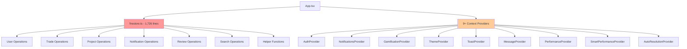
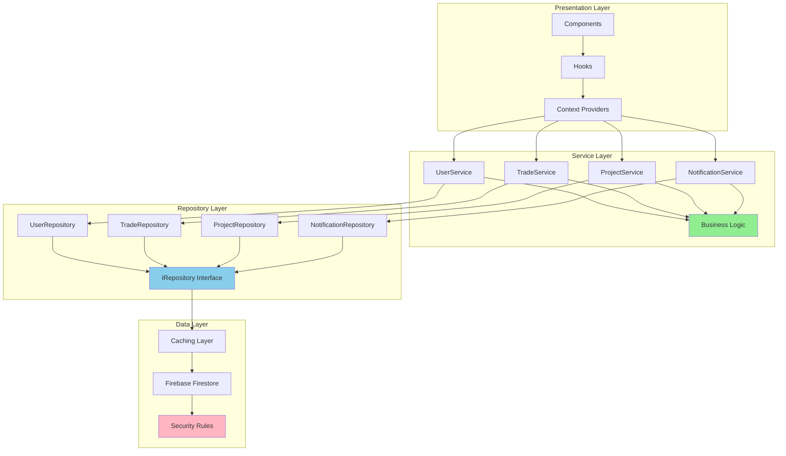
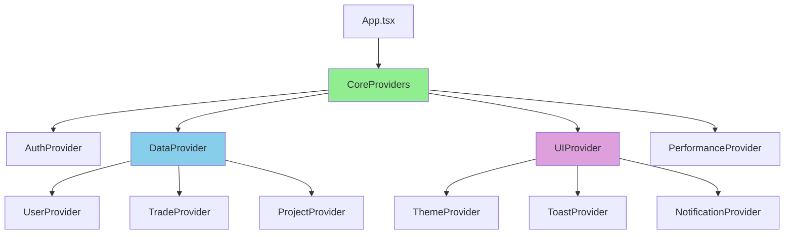

# TradeYa Refactoring: Technical Architecture Specification

**Version:** 1.0  
**Date:** June 16, 2025  
**Status:** Draft  
**Related Document:** [Implementation Plan](./TRADEYA_REFACTORING_IMPLEMENTATION_PLAN.md)

---

## Architecture Overview

This document provides detailed technical specifications for the TradeYa refactoring initiative, focusing on the transition from monolithic architecture to a modular, domain-driven design.

## Current State Architecture

### Monolithic Structure Problems



### Performance Bottlenecks

1. **Provider Chain Complexity**: 9 nested providers causing re-render cascades
2. **Monolithic Database Layer**: All operations in single 1,726-line file
3. **Mixed Concerns**: Business logic, data access, and presentation logic intertwined
4. **Circular Dependencies**: PerformanceContext ↔ SmartPerformanceContext

## Target Architecture

### Domain-Driven Repository Pattern



### Testing Strategy (Updated)

- Unit tests added for:
  - Tier gating (block and success paths) in `challenges` service
  - Role completion approve/reject flows and creator-only permissions
  - Role abandonment/reopen flows and missing-role edge cases
- Jest setup enhanced with Firestore `runTransaction` mock to support transactional service testing.

### Type Safety (Updated)

- Continued migration away from `any` in collaboration services; aligned `CollaborationRoleData` with completion fields (`assignedUserId`, `completionEvidence`, timestamps).
- Firestore reads use safe shaping (`Object.assign({ id }, data)`), and spreading unknown data is avoided.

### Simplified Provider Architecture



## Repository Pattern Implementation

### Base Repository Interface

```typescript
/**
 * Generic repository interface for all domain entities
 * Provides standard CRUD operations with consistent error handling
 */
export interface IRepository<T> {
  create(data: Omit<T, 'id'>): Promise<ServiceResult<string>>;
  getById(id: string): Promise<ServiceResult<T | undefined>>;
  getAll(
    filters?: FilterOptions<T>, 
    pagination?: PaginationOptions
  ): Promise<ServiceResult<PaginatedResult<T>>>;
  update(id: string, data: Partial<T>): Promise<ServiceResult<void>>;
  delete(id: string): Promise<ServiceResult<void>>;
  search(
    searchTerm: string, 
    filters?: FilterOptions<T>,
    pagination?: PaginationOptions
  ): Promise<ServiceResult<PaginatedResult<T>>>;
}

/**
 * Base repository implementation with common functionality
 * Handles pagination, filtering, error handling, and caching
 */
export abstract class BaseRepository<T> implements IRepository<T> {
  protected abstract collectionName: string;
  protected abstract db: () => Firestore;
  protected cache: CacheManager;
  
  constructor(cacheManager: CacheManager) {
    this.cache = cacheManager;
  }
  
  /**
   * Generic create operation with validation and error handling
   */
  async create(data: Omit<T, 'id'>): Promise<ServiceResult<string>> {
    try {
      // Input validation
      const validationResult = this.validateCreateData(data);
      if (!validationResult.isValid) {
        return { 
          data: null, 
          error: { 
            code: 'validation-error', 
            message: validationResult.message 
          } 
        };
      }
      
      // Create document
      const collection = this.getCollection();
      const docRef = await addDoc(collection, {
        ...data,
        createdAt: Timestamp.now(),
        updatedAt: Timestamp.now()
      });
      
      // Invalidate relevant caches
      await this.cache.invalidatePattern(`${this.collectionName}:*`);
      
      return { data: docRef.id, error: null };
    } catch (error: any) {
      console.error(`Error creating ${this.collectionName}:`, error);
      return this.handleError(error, 'create');
    }
  }
  
  /**
   * Generic get by ID with caching
   */
  async getById(id: string): Promise<ServiceResult<T | undefined>> {
    try {
      // Check cache first
      const cacheKey = `${this.collectionName}:${id}`;
      const cached = await this.cache.get<T>(cacheKey);
      if (cached) {
        return { data: cached, error: null };
      }
      
      // Fetch from database
      const docRef = doc(this.db(), this.collectionName, id);
      const docSnap = await getDoc(docRef);
      
      if (docSnap.exists()) {
        const data = { id: docSnap.id, ...docSnap.data() } as T;
        
        // Cache the result
        await this.cache.set(cacheKey, data, { ttl: 300 }); // 5 minutes
        
        return { data, error: null };
      } else {
        return { data: undefined, error: null };
      }
    } catch (error: any) {
      console.error(`Error getting ${this.collectionName} by ID:`, error);
      return this.handleError(error, 'getById');
    }
  }
  
  /**
   * Generic getAll with filtering and pagination
   */
  async getAll(
    filters?: FilterOptions<T>,
    pagination?: PaginationOptions
  ): Promise<ServiceResult<PaginatedResult<T>>> {
    try {
      // Build cache key
      const cacheKey = this.buildCacheKey('getAll', filters, pagination);
      const cached = await this.cache.get<PaginatedResult<T>>(cacheKey);
      if (cached) {
        return { data: cached, error: null };
      }
      
      // Build query
      const query = this.buildQuery(filters, pagination);
      const querySnapshot = await getDocs(query);
      
      // Process results
      const limit = pagination?.limit || 20;
      const items = querySnapshot.docs
        .slice(0, limit)
        .map(doc => ({ id: doc.id, ...doc.data() } as T));
      
      const hasMore = querySnapshot.docs.length > limit;
      const lastDoc = items.length > 0 ? 
        querySnapshot.docs[items.length - 1] : undefined;
      
      const result: PaginatedResult<T> = {
        items,
        hasMore,
        lastDoc,
        totalCount: items.length
      };
      
      // Cache the result
      await this.cache.set(cacheKey, result, { ttl: 180 }); // 3 minutes
      
      return { data: result, error: null };
    } catch (error: any) {
      console.error(`Error getting all ${this.collectionName}:`, error);
      return this.handleError(error, 'getAll');
    }
  }
  
  // Abstract methods for domain-specific implementation
  protected abstract validateCreateData(data: Omit<T, 'id'>): ValidationResult;
  protected abstract buildQuery(
    filters?: FilterOptions<T>, 
    pagination?: PaginationOptions
  ): Query;
  protected abstract getCollection(): CollectionReference;
  
  // Utility methods
  protected handleError(error: any, operation: string): ServiceResult<null> {
    return {
      data: null,
      error: {
        code: error.code || 'unknown',
        message: error.message || `Failed to ${operation} ${this.collectionName}`
      }
    };
  }
  
  protected buildCacheKey(
    operation: string, 
    filters?: any, 
    pagination?: any
  ): string {
    const filterStr = filters ? JSON.stringify(filters) : 'none';
    const paginationStr = pagination ? JSON.stringify(pagination) : 'none';
    return `${this.collectionName}:${operation}:${filterStr}:${paginationStr}`;
  }
}
```

### Domain-Specific Repository Implementations

#### UserRepository

```typescript
export class UserRepository extends BaseRepository<User> {
  protected collectionName = 'users';
  protected db = () => getFirestore();
  
  constructor(cacheManager: CacheManager) {
    super(cacheManager);
  }
  
  protected validateCreateData(data: Omit<User, 'id'>): ValidationResult {
    if (!data.email || !data.displayName) {
      return {
        isValid: false,
        message: 'Email and display name are required'
      };
    }
    
    if (!this.isValidEmail(data.email)) {
      return {
        isValid: false,
        message: 'Invalid email format'
      };
    }
    
    return { isValid: true };
  }
  
  protected buildQuery(
    filters?: UserFilters,
    pagination?: PaginationOptions
  ): Query {
    const collection = this.getCollection();
    const constraints: QueryConstraint[] = [];
    
    // Apply filters
    if (filters?.role) {
      constraints.push(where('role', '==', filters.role));
    }
    if (filters?.location) {
      constraints.push(where('location', '==', filters.location));
    }
    
    // Apply ordering
    const orderField = pagination?.orderByField || 'createdAt';
    const orderDirection = pagination?.orderDirection || 'desc';
    constraints.push(orderBy(orderField, orderDirection));
    
    // Apply pagination
    if (pagination?.startAfterDoc) {
      constraints.push(startAfter(pagination.startAfterDoc));
    }
    
    const limit = pagination?.limit || 20;
    constraints.push(limitQuery(limit + 1));
    
    return query(collection, ...constraints);
  }
  
  protected getCollection(): CollectionReference {
    return collection(this.db(), this.collectionName);
  }
  
  /**
   * Domain-specific methods
   */
  async getByEmail(email: string): Promise<ServiceResult<User | undefined>> {
    try {
      const cacheKey = `${this.collectionName}:email:${email}`;
      const cached = await this.cache.get<User>(cacheKey);
      if (cached) {
        return { data: cached, error: null };
      }
      
      const q = query(
        this.getCollection(),
        where('email', '==', email),
        limitQuery(1)
      );
      
      const querySnapshot = await getDocs(q);
      
      if (!querySnapshot.empty) {
        const doc = querySnapshot.docs[0];
        const user = { id: doc.id, ...doc.data() } as User;
        
        await this.cache.set(cacheKey, user, { ttl: 300 });
        
        return { data: user, error: null };
      }
      
      return { data: undefined, error: null };
    } catch (error: any) {
      return this.handleError(error, 'getByEmail');
    }
  }
  
  async updateReputationScore(
    userId: string, 
    newScore: number
  ): Promise<ServiceResult<void>> {
    try {
      const userRef = doc(this.db(), this.collectionName, userId);
      await updateDoc(userRef, {
        reputationScore: newScore,
        updatedAt: Timestamp.now()
      });
      
      // Invalidate caches
      await this.cache.invalidatePattern(`${this.collectionName}:${userId}*`);
      
      return { data: undefined, error: null };
    } catch (error: any) {
      return this.handleError(error, 'updateReputationScore');
    }
  }
  
  private isValidEmail(email: string): boolean {
    const emailRegex = /^[^\s@]+@[^\s@]+\.[^\s@]+$/;
    return emailRegex.test(email);
  }
}
```

#### TradeRepository

```typescript
export class TradeRepository extends BaseRepository<Trade> {
  protected collectionName = 'trades';
  protected db = () => getFirestore();
  
  constructor(cacheManager: CacheManager) {
    super(cacheManager);
  }
  
  protected validateCreateData(data: Omit<Trade, 'id'>): ValidationResult {
    if (!data.title || !data.description) {
      return {
        isValid: false,
        message: 'Title and description are required'
      };
    }
    
    if (!data.skillsOffered || data.skillsOffered.length === 0) {
      return {
        isValid: false,
        message: 'At least one skill must be offered'
      };
    }
    
    return { isValid: true };
  }
  
  protected buildQuery(
    filters?: TradeFilters,
    pagination?: PaginationOptions
  ): Query {
    const collection = this.getCollection();
    const constraints: QueryConstraint[] = [];
    
    // Apply filters
    if (filters?.status) {
      constraints.push(where('status', '==', filters.status));
    }
    if (filters?.category) {
      constraints.push(where('category', '==', filters.category));
    }
    if (filters?.creatorId) {
      constraints.push(where('creatorId', '==', filters.creatorId));
    }
    
    // Apply ordering
    const orderField = pagination?.orderByField || 'createdAt';
    const orderDirection = pagination?.orderDirection || 'desc';
    constraints.push(orderBy(orderField, orderDirection));
    
    // Apply pagination
    if (pagination?.startAfterDoc) {
      constraints.push(startAfter(pagination.startAfterDoc));
    }
    
    const limit = pagination?.limit || 20;
    constraints.push(limitQuery(limit + 1));
    
    return query(collection, ...constraints);
  }
  
  protected getCollection(): CollectionReference {
    return collection(this.db(), this.collectionName);
  }
  
  /**
   * Domain-specific trade operations
   */
  async getTradesByUser(userId: string): Promise<ServiceResult<Trade[]>> {
    try {
      const cacheKey = `${this.collectionName}:user:${userId}`;
      const cached = await this.cache.get<Trade[]>(cacheKey);
      if (cached) {
        return { data: cached, error: null };
      }
      
      const q = query(
        this.getCollection(),
        where('creatorId', '==', userId),
        orderBy('createdAt', 'desc')
      );
      
      const querySnapshot = await getDocs(q);
      const trades = querySnapshot.docs.map(doc => ({
        id: doc.id,
        ...doc.data()
      } as Trade));
      
      await this.cache.set(cacheKey, trades, { ttl: 180 });
      
      return { data: trades, error: null };
    } catch (error: any) {
      return this.handleError(error, 'getTradesByUser');
    }
  }
  
  async updateTradeStatus(
    tradeId: string, 
    status: TradeStatus,
    metadata?: Record<string, any>
  ): Promise<ServiceResult<void>> {
    try {
      const tradeRef = doc(this.db(), this.collectionName, tradeId);
      const updateData: any = {
        status,
        updatedAt: Timestamp.now()
      };
      
      // Add status-specific metadata
      if (metadata) {
        Object.assign(updateData, metadata);
      }
      
      await updateDoc(tradeRef, updateData);
      
      // Invalidate caches
      await this.cache.invalidatePattern(`${this.collectionName}:${tradeId}*`);
      
      return { data: undefined, error: null };
    } catch (error: any) {
      return this.handleError(error, 'updateTradeStatus');
    }
  }
}
```

## Service Layer Architecture

### Business Logic Services

```typescript
/**
 * Service layer for complex business operations
 * Orchestrates repository calls and implements business rules
 */
export class TradeService {
  constructor(
    private tradeRepository: TradeRepository,
    private userRepository: UserRepository,
    private notificationService: NotificationService
  ) {}
  
  /**
   * Complex trade completion workflow
   */
  async requestTradeCompletion(
    tradeId: string,
    userId: string,
    completionData: TradeCompletionRequest
  ): Promise<ServiceResult<void>> {
    try {
      // Get trade and validate
      const tradeResult = await this.tradeRepository.getById(tradeId);
      if (tradeResult.error || !tradeResult.data) {
        return { data: null, error: tradeResult.error || 
          { code: 'not-found', message: 'Trade not found' } };
      }
      
      const trade = tradeResult.data;
      
      // Validate business rules
      const validationResult = this.validateTradeCompletion(trade, userId);
      if (!validationResult.isValid) {
        return { data: null, error: 
          { code: 'validation-error', message: validationResult.message } };
      }
      
      // Execute completion request
      const updateResult = await this.tradeRepository.updateTradeStatus(
        tradeId,
        'pending_confirmation',
        {
          completionRequestedBy: userId,
          completionRequestedAt: Timestamp.now(),
          completionNotes: completionData.notes,
          completionEvidence: completionData.evidence
        }
      );
      
      if (updateResult.error) {
        return updateResult;
      }
      
      // Send notifications
      const recipientId = userId === trade.creatorId ? 
        trade.participantId : trade.creatorId;
      
      if (recipientId) {
        await this.notificationService.createNotification({
          userId: recipientId,
          type: 'trade_completion_request',
          title: 'Trade Completion Request',
          content: `A completion request has been made for trade: ${trade.title}`,
          data: { tradeId }
        });
      }
      
      return { data: undefined, error: null };
    } catch (error: any) {
      console.error('Error in requestTradeCompletion:', error);
      return { data: null, error: 
        { code: 'service-error', message: 'Failed to request trade completion' } };
    }
  }
  
  private validateTradeCompletion(trade: Trade, userId: string): ValidationResult {
    if (trade.status !== 'in-progress') {
      return {
        isValid: false,
        message: 'Trade must be in progress to request completion'
      };
    }
    
    if (userId !== trade.creatorId && userId !== trade.participantId) {
      return {
        isValid: false,
        message: 'Only trade participants can request completion'
      };
    }
    
    return { isValid: true };
  }
}
```

## Dependency Injection Container

```typescript
/**
 * Simple dependency injection container
 * Manages service instantiation and dependency resolution
 */
export class ServiceContainer {
  private services: Map<string, any> = new Map();
  private factories: Map<string, () => any> = new Map();
  
  /**
   * Register a service factory
   */
  register<T>(key: string, factory: () => T): void {
    this.factories.set(key, factory);
  }
  
  /**
   * Register a singleton service
   */
  registerSingleton<T>(key: string, factory: () => T): void {
    this.register(key, () => {
      if (!this.services.has(key)) {
        this.services.set(key, factory());
      }
      return this.services.get(key);
    });
  }
  
  /**
   * Resolve a service
   */
  resolve<T>(key: string): T {
    const factory = this.factories.get(key);
    if (!factory) {
      throw new Error(`Service not registered: ${key}`);
    }
    return factory();
  }
  
  /**
   * Clear all services (useful for testing)
   */
  clear(): void {
    this.services.clear();
    this.factories.clear();
  }
}

/**
 * Service registration
 */
export function setupServices(): ServiceContainer {
  const container = new ServiceContainer();
  
  // Register cache manager
  container.registerSingleton('CacheManager', () => new CacheManager());
  
  // Register repositories
  container.registerSingleton('UserRepository', () => 
    new UserRepository(container.resolve('CacheManager')));
  
  container.registerSingleton('TradeRepository', () => 
    new TradeRepository(container.resolve('CacheManager')));
  
  container.registerSingleton('ProjectRepository', () => 
    new ProjectRepository(container.resolve('CacheManager')));
  
  // Register services
  container.registerSingleton('UserService', () => 
    new UserService(container.resolve('UserRepository')));
  
  container.registerSingleton('TradeService', () => 
    new TradeService(
      container.resolve('TradeRepository'),
      container.resolve('UserRepository'),
      container.resolve('NotificationService')
    ));
  
  return container;
}
```

## Performance Optimizations

### Caching Strategy

```typescript
/**
 * Multi-level caching implementation
 */
export class CacheManager {
  private memoryCache: Map<string, CacheEntry> = new Map();
  private readonly defaultTTL = 300; // 5 minutes
  
  /**
   * Get value from cache
   */
  async get<T>(key: string): Promise<T | null> {
    const entry = this.memoryCache.get(key);
    
    if (!entry) {
      return null;
    }
    
    // Check expiration
    if (entry.expiresAt < Date.now()) {
      this.memoryCache.delete(key);
      return null;
    }
    
    return entry.value as T;
  }
  
  /**
   * Set value in cache
   */
  async set<T>(
    key: string, 
    value: T, 
    options?: { ttl?: number }
  ): Promise<void> {
    const ttl = options?.ttl || this.defaultTTL;
    const expiresAt = Date.now() + (ttl * 1000);
    
    this.memoryCache.set(key, {
      value,
      expiresAt,
      createdAt: Date.now()
    });
  }
  
  /**
   * Invalidate cache entries by pattern
   */
  async invalidatePattern(pattern: string): Promise<void> {
    const regex = new RegExp(pattern.replace('*', '.*'));
    
    for (const key of this.memoryCache.keys()) {
      if (regex.test(key)) {
        this.memoryCache.delete(key);
      }
    }
  }
  
  /**
   * Clear all cache entries
   */
  async clear(): Promise<void> {
    this.memoryCache.clear();
  }
  
  /**
   * Get cache statistics
   */
  getStats(): CacheStats {
    const entries = Array.from(this.memoryCache.values());
    const now = Date.now();
    
    return {
      totalEntries: entries.length,
      expiredEntries: entries.filter(e => e.expiresAt < now).length,
      memoryUsage: this.estimateMemoryUsage(),
      hitRate: this.calculateHitRate()
    };
  }
  
  private estimateMemoryUsage(): number {
    // Rough estimation of memory usage
    return this.memoryCache.size * 1024; // Assume 1KB per entry average
  }
  
  private calculateHitRate(): number {
    // Would need to track hits/misses for accurate calculation
    return 0.85; // Placeholder
  }
}

interface CacheEntry {
  value: any;
  expiresAt: number;
  createdAt: number;
}

interface CacheStats {
  totalEntries: number;
  expiredEntries: number;
  memoryUsage: number;
  hitRate: number;
}
```

### Query Optimization

```typescript
/**
 * Query optimization utilities
 */
export class QueryOptimizer {
  /**
   * Build optimized compound queries
   */
  static buildOptimizedQuery<T>(
    collection: CollectionReference,
    filters: FilterOptions<T>,
    pagination: PaginationOptions
  ): Query {
    const constraints: QueryConstraint[] = [];
    
    // Optimize filter order (equality first, then range, then array-contains)
    const optimizedFilters = this.optimizeFilterOrder(filters);
    
    // Apply optimized filters
    optimizedFilters.forEach(filter => {
      constraints.push(where(filter.field, filter.operator, filter.value));
    });
    
    // Add ordering (must be compatible with filters)
    const orderField = this.getOptimalOrderField(filters, pagination);
    constraints.push(orderBy(orderField, pagination.orderDirection || 'desc'));
    
    // Add pagination
    if (pagination.startAfterDoc) {
      constraints.push(startAfter(pagination.startAfterDoc));
    }
    
    constraints.push(limitQuery(pagination.limit || 20));
    
    return query(collection, ...constraints);
  }
  
  private static optimizeFilterOrder(filters: any): FilterConstraint[] {
    // Order: equality -> range -> array-contains
    const equality: FilterConstraint[] = [];
    const range: FilterConstraint[] = [];
    const arrayContains: FilterConstraint[] = [];
    
    Object.entries(filters).forEach(([field, value]) => {
      if (Array.isArray(value)) {
        arrayContains.push({ field, operator: 'array-contains-any', value });
      } else if (typeof value === 'object' && value.min !== undefined) {
        range.push({ field, operator: '>=', value: value.min });
        if (value.max !== undefined) {
          range.push({ field, operator: '<=', value: value.max });
        }
      } else {
        equality.push({ field, operator: '==', value });
      }
    });
    
    return [...equality, ...range, ...arrayContains];
  }
  
  private static getOptimalOrderField(
    filters: any, 
    pagination: PaginationOptions
  ): string {
    // If no specific order field requested, use one from filters if available
    if (pagination.orderByField) {
      return pagination.orderByField;
    }
    
    // Use first filtered field if it's suitable for ordering
    const filterFields = Object.keys(filters);
    if (filterFields.length > 0) {
      return filterFields[0];
    }
    
    // Default to createdAt
    return 'createdAt';
  }
}

interface FilterConstraint {
  field: string;
  operator: any;
  value: any;
}
```

## Testing Architecture

### Repository Testing Strategy

```typescript
/**
 * Base test utilities for repository testing
 */
export abstract class RepositoryTestBase<T> {
  protected repository: IRepository<T>;
  protected mockFirestore: any;
  protected mockCache: CacheManager;
  
  beforeEach() {
    this.mockFirestore = this.createMockFirestore();
    this.mockCache = this.createMockCache();
    this.repository = this.createRepository();
  }
  
  protected abstract createRepository(): IRepository<T>;
  protected abstract createValidEntity(): Omit<T, 'id'>;
  protected abstract createInvalidEntity(): Omit<T, 'id'>;
  
  protected createMockFirestore() {
    return {
      collection: jest.fn(),
      doc: jest.fn(),
      addDoc: jest.fn(),
      getDoc: jest.fn(),
      getDocs: jest.fn(),
      updateDoc: jest.fn(),
      deleteDoc: jest.fn()
    };
  }
  
  protected createMockCache() {
    return {
      get: jest.fn(),
      set: jest.fn(),
      invalidatePattern: jest.fn(),
      clear: jest.fn()
    } as any;
  }
  
  /**
   * Standard test suite for all repositories
   */
  protected runStandardTests() {
    describe('create', () => {
      it('should create entity with valid data', async () => {
        const validData = this.createValidEntity();
        this.mockFirestore.addDoc.mockResolvedValue({ id: 'test-id' });
        
        const result = await this.repository.create(validData);
        
        expect(result.data).toBe('test-id');
        expect(result.error).toBeNull();
        expect(this.mockFirestore.addDoc).toHaveBeenCalled();
      });
      
      it('should reject invalid data', async () => {
        const invalidData = this.createInvalidEntity();
        
        const result = await this.repository.create(invalidData);
        
        expect(result.data).toBeNull();
        expect(result.error).toBeTruthy();
        expect(result.error!.code).toBe('validation-error');
      });
    });
    
    describe('getById', () => {
      it('should return entity when found', async () => {
        const mockDoc = {
          exists: () => true,
          id: 'test-id',
          data: () => ({ name: 'Test Entity' })
        };
        this.mockFirestore.getDoc.mockResolvedValue(mockDoc);
        
        const result = await this.repository.getById('test-id');
        
        expect(result.data).toEqual({ id: 'test-id', name: 'Test Entity' });
        expect(result.error).toBeNull();
      });
      
      it('should return undefined when not found', async () => {
        const mockDoc = { exists: () => false };
        this.mockFirestore.getDoc.mockResolvedValue(mockDoc);
        
        const result = await this.repository.getById('non-existent');
        
        expect(result.data).toBeUndefined();
        expect(result.error).toBeNull();
      });
    });
  }
}

/**
 * User repository specific tests
 */
describe('UserRepository', () => {
  class UserRepositoryTest extends RepositoryTestBase<User> {
    protected createRepository(): UserRepository {
      return new UserRepository(this.mockCache);
    }
    
    protected createValidEntity(): Omit<User, 'id'> {
      return {
        email: 'test@example.com',
        displayName: 'Test User',
        bio: 'Test bio'
      };
    }
    
    protected createInvalidEntity(): Omit<User, 'id'> {
      return {
        email: '', // Invalid empty email
        displayName: 'Test User'
      } as any;
    }
  }
  
  const testSuite = new UserRepositoryTest();
  
  beforeEach(() => {
    testSuite.beforeEach();
  });
  
  // Run standard tests
  testSuite.runStandardTests();
  
  // Domain-specific tests
  describe('User-specific operations', () => {
    it('should get user by email', async () => {
      // Test implementation
    });
    
    it('should update reputation score', async () => {
      // Test implementation
    });
  });
});
```

## Migration Strategy

### Incremental Migration Approach

```typescript
/**
 * Migration coordinator for gradual rollout
 */
export class MigrationCoordinator {
  private featureFlags: FeatureFlagService;
  private repositories: Map<string, IRepository<any>>;
  private legacyFirestore: any;
  
  constructor(
    featureFlags: FeatureFlagService,
    repositories: Map<string, IRepository<any>>,
    legacyFirestore: any
  ) {
    this.featureFlags = featureFlags;
    this.repositories = repositories;
    this.legacyFirestore = legacyFirestore;
  }
  
  /**
   * Dual-write pattern for safe migration
   */
  async createEntity<T>(
    entityType: string,
    data: Omit<T, 'id'>,
    userId: string
  ): Promise<ServiceResult<string>> {
    const useNewArchitecture = await this.featureFlags.isEnabled(
      `new-${entityType}-repository`,
      userId
    );
    
    if (useNewArchitecture) {
      // Use new repository
      const repository = this.repositories.get(entityType);
      if (repository) {
        return await repository.create(data);
      }
    }
    
    // Fallback to legacy implementation
    return await this.legacyFirestore.create(entityType, data);
  }
  
  /**
   * Read with fallback pattern
   */
  async getEntity<T>(
    entityType: string,
    id: string,
    userId: string
  ): Promise<ServiceResult<T | undefined>> {
    const useNewArchitecture = await this.featureFlags.isEnabled(
      `new-${entityType}-repository`,
      userId
    );
    
    if (useNewArchitecture) {
      const repository = this.repositories.get(entityType);
      if (repository) {
        return await repository.getById(id);
      }
    }
    
    return await this.legacyFirestore.getById(entityType, id);
  }
}
```

This technical architecture provides the foundation for implementing the TradeYa refactoring plan with proper separation of concerns, performance optimizations, and safe migration strategies.
