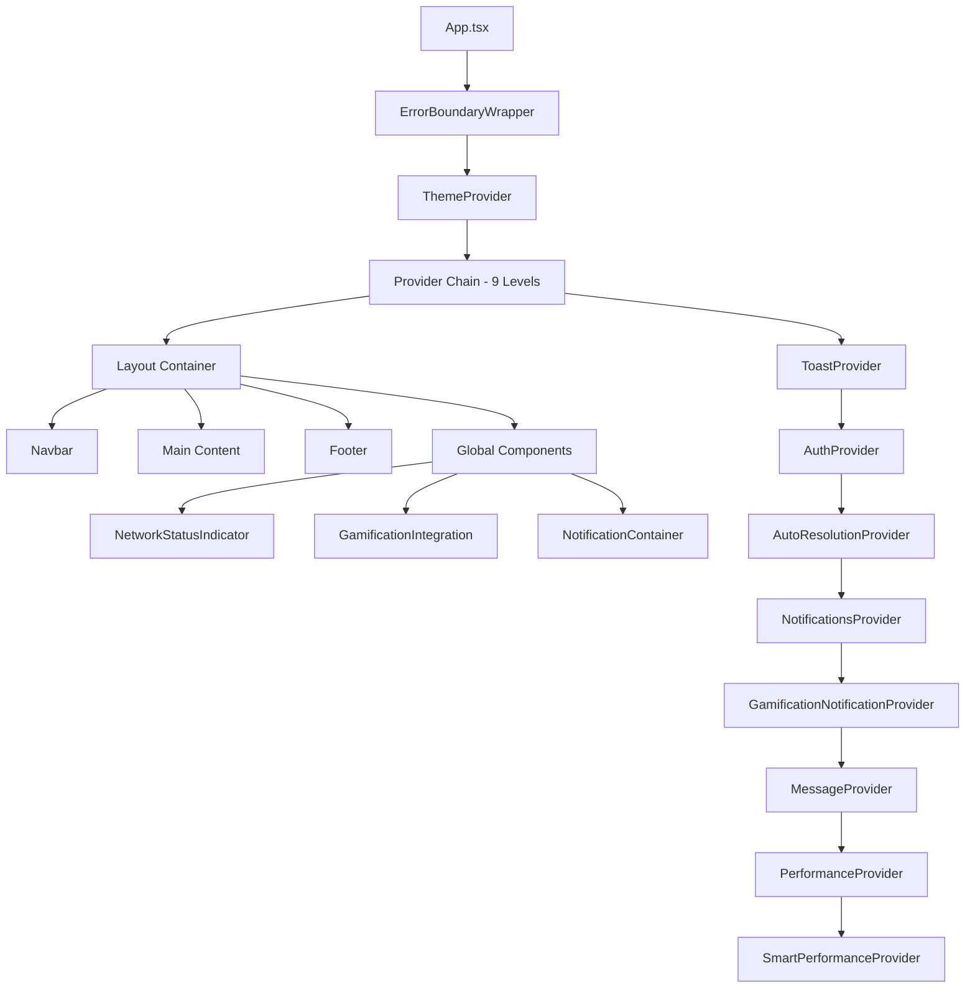
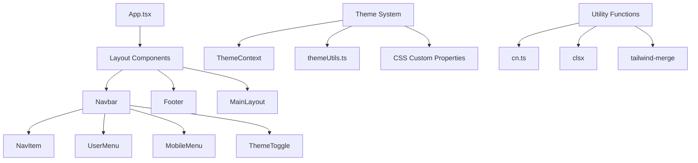
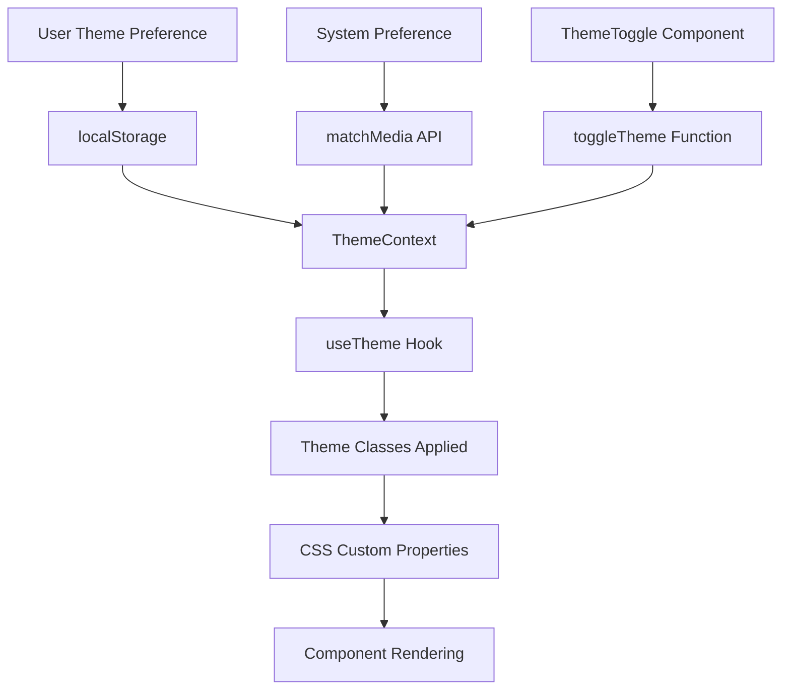
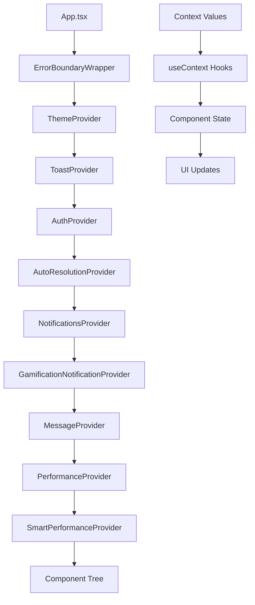
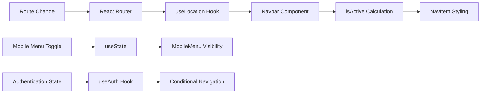
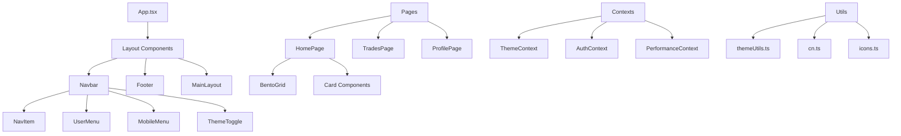

# TradeYa Layout System Architecture

**Version:** 1.1  
**Date:** August 11, 2025  
**Status:** Comprehensive Reference Guide  
**Last Updated:** August 11, 2025

---

## Table of Contents

1. [Overview](#overview)
2. [Component Hierarchy](#component-hierarchy)
3. [Styling Approaches](#styling-approaches)
4. [Responsive Breakpoints](#responsive-breakpoints)
5. [Grid Systems](#grid-systems)
6. [Positioning Strategies](#positioning-strategies)
7. [Dependency Relationships](#dependency-relationships)
8. [Data Flow Patterns](#data-flow-patterns)
9. [State Management](#state-management)
10. [CSS Class Naming Conventions](#css-class-naming-conventions)
11. [Media Queries](#media-queries)
12. [Flexbox & Grid Implementations](#flexbox--grid-implementations)
13. [Z-Index Stacking Contexts](#z-index-stacking-contexts)
14. [JavaScript Interactions](#javascript-interactions)
15. [Performance Considerations](#performance-considerations)
16. [Browser Compatibility](#browser-compatibility)
17. [Gotchas & Fragile Areas](#gotchas--fragile-areas)
18. [Cross-References](#cross-references)

---

## Overview

The TradeYa layout system is a sophisticated, multi-layered architecture that combines React components, Tailwind CSS utilities, CSS custom properties, and TypeScript for type safety. The system is currently in a transitional state from a monolithic structure to a modular, domain-driven design as outlined in the refactoring documentation.

### Key Architectural Principles

- **Component-Based Layout:** Modular React components with clear interfaces
- **Utility-First Styling:** Tailwind CSS with custom extensions
- **Theme-Aware Design:** CSS custom properties for consistent theming
- **Responsive-First:** Mobile-first design with progressive enhancement
- **Performance-Optimized:** Lazy loading, code splitting, and preloading strategies

---

## Component Hierarchy

### Root Layout Structure



### Layout Component Files

| Component | File Path | Responsibility |
|-----------|-----------|----------------|
| **MainLayout** | [`src/components/layout/MainLayout.tsx`](src/components/layout/MainLayout.tsx) | Basic three-section layout wrapper |
| **Navbar** | [`src/components/layout/Navbar.tsx`](src/components/layout/Navbar.tsx) | Top navigation with responsive design |
| **BottomNavigation** | [`src/components/layout/BottomNavigation.tsx`](src/components/layout/BottomNavigation.tsx) | Mobile bottom navigation bar (mobile only) |
| **Footer** | [`src/components/layout/Footer.tsx`](src/components/layout/Footer.tsx) | Bottom site footer |
| **NavItem** | [`src/components/ui/NavItem.tsx`](src/components/ui/NavItem.tsx) | Individual navigation items |
| **MobileMenu** | [`src/components/ui/MobileMenu.tsx`](src/components/ui/MobileMenu.tsx) | Mobile-specific navigation |
| **UserMenu** | [`src/components/ui/UserMenu.tsx`](src/components/ui/UserMenu.tsx) | User account dropdown |

### Detailed Component Analysis

#### MainLayout Component

**Location:** [`src/components/layout/MainLayout.tsx`](src/components/layout/MainLayout.tsx:9-18)

```typescript
interface MainLayoutProps {
  children: ReactNode;
}

const MainLayout: React.FC<MainLayoutProps> = ({ children }) => {
  return (
    <div className="flex flex-col min-h-screen">
      <Navbar />
      <main className="flex-grow container mx-auto px-4 py-8">
        {children}
      </main>
      <Footer />
    </div>
  );
};
```

**Key Features:**

- **Flexbox Layout:** `flex flex-col min-h-screen` ensures full viewport height
- **Flex-grow Main:** `flex-grow` makes main content expand to fill available space
- **Container System:** `container mx-auto px-4 py-8` provides responsive centering
- **Simple Interface:** Single `children` prop for maximum flexibility

#### App.tsx Layout Implementation

**Location:** [`src/App.tsx`](src/App.tsx:367-468)

```typescript
<div className="min-h-screen flex flex-col bg-gray-50 dark:bg-gray-900">
  <Navbar />
  <main className="flex-grow">
    <Suspense fallback={LoadingSpinner}>
      <Routes>
        {/* Route definitions */}
      </Routes>
    </Suspense>
  </main>
  <Footer />
  <NetworkStatusIndicator />
  <GamificationIntegration />
  <NotificationContainer />
</div>
```

**⚠️ Critical Inconsistency:** The application uses layout implementation directly in App.tsx rather than consistently using MainLayout component.

---

## Styling Approaches

### 1. CSS Custom Properties System

**Location:** [`src/index.css`](src/index.css:24-70)

```css
:root {
  /* Base typography */
  font-family: 'Inter', system-ui, -apple-system, BlinkMacSystemFont, 'Segoe UI', Roboto, sans-serif;
  
  /* Light mode variables */
  --color-bg-primary: #ffffff;
  --color-bg-secondary: #f9fafb;
  --color-bg-card: #ffffff;
  --color-text-primary: #1f2937;
  --color-text-secondary: #4b5563;
  --color-border: #e5e7eb;
  --color-shadow: rgba(0, 0, 0, 0.05);
  
  /* Brand colors */
  --color-primary: #f97316;
  --color-primary-hover: #ea580c;
  --color-secondary: #0ea5e9;
  --color-accent: #8b5cf6;
}

.dark {
  /* Dark mode overrides */
  --color-bg-primary: #111827;
  --color-bg-secondary: #1f2937;
  --color-bg-card: #1f2937;
  --color-text-primary: #f9fafb;
  --color-text-secondary: #d1d5db;
  --color-border: #374151;
  --color-shadow: rgba(0, 0, 0, 0.3);
  
  /* Adjusted brand colors for dark mode */
  --color-primary: #fb923c;
  --color-primary-hover: #f97316;
}
```

### 2. Tailwind Configuration

**Location:** [`tailwind.config.ts`](tailwind.config.ts:9-277)

```typescript
export default {
  content: [
    './index.html',
    './src/**/*.{js,ts,jsx,tsx}',
    './components/**/*.{js,ts,jsx,tsx}',
  ],
  darkMode: 'class', // Class-based dark mode
  theme: {
    extend: {
      fontFamily: {
        sans: ['Inter var', 'Inter', 'system-ui', /* ... */],
        heading: ['Outfit', 'Inter var', /* ... */],
        mono: ['JetBrains Mono', /* ... */],
      },
      colors: {
        // CSS custom property integration
        'bg-primary': 'var(--color-bg-primary)',
        'bg-secondary': 'var(--color-bg-secondary)',
        'text-primary': 'var(--color-text-primary)',
        
        // Extended color palette
        primary: {
          50: '#fff7ed',
          100: '#ffedd5',
          // ... full scale
          500: '#f97316', // Main orange
          600: '#ea580c',
          DEFAULT: 'var(--color-primary)',
          hover: 'var(--color-primary-hover)',
        },
      },
      animation: {
        'fade-in': 'fadeIn 200ms ease-in-out',
        'slide-up': 'slideUp 0.4s cubic-bezier(0.16, 1, 0.3, 1)',
        'bounce-in': 'bounceIn 500ms cubic-bezier(0.34, 1.56, 0.64, 1)',
        // ... 16 total animations
      },
    },
  },
}
```

### 2.1 Tailwind v4 Integration and @theme Rules

Tailwind is configured for v4 with the official Vite plugin and @theme blocks:

- Vite plugin order (Tailwind before React):

```ts
// vite.config.ts
import { defineConfig } from 'vite'
import react from '@vitejs/plugin-react'
import tailwind from '@tailwindcss/vite'

export default defineConfig({
  plugins: [tailwind(), react()],
})
```

- PostCSS configuration:

```js
// postcss.config.cjs
module.exports = {
  plugins: {
    '@tailwindcss/postcss': {},
    autoprefixer: {},
  },
}
```

- CSS entry uses the v4 import and `@theme` blocks:

```css
/* src/index.css */
@import "tailwindcss";

@theme dark {
  /* Only custom properties or @keyframes; no nested selectors */
  --border-default: rgba(255, 255, 255, 0.12);
  --border-strong: rgba(255, 255, 255, 0.2);
  --border-divider: rgba(255, 255, 255, 0.08);
}
```

Note: `@theme` blocks must not include `:root { ... }` or other selectors; otherwise the build fails.

### 3. Theme Utilities System

**Location:** [`src/utils/themeUtils.ts`](src/utils/themeUtils.ts:28-103)

```typescript
export const themeClasses = {
  // Backgrounds
  card: 'bg-white dark:bg-neutral-800 border border-neutral-200 dark:border-neutral-700',
  cardAlt: 'bg-neutral-50 dark:bg-neutral-700 border border-neutral-200 dark:border-neutral-600',
  page: 'bg-neutral-50 dark:bg-neutral-900',
  input: 'bg-white dark:bg-neutral-800 border-neutral-300 dark:border-neutral-600',

  // Text
  text: 'text-neutral-900 dark:text-neutral-100',
  textMuted: 'text-neutral-500 dark:text-neutral-400',
  textAccent: 'text-primary-500 dark:text-primary-400',

  // Buttons
  primaryButton: 'bg-primary-500 hover:bg-primary-600 text-white',
  secondaryButton: 'bg-secondary-500 hover:bg-secondary-600 text-white',
  
  // Interactive effects
  hoverCard: 'hover:shadow-md hover:-translate-y-1 dark:hover:bg-neutral-700/70',
  hoverGlassCard: 'hover:shadow-md hover:-translate-y-1 hover:bg-white/80 dark:hover:bg-neutral-800/70',
  
  // Transitions
  transition: 'transition-all duration-200',
  transitionFast: 'transition-all duration-150',
  transitionSlow: 'transition-all duration-300',
};

// Utility function for dynamic dark mode classes
export const withDarkMode = (baseClasses: string, darkClasses: string): string => {
  const darkClassesWithPrefix = darkClasses
    .split(' ')
    .map(cls => `dark:${cls}`)
    .join(' ');
  return `${baseClasses} ${darkClassesWithPrefix}`;
};
```

### 4. Class Name Merging Utility

**Location:** [`src/utils/cn.ts`](src/utils/cn.ts:16-18) & [`src/lib/utils.ts`](src/lib/utils.ts:9-11)

```typescript
import clsx from 'clsx';
import { twMerge } from 'tailwind-merge';

export function cn(...inputs: ClassValue[]) {
  return twMerge(clsx(inputs));
}
```

**Purpose:** Merges conditional classes and resolves Tailwind CSS conflicts automatically.

---

## Responsive Breakpoints

### Tailwind Breakpoint System

| Breakpoint | Min Width | Usage Pattern | Common Classes |
|------------|-----------|---------------|----------------|
| **Default** | 0px | Mobile-first base | `px-4`, `py-2`, `text-sm` |
| **sm** | 640px | Small tablets | `sm:px-6`, `sm:text-base` |
| **md** | 768px | Tablets | `md:px-8`, `md:grid-cols-2` |
| **lg** | 1024px | Small desktops | `lg:px-8`, `lg:grid-cols-3` |
| **xl** | 1280px | Large desktops | `xl:grid-cols-6`, `xl:max-w-7xl` |
| **2xl** | 1536px | Extra large | `2xl:px-0` |

### Container System Implementation

```typescript
// Standard container pattern used throughout the application
<div className="max-w-7xl mx-auto px-4 sm:px-6 lg:px-8 py-12">
  {/* Content */}
</div>

// Responsive grid pattern
<div className="grid grid-cols-1 md:grid-cols-2 lg:grid-cols-3 xl:grid-cols-4 gap-4">
  {/* Grid items */}
</div>
```

### Responsive Navigation Implementation

**Location:** [`src/components/layout/Navbar.tsx`](src/components/layout/Navbar.tsx:65-75)

```typescript
{/* Desktop navigation */}
<div className="hidden md:ml-8 md:flex md:space-x-4 lg:space-x-8">
  {mainNavItems.map((item) => (
    <NavItem key={item.path} to={item.path} label={item.label} isActive={isActive(item.path)} />
  ))}
</div>

{/* Mobile menu button */}
<div className="flex items-center md:hidden">
  <button onClick={() => setMobileMenuOpen(!mobileMenuOpen)}>
    {/* Mobile menu toggle */}
  </button>
</div>
```

---

## Grid Systems

### 1. BentoGrid Advanced Grid System

**Location:** [`src/components/ui/BentoGrid.tsx`](src/components/ui/BentoGrid.tsx:29-69)

```typescript
type BentoGridProps = {
  children: React.ReactNode;
  className?: string;
  gap?: 'none' | 'sm' | 'md' | 'lg' | 'xl';
  columns?: 1 | 2 | 3 | 4 | 6;
  rows?: number;
};

type BentoItemProps = {
  children: React.ReactNode;
  className?: string;
  colSpan?: 1 | 2 | 3 | 4 | 6;
  rowSpan?: 1 | 2 | 3 | 4;
  featured?: boolean;
};

const BentoGrid: React.FC<BentoGridProps> = ({ children, className = '', gap = 'md', columns = 6 }) => {
  const gapSizes = {
    none: 'gap-0',
    sm: 'gap-2',
    md: 'gap-4',
    lg: 'gap-6',
    xl: 'gap-8',
  };

  const gridCols = {
    1: 'grid-cols-1',
    2: 'grid-cols-1 md:grid-cols-2',
    3: 'grid-cols-1 md:grid-cols-3',
    4: 'grid-cols-1 md:grid-cols-2 lg:grid-cols-4',
    6: 'grid-cols-1 md:grid-cols-2 lg:grid-cols-3 xl:grid-cols-6',
  };

  return (
    <div className={cn('grid', gridCols[columns], gapSizes[gap], className)}>
      {children}
    </div>
  );
};
```

### 2. Homepage Grid Implementation

**Location:** [`src/pages/HomePage.tsx`](src/pages/HomePage.tsx:42-134)

```typescript
<BentoGrid columns={6} gap="md" className="mb-12">
  {/* Featured skill trades - spans 3 columns, 2 rows */}
  <BentoItem colSpan={3} rowSpan={2} className="overflow-hidden">
    <Card variant="glass" hover className="h-full">
      <CardBody>
        <h2 className="text-2xl font-semibold text-gray-900 dark:text-gray-100 mb-4">
          Skill Trades
        </h2>
        <p className="text-gray-600 dark:text-gray-300 mb-4">
          Exchange your skills with others in the community.
        </p>
        <Link to="/trades" className="text-orange-500 hover:text-orange-700">
          Browse Trades →
        </Link>
      </CardBody>
    </Card>
  </BentoItem>

  {/* Standard items - 3 columns, 1 row each */}
  <BentoItem colSpan={3} rowSpan={1}>
    {/* Projects content */}
  </BentoItem>
  
  {/* Smaller items - 2 columns, 1 row each */}
  <BentoItem colSpan={2} rowSpan={1}>
    {/* Directory content */}
  </BentoItem>
</BentoGrid>
```

### 2a. HomePage Live Data Contract

To replace the placeholder content in `src/pages/HomePage.tsx` with real, query-backed information we standardize the data contract described below. Each block references the service(s) that should power it along with fallbacks for offline/unauthenticated scenarios.

| Section / Card | Required Fields | Source(s) | Notes |
| --- | --- | --- | --- |
| `heroStats` (Skill Trades card) | `activeTradesCount`, `completedTradesCount`, `ctaHref` | `getSystemStats()` from `src/services/firestore-extensions.ts` for aggregate counts; fall back to `0` if unavailable. | Counts are global, not user-scoped. Use cached system stats or Cloud Function aggregation once available. |
| `collaborationHighlights` | `id`, `title`, `headline`, `openRoles`, `statusBadge` | `CollaborationService.getCollaborationsByStatus('recruiting', limit)` in `src/services/entities/CollaborationService.ts`. | Limit to 3 newest recruiting collaborations; show role summaries derived from `roles` array. |
| `challengeSpotlight` | `id`, `title`, `rewardSummary`, `deadline`, `status` | `getChallenges({ status: [ChallengeStatus.ACTIVE], sortBy: 'endDate', limit: 1 })` in `src/services/challenges.ts`. | Prefer soonest-ending active challenge; if none active, surface the next scheduled challenge. |
| `communityStats` | `activeUsers`, `skillsTraded`, `totalCollaborations` | Extend `SystemStats` to include `weeklyActiveUsers`, `skillsTraded` derived from trades/completions; cache doc under `systemStats/latest`. | Display badges marked “Live” only when the snapshot is <15 minutes old. |
| `recentActivityFeed` | Array of `{ id, type, description, timestamp, accent }` | New helper `getGlobalActivityFeed(limit)` inside `src/services/dashboard.ts` (reuse trade/challenge events + public XP transactions). | This feed is global; exclude private events. Provide graceful empty state if fewer than 2 events exist. |

Implementation Details:

1. **Type Definitions**  
   Add `HomePageData` and sub-interfaces in `src/types/homepage.ts` (new file) to consolidate the contract. This keeps hooks and tests aligned.

2. **Service Layer**  
   - Introduce `src/services/homepage.ts` that orchestrates the calls listed above, handles Promise.all batching, and normalizes results into the `HomePageData` shape.  
   - Extend `getSystemStats` to cache recent totals (e.g., store doc `systemStats/live` with `lastUpdated`). If Firestore limits are a concern, gate the full scan behind a scheduled Cloud Function and have the client read the aggregated doc.
   - Implement `getGlobalActivityFeed` inside `dashboard.ts` (or the new homepage service) by querying:
     - `trades` collection (`status in ['open','in-progress','completed']`, order by `createdAt` desc, limit 5).
     - `collaborations` collection (recent recruiting/in-progress events).
     - `xpTransactions` collection (public leaderboard-worthy events where `visibility == 'public'`).
     Merge + sort by timestamp descending.

3. **Error / Loading Contract**  
   Each section should surface:
   - `isLoading` per hook for skeletons.
   - `error` message (logged via `PerformanceMonitor`) but with non-blocking UI fallback text (e.g., “Statistics unavailable”).
   - Optional stale data indicator by comparing `lastUpdated` vs `Date.now()`.

4. **Indexes & Security**  
   - If we query `trades` or `collaborations` by `status` + `createdAt`, ensure matching composite indexes exist (`firestore.indexes.json`).  
   - The global feed must only read documents flagged as public; update security rules accordingly (`firestore.rules`) if we introduce `visibility` filters.

5. **Testing Guidance**  
   - Mock `HomePageData` contract in unit tests (see plan section §5).  
   - Add regression tests ensuring the component renders skeletons for each data block when hooks are loading and falls back gracefully when errors occur.

Documenting this contract ensures future contributors know which services feed the HomePage and how to extend the live data without breaking the layout guidelines defined above.

### Implementation Notes (Nov 2025)

- `HomePageDataProvider` + hooks (`useHomeStats`, `useCollaborationHighlights`, etc.) live in `src/hooks/useHomePageData.tsx` and wrap `HomePage.tsx` so each section receives consistent loading/error states without duplicate fetches.
- `fetchHomePageData` in `src/services/homepage.ts` batches `getSystemStats`, `CollaborationService.getCollaborationsByStatus`, `getChallenges`, and a new `getGlobalActivityFeed` helper to hydrate the UI with the contract above.
- `src/pages/HomePage.tsx` renders skeletons and fallbacks per section and pipes any service errors through `PerformanceMonitor`, keeping the asymmetric layout intact while data resolves.
- Unit coverage exists in `src/hooks/__tests__/useHomePageData.test.tsx` to guard the provider contract and ensure regressions in the data orchestration layer are caught quickly.
- `getSystemStats` only writes to the `systemStats/live` cache when running in a privileged/server context; browser clients compute and return live stats but skip the cache write to avoid Firestore permission errors. A future Cloud Function can periodically refresh the cache document for faster client reads.

### 3. Grid Span Classes

| Span Type | Available Values | CSS Classes |
|-----------|------------------|-------------|
| **Column Span** | 1, 2, 3, 4, 6 | `md:col-span-1` through `md:col-span-6` |
| **Row Span** | 1, 2, 3, 4 | `md:row-span-1` through `md:row-span-4` |
| **Featured** | boolean | `ring-2 ring-primary-500 shadow-lg` |

---

## Positioning Strategies

### 1. Flexbox Layouts

#### Primary Application Layout

```css
/* App container */
.min-h-screen.flex.flex-col {
  min-height: 100vh;
  display: flex;
  flex-direction: column;
}

/* Main content area */
.flex-grow {
  flex: 1 1 0%;
}
```

#### Navbar Positioning

```css
/* Sticky navigation */
.sticky.top-0.z-50 {
  position: sticky;
  top: 0;
  z-index: 50;
}
```

### 2. Grid Positioning

#### CSS Grid Implementation

```css
/* BentoGrid container */
.grid {
  display: grid;
}

/* Responsive grid columns */
.grid-cols-1 { grid-template-columns: repeat(1, minmax(0, 1fr)); }
.md\:grid-cols-2 { grid-template-columns: repeat(2, minmax(0, 1fr)); }
.lg\:grid-cols-3 { grid-template-columns: repeat(3, minmax(0, 1fr)); }
.xl\:grid-cols-6 { grid-template-columns: repeat(6, minmax(0, 1fr)); }

/* Grid item spanning */
.md\:col-span-3 { grid-column: span 3 / span 3; }
.md\:row-span-2 { grid-row: span 2 / span 2; }
```

### 3. Absolute Positioning Patterns

#### Dropdown Menus

**Location:** [`src/components/ui/UserMenu.tsx`](src/components/ui/UserMenu.tsx:94-99)

```typescript
<div className="absolute right-0 mt-2 w-48 rounded-md shadow-lg py-1 z-10">
  {/* Dropdown content */}
</div>
```

#### Overlay Components

```css
/* Modal backdrop */
.fixed.inset-0.z-50 {
  position: fixed;
  top: 0;
  right: 0;
  bottom: 0;
  left: 0;
  z-index: 50;
}
```

---

## Dependency Relationships

### 1. CSS Processing Pipeline

```mermaid
graph LR
    A[src/index.css] --> B[PostCSS]
    B --> C[@tailwindcss/postcss]
    C --> D[autoprefixer]
    D --> E[Vite Build]
    E --> F[Browser CSS]
    
    G[tailwind.config.ts] --> C
    H[CSS Custom Properties] --> A
```

### 2. Component Dependencies



### 3. Build Dependencies

**Location:** [`package.json`](package.json) & [`postcss.config.cjs`](postcss.config.cjs)

```json
{
  "dependencies": {
    "clsx": "^2.x.x",
    "framer-motion": "^11.x.x",
    "react": "^18.x.x",
    "react-router-dom": "^6.x.x",
    "tailwind-merge": "^2.x.x"
  },
  "devDependencies": {
    "@tailwindcss/postcss": "^4.x.x",
    "autoprefixer": "^10.x.x",
    "tailwindcss": "^3.x.x",
    "vite": "^5.x.x"
  }
}
```

```javascript
// postcss.config.cjs
module.exports = {
  plugins: {
    '@tailwindcss/postcss': {},
    autoprefixer: {},
  },
}
```

---

## Data Flow Patterns

### 1. Theme State Flow



### 2. Provider Chain Data Flow



### 3. Navigation State Flow



---

## State Management

### 1. Theme State Management

**Location:** [`src/contexts/ThemeContext.tsx`](src/contexts/ThemeContext.tsx:13-84)

```typescript
type Theme = 'light' | 'dark';

interface ThemeContextType {
  theme: Theme;
  toggleTheme: () => void;
  setTheme: (theme: Theme) => void;
}

export const ThemeProvider: React.FC<{ children: React.ReactNode }> = ({ children }) => {
  const [theme, setTheme] = useState<Theme>(() => {
    // Priority: localStorage > system preference > 'light'
    const savedTheme = localStorage.getItem('theme') as Theme | null;
    if (savedTheme) return savedTheme;
    
    if (window.matchMedia?.('(prefers-color-scheme: dark)').matches) {
      return 'dark';
    }
    
    return 'light';
  });

  useEffect(() => {
    // Update localStorage and DOM classes
    localStorage.setItem('theme', theme);
    const root = window.document.documentElement;
    root.classList.add('transition-colors', 'duration-300');
    
    if (theme === 'dark') {
      root.classList.add('dark');
    } else {
      root.classList.remove('dark');
    }
  }, [theme]);

  // Listen for system preference changes
  useEffect(() => {
    const mediaQuery = window.matchMedia('(prefers-color-scheme: dark)');
    const handleChange = (e: MediaQueryListEvent) => {
      if (!localStorage.getItem('theme')) {
        setTheme(e.matches ? 'dark' : 'light');
      }
    };
    
    mediaQuery.addEventListener('change', handleChange);
    return () => mediaQuery.removeEventListener('change', handleChange);
  }, []);
};
```

### 2. Navigation State Management

**Location:** [`src/components/layout/Navbar.tsx`](src/components/layout/Navbar.tsx:18-40)

```typescript
const Navbar: React.FC = () => {
  const { currentUser } = useAuth();
  const location = useLocation();
  const [mobileMenuOpen, setMobileMenuOpen] = useState(false);
  const [scrolled, setScrolled] = useState(false);

  // Active route detection
  const isActive = (path: string) => {
    return location.pathname === path ||
           (path !== '/' && location.pathname.startsWith(path));
  };

  // Scroll-aware styling
  useEffect(() => {
    const handleScroll = () => {
      const isScrolled = window.scrollY > 10;
      if (isScrolled !== scrolled) {
        setScrolled(isScrolled);
      }
    };

    window.addEventListener('scroll', handleScroll);
    return () => window.removeEventListener('scroll', handleScroll);
  }, [scrolled]);
};
```

### 3. Layout-Related Performance State

**Location:** [`src/contexts/PerformanceContext.tsx`](src/contexts/PerformanceContext.tsx:23-25)

```typescript
interface PerformanceContextType {
  criticalPathConfig: Partial<CriticalPathConfig>;
  autoCollectOnRouteChange: boolean; // Layout-related metric collection
}
```

---

## CSS Class Naming Conventions

### 1. Tailwind Utility Patterns

#### Layout Utilities

```css
/* Container patterns */
.container.mx-auto.px-4.sm:px-6.lg:px-8  /* Responsive container */
.max-w-7xl.mx-auto                       /* Max width container */

/* Flexbox patterns */
.flex.flex-col.min-h-screen              /* Full height flex container */
.flex.items-center.justify-between       /* Flex alignment */
.flex-grow                               /* Flex expansion */

/* Grid patterns */
.grid.grid-cols-1.md:grid-cols-2.lg:grid-cols-3  /* Responsive grid */
.col-span-2.row-span-1                           /* Grid spanning */

/* Spacing patterns */
.space-x-4.space-y-2                    /* Flex/grid spacing */
.gap-4.gap-x-6.gap-y-4                  /* Grid gaps */
```

#### Theme-Aware Patterns

```css
/* Background patterns */
.bg-white.dark:bg-gray-800               /* Theme-aware backgrounds */
.bg-gray-50.dark:bg-gray-900             /* Page backgrounds */

/* Text patterns */
.text-gray-900.dark:text-gray-100        /* Primary text */
.text-gray-500.dark:text-gray-400        /* Secondary text */

/* Border patterns */
.border-gray-200.dark:border-gray-700    /* Theme-aware borders */
```

### 2. Component Class Patterns

#### Card Components

**Location:** [`src/components/ui/Card.tsx`](src/components/ui/Card.tsx:18)

```typescript
// Base card classes
const cardClasses = "bg-white rounded-lg border border-gray-200 shadow-sm";

// Interactive card classes
const interactiveClasses = "cursor-pointer hover:shadow-md transition-shadow";

// Combined pattern
<div className={`${cardClasses} ${onClick ? interactiveClasses : ''} ${className}`}>
```

#### Navigation Classes

```css
/* Desktop navigation item */
.inline-flex.items-center.px-1.pt-1.border-b-2.text-sm.font-medium.transition-colors.duration-200

/* Active state */
.border-orange-500.text-gray-900.dark:text-gray-100

/* Inactive state */
.border-transparent.text-gray-500.dark:text-gray-300.hover:border-orange-300
```

### 3. Custom Utility Classes

#### Theme Utility Classes

**Location:** [`src/utils/themeUtils.ts`](src/utils/themeUtils.ts:28-103)

```typescript
export const themeClasses = {
  // Semantic naming for layout components
  card: 'bg-white dark:bg-neutral-800 border border-neutral-200 dark:border-neutral-700',
  page: 'bg-neutral-50 dark:bg-neutral-900',
  
  // Interactive states
  hoverCard: 'hover:shadow-md hover:-translate-y-1 dark:hover:bg-neutral-700/70',
  hoverGlassCard: 'hover:shadow-md hover:-translate-y-1 hover:bg-white/80 dark:hover:bg-neutral-800/70',
  
  // Transition utilities
  transition: 'transition-all duration-200',
  transitionFast: 'transition-all duration-150',
  transitionSlow: 'transition-all duration-300',
};
```

---

## Media Queries

### 1. Tailwind Responsive Prefixes

```css
/* Mobile-first breakpoints */
@media (min-width: 640px) { /* sm: */ }
@media (min-width: 768px) { /* md: */ }
@media (min-width: 1024px) { /* lg: */ }
@media (min-width: 1280px) { /* xl: */ }
@media (min-width: 1536px) { /* 2xl: */ }
```

### 2. Custom Media Queries in CSS

#### Dark Mode Detection

**Location:** [`src/contexts/ThemeContext.tsx`](src/contexts/ThemeContext.tsx:24)

```typescript
// System preference detection
if (window.matchMedia && window.matchMedia('(prefers-color-scheme: dark)').matches) {
  return 'dark';
}

// Runtime listener for preference changes
const mediaQuery = window.matchMedia('(prefers-color-scheme: dark)');
const handleChange = (e: MediaQueryListEvent) => {
  if (!localStorage.getItem('theme')) {
    setTheme(e.matches ? 'dark' : 'light');
  }
};
mediaQuery.addEventListener('change', handleChange);
```

#### Reduced Motion Support

**Location:** [`tailwind.config.ts`](tailwind.config.ts) (implied in animation configuration)

```css
@media (prefers-reduced-motion: reduce) {
  * {
    animation-duration: 0.01ms !important;
    animation-iteration-count: 1 !important;
    transition-duration: 0.01ms !important;
  }
}
```

### 3. Container Queries (Future Enhancement)

```css
/* Potential container query implementation */
@container (min-width: 400px) {
  .card-content {
    display: grid;
    grid-template-columns: 1fr 200px;
  }
}
```

---

## Flexbox & Grid Implementations

### 1. Primary Layout Flexbox

#### Application Container

```css
/* App.tsx main container */
.min-h-screen.flex.flex-col {
  min-height: 100vh;
  display: flex;
  flex-direction: column;
}

/* Main content expansion */
.flex-grow {
  flex: 1 1 0%;
}
```

#### Navigation Flexbox

```css
/* Navbar container */
.flex.justify-between.h-16 {
  display: flex;
  justify-content: space-between;
  height: 4rem;
}

/* Navigation items */
.hidden.md:flex.md:space-x-4.lg:space-x-8 {
  display: none;
}

@media (min-width: 768px) {
  .hidden.md:flex.md:space-x-4.lg:space-x-8 {
    display: flex;
    gap: 1rem;
  }
}

@media (min-width: 1024px) {
  .hidden.md:flex.md:space-x-4.lg:space-x-8 {
    gap: 2rem;
  }
}
```

### 2. CSS Grid Implementation

#### BentoGrid System

**Location:** [`src/components/ui/BentoGrid.tsx`](src/components/ui/BentoGrid.tsx:46-56)

```css
/* Base grid */
.grid {
  display: grid;
}

/* Responsive column templates */
.grid-cols-1 { grid-template-columns: repeat(1, minmax(0, 1fr)); }

@media (min-width: 768px) {
  .md\:grid-cols-2 { grid-template-columns: repeat(2, minmax(0, 1fr)); }
  .md\:grid-cols-3 { grid-template-columns: repeat(3, minmax(0, 1fr)); }
}

@media (min-width: 1024px) {
  .lg\:grid-cols-3 { grid-template-columns: repeat(3, minmax(0, 1fr)); }
  .lg\:grid-cols-4 { grid-template-columns: repeat(4, minmax(0, 1fr)); }
}

@media (min-width: 1280px) {
  .xl\:grid-cols-6 { grid-template-columns: repeat(6, minmax(0, 1fr)); }
}

/* Grid item spanning */
.md\:col-span-3 { grid-column: span 3 / span 3; }
.md\:row-span-2 { grid-row: span 2 / span 2; }

/* Grid gaps */
.gap-4 { gap: 1rem; }
.gap-6 { gap: 1.5rem; }
.gap-8 { gap: 2rem; }
```

#### Footer Grid Layout

**Location:** [`src/components/layout/Footer.tsx`](src/components/layout/Footer.tsx:9)

```css
.grid.grid-cols-1.md:grid-cols-4.gap-8 {
  display: grid;
  grid-template-columns: repeat(1, minmax(0, 1fr));
  gap: 2rem;
}

@media (min-width: 768px) {
  .grid.grid-cols-1.md:grid-cols-4.gap-8 {
    grid-template-columns: repeat(4, minmax(0, 1fr));
  }
}
```

### 3. Hybrid Flex-Grid Patterns

#### Card Layouts

```css
/* Card header with flex */
.flex.flex-col.space-y-1\.5.p-6 {
  display: flex;
  flex-direction: column;
  gap: 0.375rem;
  padding: 1.5rem;
}

/* Card content area */
.p-6.pt-0 {
  padding: 1.5rem;
  padding-top: 0;
}

/* Card footer with flex alignment */
.flex.items-center.p-6.pt-0 {
  display: flex;
  align-items: center;
  padding: 1.5rem;
  padding-top: 0;
}
```

---

## Z-Index Stacking Contexts

### 1. Z-Index Scale System

| Layer | Z-Index | Usage | Components |
|-------|---------|-------|------------|
| **Base** | 0 | Normal content flow | Most components |
| **Dropdown** | 10 | Dropdown menus | UserMenu, NavItem dropdowns |
| **Fixed Elements** | 20 | Fixed positioning | Scroll indicators |
| **Overlay** | 30 | Modal backdrops | Modal backgrounds |
| **Modal** | 40 | Modal content | Dialog boxes |
| **Navigation** | 50 | Sticky navigation | Navbar, mobile menu |
| **Toast** | 60 | Toast notifications | Toast messages |
| **Tooltip** | 70 | Tooltips | Hover tooltips |
| **Maximum** | 9999 | Critical overlays | Error boundaries |

### 2. Implementation Examples

#### Navbar Stacking

**Location:** [`src/components/layout/Navbar.tsx`](src/components/layout/Navbar.tsx:54)

```css
.sticky.top-0.z-50 {
  position: sticky;
  top: 0;
  z-index: 50;
}
```

#### Dropdown Stacking

**Location:** [`src/components/ui/UserMenu.tsx`](src/components/ui/UserMenu.tsx:95)

```css
.absolute.right-0.mt-2.w-48.rounded-md.shadow-lg.py-1.z-10 {
  position: absolute;
  right: 0;
  margin-top: 0.5rem;
  width: 12rem;
  z-index: 10;
}
```

#### Modal Stacking

```css
/* Modal backdrop */
.fixed.inset-0.bg-black.bg-opacity-50.z-40 {
  position: fixed;
  top: 0;
  right: 0;
  bottom: 0;
  left: 0;
  background-color: rgba(0, 0, 0, 0.5);
  z-index: 40;
}

/* Modal content */
.fixed.inset-0.z-50.flex.items-center.justify-center {
  position: fixed;
  top: 0;
  right: 0;
  bottom: 0;
  left: 0;
  z-index: 50;
  display: flex;
  align-items: center;
  justify-content: center;
}
```

### 3. Stacking Context Creation

#### Isolation Patterns

```css
/* Create new stacking context */
.isolate {
  isolation: isolate;
}

/* Transform creates stacking context */
.transform {
  transform: translateZ(0);
}

/* Opacity creates stacking context */
.opacity-95 {
  opacity: 0.95;
}
```

---

## JavaScript Interactions

### 1. Theme Toggle Interaction

**Location:** [`src/contexts/ThemeContext.tsx`](src/contexts/ThemeContext.tsx:69-71)

```typescript
const toggleTheme = () => {
  setTheme(prevTheme => (prevTheme === 'light' ? 'dark' : 'light'));
};

// DOM class manipulation
useEffect(() => {
  const root = window.document.documentElement;
  root.classList.add('transition-colors', 'duration-300');
  
  if (theme === 'dark') {
    root.classList.add('dark');
  } else {
    root.classList.remove('dark');
  }
}, [theme]);
```

### 2. Mobile Menu Toggle

**Location:** [`src/components/layout/Navbar.tsx`](src/components/layout/Navbar.tsx:112-123)

```typescript
const [mobileMenuOpen, setMobileMenuOpen] = useState(false);

<button
  onClick={() => setMobileMenuOpen(!mobileMenuOpen)}
  className="inline-flex items-center justify-center p-2 rounded-md"
>
  {mobileMenuOpen ? <X className="block h-6 w-6" /> : <Menu className="block h-6 w-6" />}
</button>

<MobileMenu isOpen={mobileMenuOpen} onClose={() => setMobileMenuOpen(false)} />
```

### 3. Scroll-Aware Navigation

**Location:** [`src/components/layout/Navbar.tsx`](src/components/layout/Navbar.tsx:28-40)

```typescript
const [scrolled, setScrolled] = useState(false);

useEffect(() => {
  const handleScroll = () => {
    const isScrolled = window.scrollY > 10;
    if (isScrolled !== scrolled) {
      setScrolled(isScrolled);
    }
  };

  window.addEventListener('scroll', handleScroll);
  return () => window.removeEventListener('scroll', handleScroll);
}, [scrolled]);

// Dynamic class application
<nav className={`sticky top-0 z-50 bg-white dark:bg-gray-800 ${
  scrolled ? 'shadow-md dark:shadow-gray-900/30' : 'shadow-sm dark:shadow-gray-700/20'
}`}>
```

### 4. Click Outside Detection

**Location:** [`src/components/ui/UserMenu.tsx`](src/components/ui/UserMenu.tsx:17-29)

```typescript
const [isOpen, setIsOpen] = useState(false);
const menuRef = useRef<HTMLDivElement>(null);

useEffect(() => {
  const handleClickOutside = (event: MouseEvent) => {
    if (menuRef.current && !menuRef.current.contains(event.target as Node)) {
      setIsOpen(false);
    }
  };

  document.addEventListener('mousedown', handleClickOutside);
  return () => document.removeEventListener('mousedown', handleClickOutside);
}, []);
```

### 5. Route Preloading

**Location:** [`src/components/ui/RoutePreloader.tsx`](src/components/ui/RoutePreloader.tsx:119-148)

```typescript
const RoutePreloader: React.FC = () => {
  const location = useLocation();

  useEffect(() => {
    // Route-specific resource preloading
    const resources = routeResources[location.pathname];
    
    if (resources) {
      // Preload critical images
      if (resources.preloadImages?.length) {
        preloadImages(resources.preloadImages);
      }
      
      // Prefetch likely next routes
      if (resources.prefetchRoutes?.length) {
        prefetchRoutes(resources.prefetchRoutes);
      }
    }
  }, [location.pathname]);

  return null;
};
```

---

## Performance Considerations

### 1. Lazy Loading & Code Splitting

#### Route-Level Code Splitting

**Location:** [`src/App.tsx`](src/App.tsx:26-42)

```typescript
// Lazy-loaded page components
const HomePage = lazy(() => import('./pages/HomePage'));
const TradesPage = lazy(() => import('./pages/TradesPage'));
const ProjectDetailPage = lazy(() => import('./pages/ProjectDetailPage'));

// Suspense wrapper with fallback
<Suspense fallback={
  <div className="flex items-center justify-center min-h-screen">
    <div className="animate-spin rounded-full h-12 w-12 border-4 border-gray-200 dark:border-gray-700 border-t-orange-500"></div>
  </div>
}>
  <Routes>
    <Route path="/" element={<HomePage />} />
    <Route path="/trades" element={<TradesPage />} />
  </Routes>
</Suspense>
```

#### Component-Level Lazy Loading

```typescript
// Conditional component loading
const HeavyComponent = lazy(() => import('./HeavyComponent'));

const ConditionalLoader = ({ shouldLoad }: { shouldLoad: boolean }) => {
  if (!shouldLoad) return null;
  
  return (
    <Suspense fallback={<Skeleton />}>
      <HeavyComponent />
    </Suspense>
  );
};
```

### 2. CSS Performance Optimizations

#### Critical CSS Inlining

**Location:** [`src/index.css`](src/index.css:50-53)

```css
/* Optimized font rendering */
body {
  font-synthesis: none;
  text-rendering: optimizeLegibility;
  -webkit-font-smoothing: antialiased;
  -moz-osx-font-smoothing: grayscale;
}
```

#### Transition Optimization

```css
/* GPU-accelerated transitions */
.transition-all {
  transition-property: all;
  transition-timing-function: cubic-bezier(0.4, 0, 0.2, 1);
  transition-duration: 150ms;
  will-change: transform, opacity;
}

/* Selective transition properties */
.transition-colors {
  transition-property: color, background-color, border-color;
  transition-timing-function: cubic-bezier(0.4, 0, 0.2, 1);
  transition-duration: 150ms;
}
```

### 3. Bundle Optimization

#### Tailwind CSS Purging

**Location:** [`tailwind.config.ts`](tailwind.config.ts:4-8)

```typescript
export default {
  content: [
    './index.html',
    './src/**/*.{js,ts,jsx,tsx}',
    './components/**/*.{js,ts,jsx,tsx}',
  ],
  // Purges unused CSS in production
}
```

#### Dynamic Imports

```typescript
// Dynamic theme loading
const loadTheme = async (themeName: string) => {
  const theme = await import(`./themes/${themeName}.ts`);
  return theme.default;
};

// Dynamic icon loading
const loadIcon = async (iconName: string) => {
  const icon = await import(`lucide-react`).then(mod => mod[iconName]);
  return icon;
};
```

### 4. Memory Management

#### Event Listener Cleanup

```typescript
useEffect(() => {
  const handleResize = () => {
    // Handle resize
  };
  
  window.addEventListener('resize', handleResize);
  return () => window.removeEventListener('resize', handleResize);
}, []);
```

#### Component Cleanup

```typescript
const MyComponent = () => {
  const [data, setData] = useState(null);
  
  useEffect(() => {
    let isMounted = true;
    
    fetchData().then(result => {
      if (isMounted) {
        setData(result);
      }
    });
    
    return () => {
      isMounted = false;
    };
  }, []);
};
```

---

## Browser Compatibility

### 1. Supported Browsers

| Browser | Minimum Version | Layout Features Supported |
|---------|----------------|---------------------------|
| **Chrome** | 88+ | Full CSS Grid, Flexbox, Custom Properties |
| **Firefox** | 85+ | Full CSS Grid, Flexbox, Custom Properties |
| **Safari** | 14+ | Full CSS Grid, Flexbox, Custom Properties |
| **Edge** | 88+ | Full CSS Grid, Flexbox, Custom Properties |

### 2. CSS Feature Support

#### CSS Grid Support

```css
/* Fallback for older browsers */
.grid-fallback {
  display: flex;
  flex-wrap: wrap;
}

/* Modern grid */
@supports (display: grid) {
  .grid-fallback {
    display: grid;
    grid-template-columns: repeat(auto-fit, minmax(300px, 1fr));
  }
}
```

#### Custom Properties Fallback

```css
/* Fallback values */
.theme-aware {
  background-color: #ffffff; /* Fallback */
  background-color: var(--color-bg-primary, #ffffff);
  
  color: #1f2937; /* Fallback */
  color: var(--color-text-primary, #1f2937);
}
```

#### Dark Mode Support Detection

```typescript
// Feature detection for dark mode support
const supportsDarkMode = () => {
  return window.matchMedia && window.matchMedia('(prefers-color-scheme: dark)').matches !== undefined;
};

// Graceful degradation
const initializeTheme = () => {
  if (supportsDarkMode()) {
    // Use system preference
    return window.matchMedia('(prefers-color-scheme: dark)').matches ? 'dark' : 'light';
  }
  
  // Fallback to light mode
  return 'light';
};
```

### 3. PostCSS Autoprefixer Configuration

**Location:** [`postcss.config.cjs`](postcss.config.cjs:2-5)

```javascript
module.exports = {
  plugins: {
    '@tailwindcss/postcss': {},
    autoprefixer: {}, // Automatically adds vendor prefixes
  },
}
```

---

## Border System

### 1. Tokenized Border Strategy

To achieve consistent glassmorphic styling and reduce ad-hoc border colors, borders are standardized via CSS custom properties and Tailwind mappings.

Tokens (defined in `src/index.css`):

```css
:root {
  --border-default: rgba(0, 0, 0, 0.08);
  --border-strong: rgba(0, 0, 0, 0.16);
  --border-divider: rgba(0, 0, 0, 0.06);
  --border-success: rgba(34, 197, 94, 0.5);
  --border-warning: rgba(245, 158, 11, 0.5);
  --border-error: rgba(239, 68, 68, 0.5);
}
```

Tailwind mappings (in `tailwind.config.ts`):

```ts
extend: {
  colors: {
    'border-default': 'var(--border-default)',
    'border-strong': 'var(--border-strong)',
    'border-divider': 'var(--border-divider)',
    'border-success': 'var(--border-success)',
    'border-warning': 'var(--border-warning)',
    'border-error': 'var(--border-error)',
    'glass-border': 'var(--color-glass-border)',
  }
}
```

Utilities (in `src/index.css`):

```css
@layer utilities {
  .border-standard { border-width: 1px; border-color: var(--border-default); }
  .border-strong { border-width: 1px; border-color: var(--border-strong); }
  .border-glass { border-width: 1px; border-color: var(--color-glass-border); }
  .border-divider { border-top-width: 1px; border-color: var(--border-divider); }
  .border-success { border-color: var(--border-success); }
  .border-warning { border-color: var(--border-warning); }
  .border-error { border-color: var(--border-error); }
}
```

Usage guidance:
- Use `.border-glass` for glassmorphic surfaces (Cards, Dropdowns, Sheets, Modals)
- Use `.border-standard` for general frames; `.border-strong` for emphasized frames
- Use `.border-divider` for subtle separators (prefer `border-b border-divider`)
- Use `.border-success|warning|error` for semantic borders; keep bg/text/rings as-is
- Navbar edge uses `navbar-gradient-border` (keep scoped to nav)

v4 note:
- The `.glassmorphic` helper applies `border` and sets `border-color: var(--color-glass-border)` directly to comply with Tailwind v4 @apply constraints. Prefer `.border-glass` or `.glassmorphic` over raw `border-<color>` classes.

Lint/tooling:
- Run `node scripts/style-audit/borderAudit.ts` to flag raw `border-<color>` usages
- Replace decorative borders with the utilities above to maintain consistency

---

## Gotchas & Fragile Areas

### 1. ⚠️ Provider Chain Complexity

**Location:** [`src/App.tsx`](src/App.tsx:357-367)

**Issue:** 9 nested context providers can cause performance issues and re-render cascades.

```typescript
// FRAGILE: Deep provider nesting
<ErrorBoundaryWrapper>
  <ThemeProvider>
    <ToastProvider>
      <AuthProvider>
        <AutoResolutionProvider>
          <NotificationsProvider>
            <GamificationNotificationProvider>
              <MessageProvider>
                <PerformanceProvider>
                  <SmartPerformanceProvider>
                    {/* Components */}
                  </SmartPerformanceProvider>
                </PerformanceProvider>
              </MessageProvider>
            </GamificationNotificationProvider>
          </NotificationsProvider>
        </AutoResolutionProvider>
      </AuthProvider>
    </ToastProvider>
  </ThemeProvider>
</ErrorBoundaryWrapper>
```

**Risk:** Each provider re-render can trigger cascading re-renders of all child providers.

**Mitigation:**

```typescript
// Use React.memo for expensive providers
const ExpensiveProvider = React.memo(({ children, value }) => (
  <Context.Provider value={value}>{children}</Context.Provider>
));

// Memoize context values
const contextValue = useMemo(() => ({ theme, toggleTheme }), [theme]);
```

### 2. ⚠️ Layout Inconsistency

**Issue:** MainLayout component exists but isn't consistently used.

**Risk Areas:**

- [`src/App.tsx`](src/App.tsx:367-468) implements layout directly
- [`src/components/layout/MainLayout.tsx`](src/components/layout/MainLayout.tsx) is unused
- Different pages may have inconsistent layout behavior

**Fix Required:**

```typescript
// Standardize layout usage
const App = () => (
  <BrowserRouter>
    <Providers>
      <MainLayout>
        <Routes>
          {/* Route definitions */}
        </Routes>
      </MainLayout>
    </Providers>
  </BrowserRouter>
);
```

### 3. ⚠️ Theme Class Conflicts

**Issue:** Multiple theme utility systems can conflict.

**Conflict Areas:**

- [`src/utils/themeUtils.ts`](src/utils/themeUtils.ts) - New system
- Direct Tailwind classes in components - Legacy approach
- CSS custom properties - Base system

**Example Conflict:**

```typescript
// FRAGILE: Multiple theme approaches
<div className="bg-white dark:bg-gray-800"> {/* Direct Tailwind */}
<div className={themeClasses.card}>        {/* Theme utility */}
<div style={{ backgroundColor: 'var(--color-bg-card)' }}> {/* CSS custom props */}
```

### 4. ⚠️ Z-Index Management

**Risk:** No centralized z-index management system.

**Problem Areas:**

```typescript
// Scattered z-index values
className="z-10"    // UserMenu dropdown
className="z-50"    // Navbar
className="z-40"    // Modal backdrop
className="z-9999"  // Emergency override
```

**Solution:** Implement centralized z-index system:

```typescript
export const zIndex = {
  base: 0,
  dropdown: 10,
  sticky: 20,
  overlay: 30,
  modal: 40,
  navigation: 50,
  toast: 60,
  tooltip: 70,
  maximum: 9999,
} as const;
```

### 5. ✅ Sticky Navbar Scroll Offsets

**Problem:** Headings and sections can be hidden under the sticky navbar (`Navbar` is `sticky top-0`) when navigating via hash links or calling `element.scrollIntoView(...)`.

**Global Fix:** We set safe-scroll offsets in `src/index.css` to account for the navbar height across breakpoints and devices:

```css
/* Keep in sync with Navbar heights */
:root { --navbar-height: 4rem; }           /* desktop: h-16 */
@media (max-width: 767px) {
  :root { --navbar-height: 3.5rem; }      /* mobile: h-14 */
}
html { scroll-padding-top: calc(var(--navbar-height) + env(safe-area-inset-top, 0px)); }
[id] { scroll-margin-top: calc(var(--navbar-height) + 0.5rem); }
```

**Maintenance:** If `Navbar` heights change, update `--navbar-height` values accordingly.

### 6. ⚠️ Responsive Breakpoint Dependencies

**Issue:** Tailwind breakpoints hardcoded throughout components.

**Risk:** Difficult to modify breakpoint system without global search/replace.

**Fragile Pattern:**

```typescript
// FRAGILE: Hardcoded breakpoints
<div className="grid-cols-1 md:grid-cols-2 lg:grid-cols-3 xl:grid-cols-6">
<div className="hidden md:flex md:space-x-4 lg:space-x-8">
```

**Better Approach:**

```typescript
// Centralized breakpoint configuration
export const breakpoints = {
  sm: 'sm:',
  md: 'md:',
  lg: 'lg:',
  xl: 'xl:',
} as const;

// Component usage
const gridClasses = `grid-cols-1 ${breakpoints.md}grid-cols-2 ${breakpoints.lg}grid-cols-3`;
```

### 7. ⚠️ Animation Performance

**Risk:** Too many simultaneous animations can cause jank.

**Problem Areas:**

- Page transitions
- Hover effects
- Theme switching
- Mobile menu animations

**Performance Check:**

```typescript
// Respect reduced motion preferences
const prefersReducedMotion = window.matchMedia('(prefers-reduced-motion: reduce)').matches;

const animationClasses = prefersReducedMotion 
  ? 'transition-none' 
  : 'transition-all duration-200 hover:scale-105';
```

### 7. ⚠️ CSS Custom Property Fallbacks

**Risk:** CSS custom properties without fallbacks can cause invisible content.

**Fragile:**

```css
color: var(--color-text-primary); /* No fallback */
```

**Safe:**

```css
color: var(--color-text-primary, #1f2937); /* With fallback */
```

---

## Cross-References

### 1. Layout Component Dependencies



### 2. File Relationship Matrix

| Component | Dependencies | Used By | Theme Integration |
|-----------|--------------|---------|-------------------|
| **App.tsx** | All providers, Router | Entry point | ✅ Dark mode class |
| **MainLayout** | Navbar, Footer | Pages (inconsistent) | ✅ Theme classes |
| **Navbar** | NavItem, UserMenu, MobileMenu | App, MainLayout | ✅ Full theme support |
| **BentoGrid** | cn utility | HomePage, other grids | ✅ Theme-aware |
| **Card** | - | All card-based content | ⚠️ Partial theme support |
| **ThemeContext** | localStorage, matchMedia | Global theme state | ✅ Core theme provider |

### 3. Refactoring Impact Map

#### High-Impact Changes

- **Provider Chain Refactoring** → Affects entire application
- **MainLayout Standardization** → Affects all pages
- **Theme System Consolidation** → Affects all styled components

#### Medium-Impact Changes

- **Breakpoint System Changes** → Affects responsive components
- **Z-Index Centralization** → Affects layered components
- **Animation System Updates** → Affects interactive components

#### Low-Impact Changes

- **Individual Component Updates** → Localized effects
- **Utility Function Enhancements** → Gradual adoption possible
- **Performance Optimizations** → Background improvements

### 4. Testing Strategy Cross-References

#### Layout-Specific Tests Required

1. **Responsive Behavior Tests**
   - Breakpoint transitions
   - Grid system responsiveness
   - Navigation collapse/expand

2. **Theme Integration Tests**
   - Theme switching functionality
   - CSS custom property application
   - Dark mode persistence

3. **Performance Tests**
   - Provider chain re-render impact
   - Animation performance
   - Bundle size impact

4. **Browser Compatibility Tests**
   - CSS Grid fallbacks
   - Custom property support
   - Dark mode feature detection

---

## Conclusion

The TradeYa layout system represents a sophisticated but complex architecture with significant opportunities for consolidation and optimization. While the individual components are well-designed and feature-rich, the system would benefit from:

1. **Standardized layout application** across all pages
2. **Provider chain optimization** to reduce complexity
3. **Theme system consolidation** to eliminate conflicts
4. **Centralized configuration** for breakpoints and z-indexes
5. **Performance optimizations** for animations and re-renders

This documentation provides a comprehensive foundation for safe refactoring and feature additions, with clear identification of fragile areas that require careful handling during any architectural changes.

---

**Document Maintenance:**

- Update when layout components are modified
- Review after major refactoring initiatives
- Validate cross-references quarterly
- Update performance benchmarks after optimizations

**Last Updated:** June 16, 2025  
**Maintained By:** Development Team
